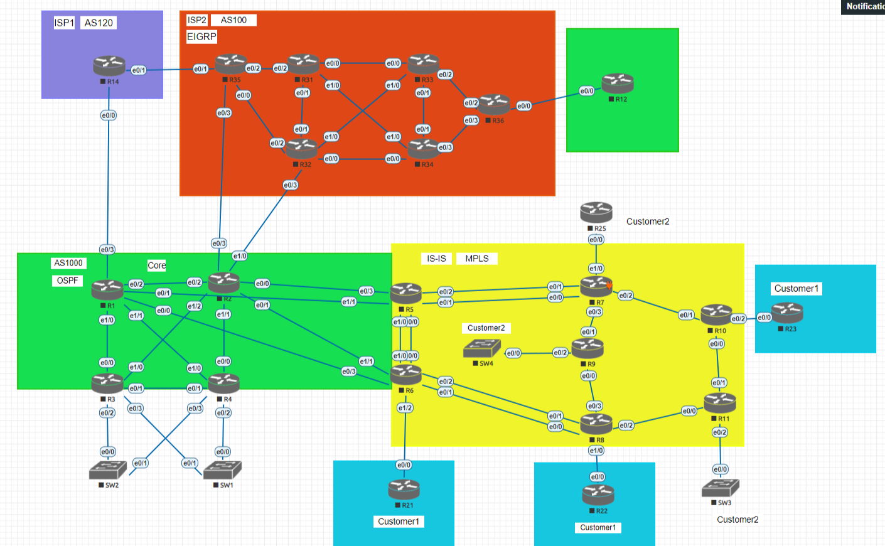

### Цели проектной работы

1. На сети ISP2 настроить протокол EIGRP, настройку IBGP выполнить с разбиением на 2 кластера с 2-мя роутрефлекторами.
2. На ядре сети оператора AS1000 выполнить настройку протокола OSPF. Настроить фрагмент сети офиса. Настроить сервер DHCP.
3. На фрагменте транспортной IP сети оператора настроить протокол IS-IS и запустить транспортный протокол MPLS-TE.
4. На траспортной сети оператора постоить туннели для пользователей 1 и 2
5. Настроить на стыках с провайдерами EBGP.
