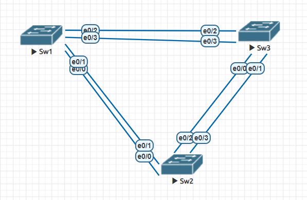

# Практическое задание №2

[1. Создание сети и настройка основных параметров устройства]()

[2. Выбор корневого моста]()

[3. Наблюдение за процессом выбора протоколом STP порта, исходя из стоимости портов]()

[4. Наблюдение за процессом выбора протоколом STP порта, исходя из приоритета портов]()

В программе EVE-NG создаем сетевые элементы и соединения согласно с условиями задания. [(рисунок 1)]

производим настройку коммутаторов
отключаем поиcк DNS командой _no ip domain-lookup_
присвоение имени коммутатору _hostname Sw1_
назначаем **class**  в качестве зашифрованного пароля доступа к привилигированному режиму _enable secret class_

назначаем **cisco** в качестве паролей консоли и VTY
назначаем logging synchronous для консоли
настраиваем баннерное сообщение дня MOTD, команда _banner motd C Attention!!! You bear full responsibility for interfering with the operation of the equipment. C_
задаем IP-address, указанный в таблице адресации для VLAN1 на всех коммутаторах
копируем текущую конфигурацию в файл загрузочной конфигурации, команда _copy running-config startup-config_

Результат первичной конфигурации на примере Sw1

Sw1# sh run
Building configuration...

Current configuration : 1171 bytes
!
! Last configuration change at 15:32:33 MSK Sun Sep 24 2023
!
version 15.2
service timestamps debug datetime msec
service timestamps log datetime msec
no service password-encryption
service compress-config
!
hostname Sw1
!
boot-start-marker
boot-end-marker
!
!
enable secret 5 $1$aIdV$4NwDenVS5FTYEO/6NHY9q0
!
no aaa new-model
clock timezone MSK 3 0
!
!
no ip domain-lookup
ip cef
no ipv6 cef
!
!
spanning-tree mode pvst
spanning-tree extend system-id
!
vlan internal allocation policy ascending
!
!
interface Ethernet0/0
!
interface Ethernet0/1
!
interface Ethernet0/2
!
interface Ethernet0/3
!
interface Ethernet1/0
!
interface Ethernet1/1
!
interface Ethernet1/2
!
interface Ethernet1/3
!
interface Vlan1
description Management
ip address 192.168.1.1 255.255.255.0
!
ip forward-protocol nd
!
no ip http server
no ip http secure-server
!
!
control-plane
!
banner motd ^C Attention!!! You bear full responsibility for interfering with the operation of the equipment. ^C
!
line con 0
session-timeout 10
password cisco
logging synchronous
login
line aux 0
line vty 0 4
password cisco
logging synchronous
login
!!
end

Sw1#

