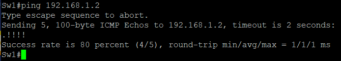
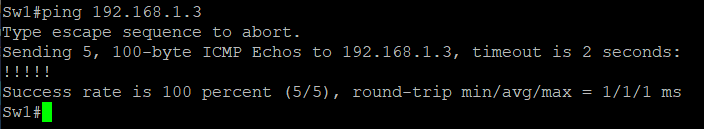
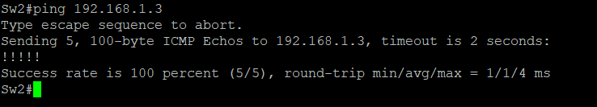

# Практическое задание №2

[1. Создание сети и настройка основных параметров устройства](https://github.com/Neytrin/Network-ingeneer/blob/9c7119febe541602e65c229d111e159203bd4dfa/labs/lab02/readme.md#L11)

[2. Выбор корневого моста]()

[3. Наблюдение за процессом выбора протоколом STP порта, исходя из стоимости портов]()

[4. Наблюдение за процессом выбора протоколом STP порта, исходя из приоритета портов]()

1. В программе EVE-NG создаем сетевые элементы и соединения согласно с условиями задания. [(рисунок 1)]

производим настройку коммутаторов:

отключаем поиcк DNS командой _no ip domain-lookup_

присвоение имени коммутатору _hostname Sw1_

назначаем **class**  в качестве зашифрованного пароля доступа к привилигированному режиму _enable secret class_

назначаем **cisco** в качестве паролей консоли и VTY

назначаем logging synchronous для консоли

настраиваем баннерное сообщение дня MOTD, команда _banner motd C Attention!!! You bear full responsibility for interfering with the operation of the equipment. C_

задаем IP-address, указанный в таблице адресации для VLAN1 на всех коммутаторах

копируем текущую конфигурацию в файл загрузочной конфигурации, команда _copy running-config startup-config_

Результат первичной конфигурации на примере Sw1
[Initial settings](Initial%20settings)

