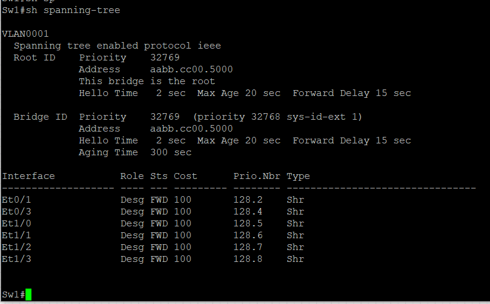
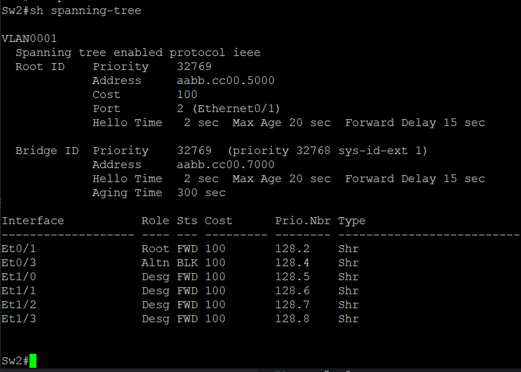
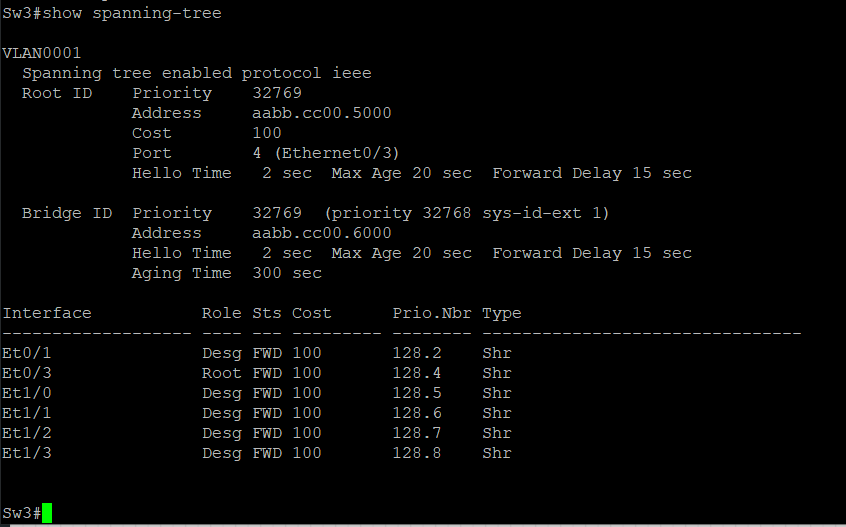
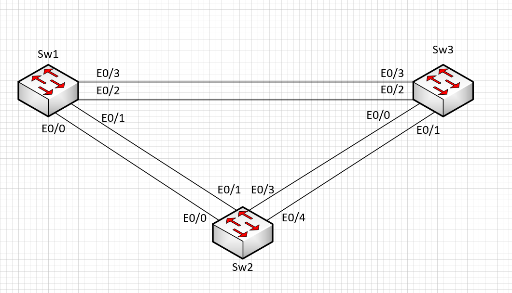

# Практическое задание №2

[1. Создание сети и настройка основных параметров устройства](https://github.com/Neytrin/Network-ingeneer/blob/9c7119febe541602e65c229d111e159203bd4dfa/labs/lab02/readme.md#L11)

[2. Выбор корневого моста]()

[3. Наблюдение за процессом выбора протоколом STP порта, исходя из стоимости портов]()

[4. Наблюдение за процессом выбора протоколом STP порта, исходя из приоритета портов]()

1. В программе EVE-NG создаем сетевые элементы и соединения согласно с условиями задания. [(рисунок 1)]

Таблица адресов

| Коммутатор | Интерфейс | IP адрес    | Маска подсети |
|------------|-----------|-------------|---------------|
| Sw1        | VLAN1     | 192.168.1.1 | 255.255.255.0 |
| Sw2        | VLAN1     | 192.168.1.2 | 255.255.255.0 |
| Sw3        | VLAN1     | 192.168.1.3 | 255.255.255.0 |

производим настройку коммутаторов:

отключаем поиcк DNS командой _no ip domain-lookup_

присвоение имени коммутатору _hostname Sw1_

назначаем **class**  в качестве зашифрованного пароля доступа к привилигированному режиму _enable secret class_

назначаем **cisco** в качестве паролей консоли и VTY

назначаем logging synchronous для консоли

настраиваем баннерное сообщение дня MOTD, команда _banner motd C Attention!!! You bear full responsibility for interfering with the operation of the equipment. C_

задаем IP-address, указанный в таблице адресации для VLAN1 на всех коммутаторах

копируем текущую конфигурацию в файл загрузочной конфигурации, команда _copy running-config startup-config_

Результат первичной конфигурации на примере Sw1
[Initial settings](Initial%20settings)

Проверка эхо-запрос от коммутатора Sw1 на коммутатор Sw2

Проверка эхо-запрос от коммутатора Sw1 на коммутатор Sw3

Проверка эхо-запрос от коммутатора Sw2 на коммутатор Sw3

# 2.Выбор корневого моста
Настраиваем задействованный в схеме, диапазон e0/0-3 интерфесов коммутаторов в режим работы Trunk следующими командами:

`Sw1(config)#interface range e0/0-3`

`Sw1(config-if-range)#shutdown`

`Sw1(config-if-range)#switchport trunk encapsulation dot1q`

`Sw1(config-if-range)#switchport mode trunk`

`Sw1(config-if-range)#exit`

Включаем на всех коммутаторах интерфейсы e0/1 и e0/3

`Sw1(config)#interface e0/1`

`Sw1(config-if)#no shutdown`

`Sw1(config-if)#interface e0/3`

`Sw1(config-if)#no shutdown`

`Sw1(config-if)#exit`

Отобразим данные протокола spanning-tree выполнив команду на каждом из трех коммутаторов

На схеме ниже отображены роль и состояние активных портов на каждом коммутаторе.

Коммутатор Sw1 является корневым. На это указывает явно надпись This bridge is the root. Совпадение параметров Root ID
c собственным Bridge ID и роли всех активных портов Designated.

Коммутатор Sw1 был выбран в качестве корневого коммутатора по результатам сравнения собственных Bridge ID и MAC адресов
всех коммутаторов учавствующих в сети уровня L2 по принципу:

- выборка по наименьшему значению Bridge ID, но у всех представленных устройст оно равно по умолчанию 32769

- выборка по наименьшему значению MAC адреса из всех представленных он равен aabb.cc00.5000 и принадлежит Sw1

Корневые порты коммутатора, именуемые еще как Root порты, всегда смотрят в сторону корневого коммутатора и выбираются
по наименьшей стоимости пути к нему. Согласно алгоритму протокола Spanning-tree на комутаторе не должно быть более
одного корневого порта. В качестве корневых портов выбраны Sw2 e0/1 и Sw3 e0/3 со стоимостью маршрута 100.

