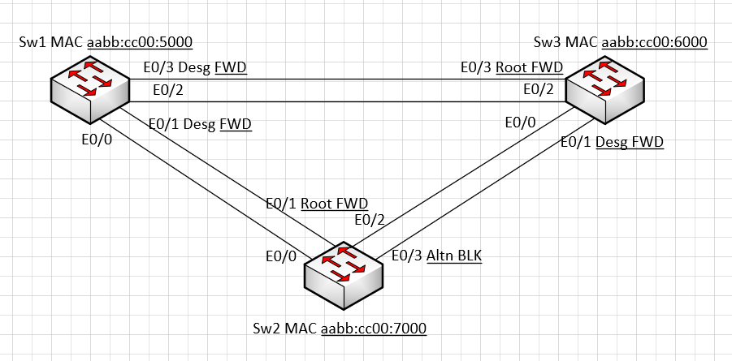
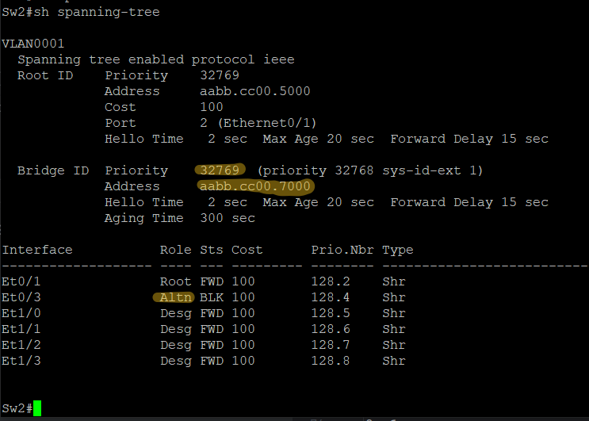
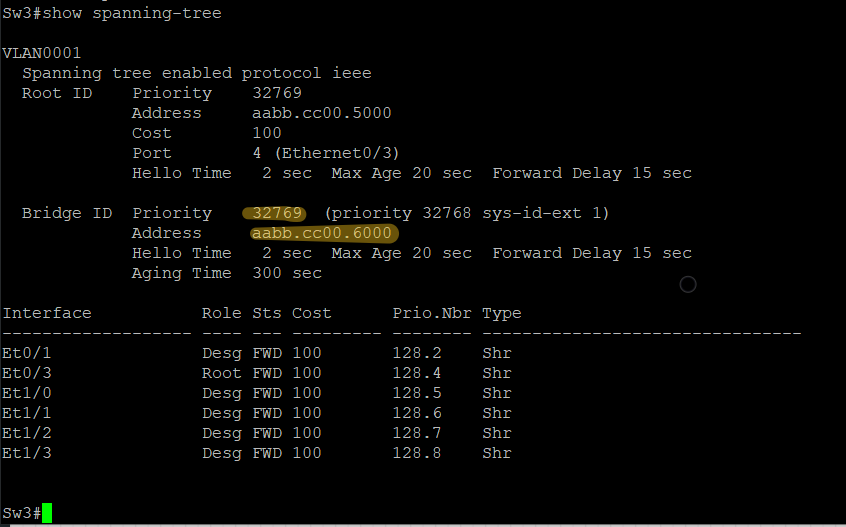

# Практическое задание №2

[1. Создание сети и настройка основных параметров устройства](https://github.com/Neytrin/Network-ingeneer/blob/24f49963935dfc81dc7d8ffb7fd22d9a7015d181/labs/lab02/readme.md#L11)

[2. Выбор корневого моста](https://github.com/Neytrin/Network-ingeneer/blob/24f49963935dfc81dc7d8ffb7fd22d9a7015d181/labs/lab02/readme.md#L53)

[3. Наблюдение за процессом выбора протоколом STP порта, исходя из стоимости портов](https://github.com/Neytrin/Network-ingeneer/blob/24f49963935dfc81dc7d8ffb7fd22d9a7015d181/labs/lab02/readme.md#L117)

[4. Наблюдение за процессом выбора протоколом STP порта, исходя из приоритета портов]()

## 1. Создание сети и настройка  основных параметров устройства

В программе EVE-NG создаем сетевые элементы и соединения согласно с условиями задания. [(рисунок 1)]


Таблица адресов

| Коммутатор | Интерфейс | IP адрес    | Маска подсети |
|------------|-----------|-------------|---------------|
| Sw1        | VLAN1     | 192.168.1.1 | 255.255.255.0 |
| Sw2        | VLAN1     | 192.168.1.2 | 255.255.255.0 |
| Sw3        | VLAN1     | 192.168.1.3 | 255.255.255.0 |

производим настройку коммутаторов:

отключаем поиcк DNS командой _no ip domain-lookup_

присвоение имени коммутатору _hostname Sw1_

назначаем **class**  в качестве зашифрованного пароля доступа к привилигированному режиму _enable secret class_

назначаем **cisco** в качестве паролей консоли и VTY

назначаем logging synchronous для консоли

настраиваем баннерное сообщение дня MOTD, команда _banner motd C Attention!!! You bear full responsibility for interfering with the operation of the equipment. C_

задаем IP-address, указанный в таблице адресации для VLAN1 на всех коммутаторах

копируем текущую конфигурацию в файл загрузочной конфигурации, команда _copy running-config startup-config_

Результат первичной конфигурации на примере Sw1
[Initial settings](Initial%20settings)

Проверка эхо-запрос от коммутатора Sw1 на коммутатор Sw2

Проверка эхо-запрос от коммутатора Sw1 на коммутатор Sw3

Проверка эхо-запрос от коммутатора Sw2 на коммутатор Sw3


## 2.Выбор корневого моста
Настраиваем задействованный в схеме, диапазон e0/0-3 интерфесов коммутаторов в режим работы Trunk следующими командами:
````
Sw1(config)#interface range e0/0-3
Sw1(config-if-range)#shutdown
Sw1(config-if-range)#switchport trunk encapsulation dot1q
Sw1(config-if-range)#switchport mode trunk
Sw1(config-if-range)#exit
````
Включаем на всех коммутаторах интерфейсы e0/1 и e0/3
````
Sw1(config)#interface e0/1
Sw1(config-if)#no shutdown
Sw1(config-if)#interface e0/3
Sw1(config-if)#no shutdown
Sw1(config-if)#exit
````
Отобразим данные протокола spanning-tree выполнив команду на каждом из трех коммутаторов


На схеме ниже отображены роль и состояние активных портов на каждом коммутаторе.



Коммутатор Sw1 является корневым. На это указывает явно надпись This bridge is the root. Совпадение параметров Root ID
c собственным Bridge ID и роли всех активных портов Designated.

Коммутатор Sw1 был выбран в качестве корневого коммутатора по результатам сравнения собственных Bridge ID и MAC адресов
всех коммутаторов учавствующих в сети уровня L2 по принципу:

- выбор по наименьшему значению Bridge ID, но у всех представленных устройст оно равно по умолчанию 32769

- выбор по наименьшему значению MAC адреса из всех представленных он равен aabb.cc00.5000 и принадлежит Sw1

Корневые порты коммутатора, именуемые еще как Root порты, всегда смотрят в сторону корневого коммутатора и выбираются
по наименьшей стоимости пути к нему. Согласно алгоритму протокола Spanning-tree на комутаторе не должно быть более
одного корневого порта. В качестве корневых портов выбраны Sw2 e0/1 и Sw3 e0/3 со стоимостью маршрута 100.

Назначенными (Designated) портами выступают порты Sw1 e0/1, Sw1 e0/3, Sw3 e0/1

В роли альтернативновного (Alternative) порта, который являетсся единственным заблокированным, выступает Sw2 e0/3

При выборе ролей для портов Sw2 e0/3 и Sw3 e0/1 выполнена последвательность выбора назначенного порта:

- выбор по суммарной стоимости пути до корневого коммутатора, для обоих портов равна 200

- выбор по наименшему значению Bridge ID, который для обоих коммутаторов одинаков 32769
однако MAC address aabb.cc00.6000 Sw3 меньше чем у Sw2, поэтому порт Sw3 e0/1 становится 
 назначенным, тогда как порт Sw2 e0/3 становится альтернативным и блокируется для избежания петли.

## 3. Наблюдение за процессом выбора протоколом STP порта, исходя из стоимости портов

Командой Show spanning-tree определяем не корневой коммутатор с заблокированным портом





Изменим стоимость порта e0/1 на коммутаторе Sw2 в меньшую сторону выставив значение 50

```
Sw2(config)#int e0/1
Sw2(config-if)#spanning-tree cost 50
```
Результат выполнения команд


Данное измение не привело к измению Root портов на коммутаторах Sw2 e0/1 и Sw3 e0/3, поскольку они по-прежнему имеют 
нименьшие значения стоимости маршрута до корневого коммутатора (root path cost-RPC)

Sw2 e0/1 - RPC=50

Sw3 e0/3 - RPC=100

Изменился суммарный RPC для Sw3 e0/1 RPC=50+100=150, тогда как
для Sw2 e0/3 RPC=100+100=200 остался прежним. В результате выбора кратчайшего маршрута Sw1-Sw2-Sw3
происходит смена ролей, ранее заблокированный порт Sw2 e0/3 становится Designated, тогда как Sw3 e0/1 - Alternative.


