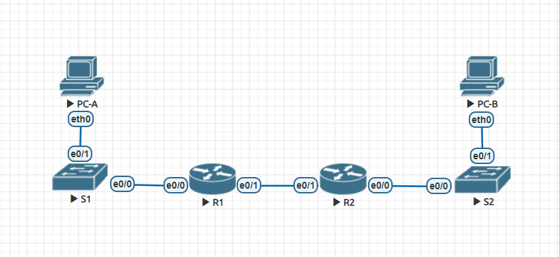
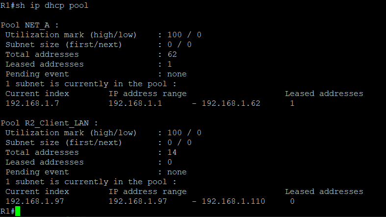
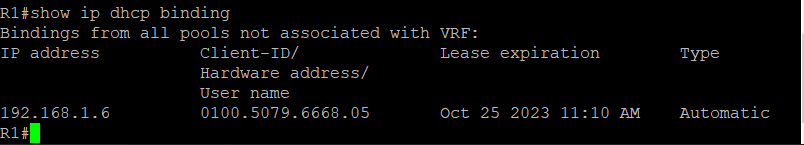
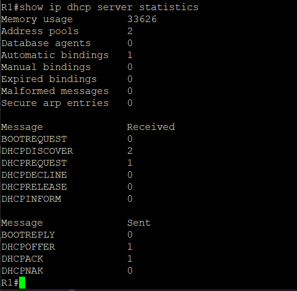
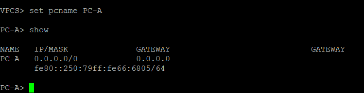
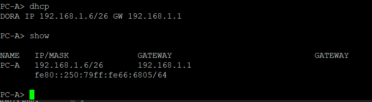
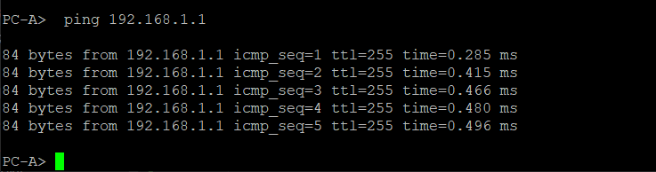

# Практическое задание №3

1. [Создание сети и настройка основных параметров устройств](https://github.com/Neytrin/Network-ingeneer/blob/b2fd1514d38af7efc84f9c17726639b0b8a388ff/labs/lab03/readme.md#L7)
2. [Настройка и проверка двух серверов DHCPv4 на маршрутизаторе R1.](https://github.com/Neytrin/Network-ingeneer/blob/b2fd1514d38af7efc84f9c17726639b0b8a388ff/labs/lab03/readme.md#L206)
3. [Настройка и проверка ретрансляции DHCPv4 на маршрутизаторе R2.]()

### 1. Создание сети и настройка основных параметров устройств

Разделим сеть 192.168.1.0/24 на подсети согласно требований:
1. Cеть A поддерживает 58 хостов (клиентский VLAN на маршрутизаторе R1)
что соответствует IP адресу подсети 192.168.1.0/26, что соответствует маске подсети 255.255.255.192.
2. Сеть B поддерживает 28 хостов (VLAN управления на маршрутизаторе R1)
  192.168.1.64/27, что соответствует маске подсети 255.255.255.224
3. Сеть C поддерживает 12 хостов (клиентский VLAN на маршрутизаторе R2)
   192.168.1.96/28, что соответствует маске подсети 255.255.255.240

В программе EVE-NG создаем сетевые элементы и соединения согласно с условиями задания 


Таблица адресации

| Устройство | Интрерфейс | IP адрес     | Маска подсети   | Шлюз по умолчанию |
|------------|------------|--------------|-----------------|-------------------|
| R1         | e0/1       | 10.0.0.1     | 255.255.255.252 | N/A               |
|            | e0/0       | N/A          | N/A             |                   |
|            | e0/0.100   | 192.168.1.1  | 255.255.255.192 |                   |
|            | e0/0.200   | 192.168.1.65 | 255.255.255.224 |                   |
|            | e0/0.1000  | N/A          | N/A             |                   |
| R2         | e0/1       | 10.0.0.2     | 255.255.255.252 | N/A               |
|            | e0/0       | 192.168.1.97 | 255.255.255.240 |                   |
| S1         | VLAN200    | 192.168.1.66 | 255.255.255.224 | 192.168.1.1       |
| S2         | VLAN1      | 192.168.1.98 | 255.255.255.240 | 192.168.1.97      |
| PC-A       | NIC        | DHCP         | DHCP            | DHCP              |
| PC-B       | NIC        | DHCP         | DHCP            | DHCP              |

Таблица VLAN

| VLAN | Name        | Interface Assigned |
|------|-------------|--------------------|
| 1    | N/A         | S2 e0/1            |
| 100  | Clients     | S1 e0/1            |
| 200  | Management  | S1 VLAN200         |
| 999  | Parking Lot | S1 e0/2-3          |
| 1000 | Native      | N/A                |

Производим первичную настройку маршрутизатроров R1 и R2. Ниже приведены команды для настройки R1

````
Router(config)#hostname R1
R1(config)#no ip domain-lookup
R1(config)#service password-encryption
R1(config)#enable secret class
R1(config)#line console 0
R1(config-line)#password 0 cisco
R1(config-line)#logging synchronous
R1(config-line)#login
R1(config-line)#exit
R1(config)#line vty 0 4
R1(config-line)#password 0 cisco
R1(config-line)#logging synchronous
R1(config-line)#login
R1(config-line)#exit
R1(config)#banner motd ' Unauthorized access is prohibited!!! '
R1(config)#clock timezone MSK 3
R1(config)#do copy running-config startup-config
````
Настраиваем маршрутизацию между VLAN на маршрутизаторе R1.
Для чего на интерфейсе e0/0 создаем три подинтерфейсы исходя из данных таблицы адресов.

````
R1(config)#interface e0/0
R1(config-if)#description to_S1
R1(config-if)#no shut
R1(config-if)#exit
R1(config)#interface e0/0.100
R1(config-subif)#encapsulation dot1Q 100
R1(config-subif)#description Clients
R1(config-subif)#ip address 192.168.1.1 255.255.255.192
R1(config-if)#exit
R1(config)#interface e0/0.200
R1(config-subif)#encapsulation dot1Q 200
R1(config-subif)#ip address 192.168.1.65 255.255.255.224
R1(config-subif)#description MANAGEMENT
R1(config-if)#exit
R1(config)#int e0/0.1000
R1(config-subif)#description Native
R1(config-subif)#encapsulation dot1Q 1000 native
````
Производим настройку интерфейса e0/1 на R1
````
R1(config)#int e0/1
R1(config-if)#no shut
R1(config-if)#ip address 10.0.0.1 255.255.255.252
R1(config-if)#description To_R2
````
Настраиваем интерфейс e0/1 на маршрутизаторе R2 с первым IP-адресом подсети C, который был вычислен ранее.
````
R2(config)#interface e0/0
R2(config-if)#no shut
R2(config-if)#ip address 192.168.1.97 255.255.255.240
R2(config-if)#description To_S2
````
Настраиваем интерфейс e0/1 для маршрутизаторов R1 и R2.
````
R1(config)#int e0/1
R1(config-if)#no shut
R1(config-if)#ip address 10.0.0.1 255.255.255.252
R1(config-if)#description To_R2

R2(config)#int e0/1
R2(config-if)#no shut
R2(config-if)#ip address 10.0.0.2 255.255.255.252
R2(config-if)#description To_R1
````
Создаем маршрут по умолчанию на каждом маршрутизаторе, указывающем на IP-адрес e0/1 на другом маршрутизаторе.
````
R1(config)#ip route 0.0.0.0 0.0.0.0 10.0.0.2

R2(config)#ip route 0.0.0.0 0.0.0.0 10.0.0.1
````
Убедимся, что статическая маршрутизация работает, пропинговав адрес e0/1 маршрутизатора R2 от маршрутизатора R1.


Выполним первичные настройки коммутаторов S1 и S2 на примере команд в S1
````
Switch(config)#hostname S1
S1(config)#no ip domain-lookup
S1(config)#enable secret class
S1(config)#line console 0
S1(config-line)#password cisco
S1(config-line)#logging synchronous
S1(config-line)#login
S1(config-line)#exit
S1(config)#line vty 0 4
S1(config-line)#logging synchronous
S1(config-line)#login
S1(config-line)#exit
S1(config)#banner motd ' Unauthorized access is prohibited!!! '
S1(config)#clock timezone MSK 3
S1(config)#do copy running-config startup-config
````
Создаем сети VLAN на S1.
````
S1(config)#vlan 100
S1(config-vlan)#name Clients
S1(config-vlan)#exit
S1(config)#vlan 200
S1(config-vlan)#name MANAGEMENT
S1(config-vlan)#exit
S1(config)#vlan 1000
S1(config-vlan)#name Native
````
Настройка и активация интерфейса управления на S1 (VLAN 200), используя второй IP-адрес из рассчитанной ранее подсети.
````
S1(config)#interface vlan 200
S1(config-if)#ip address 192.168.1.66 255.255.255.192
S1(config-if)#exit
S1(config)#ip default-gateway 192.168.1.65
````
Настраиваем и активируем интерфейс управления на S2 (VLAN 1), используя второй IP-адрес из рассчитанной ранее подсети. Кроме того, установим шлюз по умолчанию на S2.
````
S2(config)#interface vlan 1
S2(config-if)#ip address 192.168.1.98 255.255.255.240
S2(config-if)#exit
S2(config)#ip default-gateway 192.168.1.97
````
Назначаем все неиспользуемые порты на S1 VLAN Parking_Lot, настраиваем для них статический режим доступа и административно деактивируем их.
````
S1(config)#vlan 999
S1(config-vlan)#name Parking_Lot
S1(config-if)#exit
S1(config)#interface range e0/2-3
S1(config-if-range)#switchport mode access
S1(config-if-range)#switchport access vlan 999
S1(config-if-range)#shut
````
На S2 административно деактивируем все неиспользуемые порты.
````
S2(config)#int range e0/2-3
S2(config-if-range)#shut
S2(config-if-range)#shutdown
````
Назначаем используемые порты соответствующей VLAN (указанной в таблице VLAN выше) и настраиваем для них режим статического доступа.
````
S1(config)#int e0/1
S1(config-if)#switchport mode access
S1(config-if)#switchport access vlan 100
S1(config-if)#exit
S1(config)#interface e0/0
S1(config-if)#switchport trunk encapsulation dot1q
S1(config-if)#switchport mode trunk
S1(config-if)#switchport trunk native vlan 1000


S2(config)#int e0/1
S2(config-if)#switchport mode access
````
Поскольку с интерфейса e0/0 R2 кадры ETH отправляются не тэгированными,
то для их приема на e0/0 S2 воспользовались VLAN1 являющимся defult native vlan.

Проверка статуса транкинга

На данный момент, какой IP-адрес был бы у ПК, если бы он был подключен к сети с помощью DHCP?
Поскольку DHCP сервер еще не настроен, то IP адрес будет 0.0.0.0/0 

### 2. Настройка и проверка двух серверов DHCPv4 на маршрутизаторе R1.

Производим последовательную настройку двух серверов DHCPv4 на маршрутизаторе R1
Настройка для подсети А
Исключаем первые пять доступных адресов из пула адресов сети А.
````
ip dhcp excluded-address 192.168.1.1 192.168.1.5
````
Создаем DHCP pool
````
R1(config)#ip dhcp pool NET_A
R1(dhcp-config)#network 192.168.1.0 255.255.255.192
R1(dhcp-config)#domain-name ccna-lab.com.
R1(dhcp-config)#default-router 192.168.1.1
R1(dhcp-config)#lease 2 12 30
````
Исключаем первые пять доступных адресов из пула адресов сети C и настраиваем 
DHCP pool по заданным параметрам
````
R1(config)#ip dhcp excluded-address 192.168.1.97 192.168.1.101
R1(config)#ip dhcp pool R2_Client_LAN
R1(dhcp-config)#domain-name ccna-lab.com.
R1(dhcp-config)#network 192.168.1.96 255.255.255.240
R1(dhcp-config)#default-router 192.168.1.97
R1(dhcp-config)#lease 2 12 30
R1(dhcp-config)#exit
R1(config)#do write
````
Проверяем настройку сервера DHCPv4.
````
R1#sh ip dhcp pool
````

````
R1#show ip dhcp binding
````

````
show ip dhcp server statistics
````

В момент проверки настроек PC-A произошел програмный сбой, до сбоя ему был назначен
IP address 192.168.1.6
После пересоздания VPC наблюдаем

Очевидно, что настройки от сервера DHCP еще не получены, поэтому делаем запрос и проверяем их получение

Осуществляем проверку подключения к сети командой Ping шлюза по умолчанию (IP адрес e0/1 R1)


### 3. Настройка и проверка ретрансляции DHCPv4 на маршрутизаторе R2.

