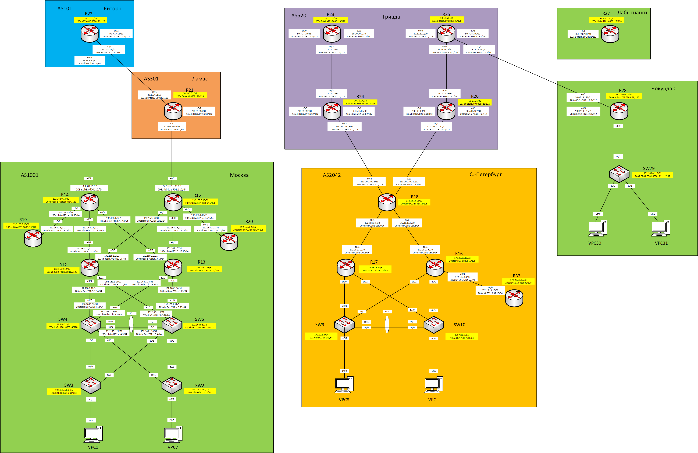

## Практическое задание №4

1. [Разработаеть и задокументировать адресное пространство для лабораторного стенда.]()
2. [Настроить ip адреса на каждом активном порту]()
3. [Настроить каждый VPC в каждом офисе в своем VLAN.]()
4. [Настроить VLAN/Loopbackup interface управления для сетевых устройств]()
5. [Настроить сети офисов так, чтобы не возникало broadcast штормов, а использование линков было максимально оптимизировано]()
6. [Используем IPv4. IPv6 адресацию]()

### 1. Разработаеть и задокументировать адресное пространство для лабораторного стенда.

Для наглядности распределения адресов составим схему сети с указанием адресов на интерфейсах всех устройств



Все назначенные адреса IPv4 и IPv6 отображаем в табличном виде.

Таблица адресов

| Office      | Hostname | Interface              | Description    | IPv4 address   | Subnet mask     | Gateway       | IPv6 address                    | IPV6 LLA     |
|-------------|----------|------------------------|----------------|----------------|-----------------|---------------|---------------------------------|--------------|
| Москва      | R14      | e0/0                   | to_R12         | 192.168.1.0    | 255.255.255.254 |               | 203a:bb8a:d701:2::14:12/64      | FE80::14     |
|             |          | e0/1                   | to_R13         | 192.168.1.2    | 255.255.255.254 |               | 203a:bb8a:d701:3::14:13/64      | FE80::14     |
|             |          | e0/2                   | to_Kitorn      | 33.13.8.21     | 255.255.255.254 |               | 203a:bb8a:d701::2/64            | FE80::14     |
|             |          | e0/3                   | to_R19         | 192.168.1.4    | 255.255.255.254 |               | 203a:bb8a:d701:4::14:19/64      | FE80::14     |
|             |          | Loopback0              |                | 192.168.0.14   | 255.255.255.255 |               | 203a:bb8a:d701:8888::14/128     |              |
|             | R15      | e0/0                   | to_R13         | 192.168.1.6    | 255.255.255.254 |               | 203a:bb8a:d701:5::15:13/64      | FE80::15     |
|             |          | e0/1                   | to_R12         | 192.168.1.8    | 255.255.255.254 |               | 203a:bb8a:d701:6::15:12/64      | FE80::15     |
|             |          | e0/2                   | to_Lamas       | 77.100.10.41   | 255.255.255.254 |               | 203a:bb8a:d701:1::2/64          | FE80::15     |
|             |          | e0/3                   | to_R20         | 192.168.1.10   | 255.255.255.254 |               | 203a:bb8a:d701:7::15:20/64      | FE80::15     |
|             |          | Loopback0              |                | 192.168.0.15   | 255.255.255.255 |               | 203a:bb8a:d701:8888::15/128     |              |
|             | R12      | e0/0                   | to_SW4         | 192.168.1.12   | 255.255.255.254 |               | 203a:bb8a:d701:8::12:4/64       | FE80::12     |
|             |          | e0/1                   | to_SW5         | 192.168.1.14   | 255.255.255.254 |               | 203a:bb8a:d701:9::12:5/64       | FE80::12     |
|             |          | e0/2                   | to_R14         | 192.168.1.1    | 255.255.255.254 |               | 203a:bb8a:d701:2::12:14/64      | FE80::12     |
|             |          | e0/3                   | to_R15         | 192.168.1.9    | 255.255.255.254 |               | 203a:bb8a:d701:6::12:15/64      | FE80::12     |
|             |          | Loopback0              |                | 192.168.0.12   | 255.255.255.255 |               | 203a:bb8a:d701:8888::12/128     |              |
|             | R13      | e0/0                   | to_SW5         | 192.168.1.16   | 255.255.255.254 |               | 203a:bb8a:d701:a::13:5/64       | FE80::13     |
|             |          | e0/1                   | to_SW4         | 192.168.1.18   | 255.255.255.254 |               | 203a:bb8a:d701:b::13:4/64       | FE80::13     |
|             |          | e0/2                   | to_R15         | 192.168.1.7    | 255.255.255.254 |               | 203a:bb8a:d701:5::13:15/64      | FE80::13     |
|             |          | e0/3                   | to_R14         | 192.168.1.3    | 255.255.255.254 |               | 203a:bb8a:d701:3::13:14/64      | FE80::13     |
|             |          | Loopback0              |                | 192.168.0.13   | 255.255.255.255 |               | 203a:bb8a:d701:8888::13/128     |              |
|             | R19      | e0/0                   | to_R14         | 192.168.1.5    | 255.255.255.254 |               | 203a:bb8a:d701:4::19:14/64      | FE80::19     |
|             |          | Loopback0              |                | 192.168.0.19   | 255.255.255.255 |               | 203a:bb8a:d701:8888::19/128     |              |
|             | R20      | e0/0                   | to_R15         | 192.168.1.11   | 255.255.255.254 |               | 203a:bb8a:d701:7::20:15/64      | FE80::20     |
|             |          | Loopback0              |                | 192.168.0.20   | 255.255.255.255 |               | 203a:bb8a:d701:8888::20/128     |              |
|             | SW4      | VLAN10                 | Client1        | 172.16.8.3     | 255.255.255.0   |               | 203a:bb8a:d701:1010::3/64       |              |
|             |          | VLAN20                 | Client7        | 172.16.12.3    | 255.255.255.0   |               | 203a:bb8a:d701:1020::3/64       |              |
|             |          | VLAN99                 | Mgmt_Access_SW | 192.168.0.131  | 255.255.255.128 |               | 203a:bb8a:d701:d::4/112         |              |
|             |          | Port-chanel 1 (e0/2-3) | to_PO1_SW5     | 192.168.1.21   | 255.255.255.254 |               | 203a:bb8a:d701:c::4:5/64        | FE80::4      |
|             |          | e1/0                   | to_R12         | 192.168.1.13   | 255.255.255.254 |               | 203a:bb8a:d701:8::4:12/64       | FE80::4      |
|             |          | e1/1                   | to_R13         | 192.168.1.19   | 255.255.255.254 |               | 203a:bb8a:d701:b::4:13/64       | FE80::4      |
|             |          | VRRP2                  | Client1_ipv4   | 172.16.8.1     | 255.255.255.0   |               |                                 |              |
|             |          | VRRP21                 | Client1_ipv6   |                |                 |               |                                 | FE80::4:4    |
|             |          | VRRP3                  | Client7_ipv4   | 172.16.12.1    | 255.255.255.0   |               |                                 |              |
|             |          | VRRP31                 | Client7_ipv6   |                |                 |               |                                 | FE80::4:5    |
|             |          | VRRP1                  | Mgmt_Access_SW | 192.168.0.129  | 255.255.255.128 |               |                                 |              |
|             |          | VRRP11                 | Mgmt_Access_SW |                |                 |               |                                 | FE80::4:1    |
|             |          | Loopback0              |                | 192.168.0.4    | 255.255.255.255 |               | 203a:bb8a:d701:8888::4/128      |              |
|             | SW5      | VLAN20                 | Client7        | 172.16.8.2     | 255.255.255.0   |               | 203a:bb8a:d701:1020::2/64       |              |
|             |          | VLAN99                 | Mgmt_Access_SW | 192.168.0.130  | 255.255.255.128 |               | 203a:bb8a:d701:d::5/112         |              |
|             |          | VLAN10                 | Client1        | 172.16.12.2    | 255.255.255.0   |               | 203a:bb8a:d701:1010::2/64       |              |
|             |          | Port-chanel 1 (e0/2-3) | to_PO1_SW4     | 192.168.1.20   | 255.255.255.254 |               | 203a:bb8a:d701:c::5:4/64        | FE80::5      |
|             |          | e1/0                   | to_R13         | 192.168.1.17   | 255.255.255.254 |               | 203a:bb8a:d701:a::5:13/64       | FE80::5      |
|             |          | e1/1                   | to_R12         | 192.168.1.15   | 255.255.255.254 |               | 203a:bb8a:d701:9::5:12/64       | FE80::5      |
|             |          | VRRP2                  | Client1_ipv4   | 172.16.8.1     | 255.255.255.0   |               |                                 |              |
|             |          | VRRP21                 | Client1_ipv6   |                |                 |               |                                 | FE80::4:4    |
|             |          | VRRP3                  | Client7_ipv4   | 172.16.12.1    | 255.255.255.0   |               |                                 |              |
|             |          | VRRP31                 | Client7_ipv6   |                |                 |               |                                 | FE80::4:5    |
|             |          | VRRP1                  | Mgmt_Access_SW | 192.168.0.129  | 255.255.255.128 |               |                                 |              |
|             |          | VRRP11                 | Mgmt_Access_SW |                |                 |               |                                 | FE80::4:1    |
|             |          | Loopback0              |                | 192.168.0.5    | 255.255.255.255 |               | 203a:bb8a:d701:8888::5/128      |              |
|             | SW3      | VLAN98                 | Mgmt_SW3       | 192.168.0.133  | 255.255.255.128 | 192.168.0.129 | 203a:bb8a:d701:d::3/112         | FE80::3      |
|             |          | e0/0                   | to_SW4         | NA             | NA              | NA            |                                 |              |
|             |          | e0/1                   | to_SW5         | NA             | NA              | NA            |                                 |              |
|             |          | e0/2                   | to_VPC1        | NA             | NA              | NA            |                                 |              |
|             | SW2      | VLAN99                 | Mgmt_SW2       | 192.168.0.132  | 255.255.255.128 | 192.168.0.129 | 203a:bb8a:d701:d::2/112         | FE80::2      |
|             |          | e0/0                   | to_SW5         | NA             | NA              | NA            |                                 |              |
|             |          | e0/1                   | to_SW4         | NA             | NA              | NA            |                                 |              |
|             |          | e0/2                   | to_VPC7        | NA             | NA              | NA            |                                 |              |
|             | VPC1     | NIC                    |                | DHCP           | DHCP            | DHCP          | SLAAC+DHCPv6                    |              |
|             | VPC7     | NIC                    |                | DHCP           | DHCP            | DHCP          | SLAAC+DHCPv6                    |              |
| Киторн      | R22      | e0/0                   | to_Moscow      | 33.13.8.20     | 255.255.255.254 |               | 203a:bb8a:d701::1/64            | FE80::22     |
|             |          | e0/1                   | to_Lamas       | 33.13.7.60     | 255.255.255.254 |               | 203a:a87a:413:7000::1/112       | FE80::22     |
|             |          | e0/2                   | to_Triada      | 90.7.17.11     | 255.255.255.254 |               | 203a:88a1:a789:1::1:1/112       | FE80::22     |
|             |          | Loopback0              |                | 10.1.1.22      | 255.255.255.255 |               | 203a:a87a:413:8888::22/128      |              |
| Ламас       | R21      | e0/0                   | to_Moscow      | 77.100.10.40   | 255.255.255.254 |               | 203a:bb8a:d701:1::1/64          | FE80::21     |
|             |          | e0/1                   | to_Kitorn      | 33.13.7.61     | 255.255.255.254 |               | 203a:a87a:413:7000::2/112       | FE80::21     |
|             |          | e0/2                   | to_Triada      | 90.7.17.53     | 255.255.255.254 |               | 203a:88a1:a789:1::2:1/112       | FE80::21     |
|             |          | Loopback0              |                | 10.10.2.22     | 255.255.255.255 |               | 203a:90aa:91:8888::21/128       |              |
| Триада      | R23      | e0/0                   | to_Kitorn      | 90.7.17.10     | 255.255.255.254 |               | 203a:88a1:a789:1::1:2/112       | FE80::23     |
|             |          | e0/1                   | to_R25         | 10.10.10.1     | 255.255.255.252 |               | 203a:88a1:a789:2::1/112         | FE80::23     |
|             |          | e0/2                   | to_R24         | 10.10.10.5     | 255.255.255.252 |               | 203a:88a1:a789:2::2:1/112       | FE80::23     |
|             |          | Loopback0              |                | 10.1.1.23      | 255.255.255.255 |               | 203a:88a1:a789:8888::23/128     |              |
|             | R24      | e0/0                   | to_Lamas       | 90.7.17.52     | 255.255.255.254 |               | 203a:88a1:a789:1::2:2/112       | FE80::24     |
|             |          | e0/1                   | to_R26         | 10.10.10.10    | 255.255.255.252 |               | 203a:88a1:a789:2::3:2/112       | FE80::24     |
|             |          | e0/2                   | to_R23         | 10.10.10.6     | 255.255.255.252 |               | 203a:88a1:a789:2::2:2/112       | FE80::24     |
|             |          | e0/3                   | to_SPeterburg  | 113.201.100.9  | 255.255.255.254 |               | 203a:88a1:a789:1::3:2/112       | FE80::24     |
|             |          | Loopback0              |                | 10.1.1.24      | 255.255.255.255 |               | 203a:88a1:a789:8888::24/128     |              |
|             | R25      | e0/0                   | to_R23         | 10.10.10.2     | 255.255.255.252 |               | 203a:88a1:a789:2::2/112         | FE80::25     |
|             |          | e0/1                   | to_Labutnangi  | 90.7.18.100    | 255.255.255.254 |               | 203a:88a1:a789:1::5:2/112       | FE80::25     |
|             |          | e0/2                   | to_R26         | 10.10.10.14    | 255.255.255.252 |               | 203a:88a1:a789:2::4:2/112       | FE80::25     |
|             |          | e0/3                   | to_Chokurdak   | 90.7.18.120    | 255.255.255.254 |               | 203a:88a1:a789:1::6:2/112       | FE80::25     |
|             |          | Loopback0              |                | 10.1.1.25      | 255.255.255.255 |               | 203a:88a1:a789:8888::25/128     |              |
|             | R26      | e0/0                   | to_R24         | 10.10.10.9     | 255.255.255.252 |               | 203a:88a1:a789:2::3:1/112       | FE80::26     |
|             |          | e0/1                   | to_Chokurdak   | 90.7.18.122    | 255.255.255.254 |               | 203a:88a1:a789:1::7:2/112       | FE80::26     |
|             |          | e0/2                   | to_R25         | 10.10.10.13    | 255.255.255.252 |               | 203a:88a1:a789:2::4:1/112       | FE80::26     |
|             |          | e0/3                   | to_SPeterburg  | 113.201.100.11 | 255.255.255.254 |               | 203a:88a1:a789:1::4:2/112       | FE80::26     |
|             |          | Loopback0              |                | 10.1.1.26      | 255.255.255.255 |               | 203a:88a1:a789:8888::26/112     |              |
| С-Петербург | R18      | e0/0                   | to_R16         | 172.18.13.5    | 255.255.255.252 |               | 203a:34:701::1:18:16/96         | FE80::18     |
|             |          | e0/1                   | to_R17         | 172.18.13.1    | 255.255.255.252 |               | 203a:34:701::2:18:17/96         | FE80::18     |
|             |          | e0/2                   | to_Triada24    | 113.201.100.8  | 255.255.255.254 |               | 203a:88a1:a789:1::3:1/112       | FE80::18     |
|             |          | e0/3                   | to_Triada26    | 113.201.100.10 | 255.255.255.254 |               | 203a:88a1:a789:1::4:1/112       | FE80::18     |
|             |          | Loopback0              |                | 172.23.13.18   | 255.255.255.255 |               | 203a:34:701:8888::18/128        |              |
|             | R17      | e0/0.101               | Client9        | 172.18.1.3     | 255.255.255.0   |               | 203a:34:701:101::2/64           | FE80::17:101 |
|             |          | e0/1                   | to_R18         | 172.18.13.2    | 255.255.255.252 |               | 203a:34:701::2:17:18/96         | FE80::17     |
|             |          | e0/2.102               | Client10       | 172.18.2.3     | 255.255.255.0   |               | 203a:34:701:102::2/64           | FE80::17:102 |
|             |          | HSRP1                  | Client9v4      | 172.18.1.1     |                 |               |                                 |              |
|             |          | HSRP2                  | Client10v4     | 172.18.2.1     |                 |               |                                 |              |
|             |          | HSRP3                  | Client9v6      |                |                 |               | 203a:34:701:101::1/64           | FE80::17:3   |
|             |          | HSRP4                  | Client10v6     |                |                 |               | 203a:34:701:102::1/64           | FE80::17:4   |
|             |          | Loopback0              |                | 172.23.13.17   | 255.255.255.255 |               | 203a:34:701:8888::17/128        |              |
|             | R16      | e0/0.102               | Client10       | 172.18.2.2     | 255.255.255.0   |               | 203a:34:701:102::3/64           | FE80::16:102 |
|             |          | e0/1                   | to_R18         | 172.18.13.6    | 255.255.255.252 |               | 203a:34:701::1:16:18/96         | FE80::16     |
|             |          | e0/2.101               | Client9        | 172.18.1.2     | 255.255.255.0   |               | 203a:34:701:101::3/64           | FE80::16:101 |
|             |          | e0/3                   | to_R32         | 172.18.13.9    | 255.255.255.252 |               | 203a:34:701::3:16:32/96         | FE80::16     |
|             |          | HSRP1                  | Client9v4      | 172.18.1.1     |                 |               |                                 |              |
|             |          | HSRP2                  | Client10v4     | 172.18.2.1     |                 |               |                                 |              |
|             |          | HSRP3                  | Client9v6      |                |                 |               | 203a:34:701:101::1/64           | FE80::17:3   |
|             |          | HSRP4                  | Client10v6     |                |                 |               | 203a:34:701:102::1/64           | FE80::17:4   |
|             |          | Loopback0              |                | 172.23.13.16   | 255.255.255.255 |               | 203a:34:701:8888::16/128        |              |
|             | R32      | e0/0                   | to_R16         | 172.18.13.10   | 255.255.255.252 |               | 203a:34:701::3:32:16/96         | FE80::32     |
|             |          | Loopback0              |                | 172.23.13.32   | 255.255.255.255 |               | 203a:34:701:8888::32/128        |              |
|             | SW9      | e0/0                   | PO1_to_SW10    | NA             | NA              | NA            |                                 |              |
|             |          | e0/1                   | PO1_to_SW10    | NA             | NA              | NA            |                                 |              |
|             |          | e0/2                   | to_VPC8        | NA             | NA              | NA            |                                 |              |
|             |          | e0/3                   | to_R17         | NA             | NA              | NA            |                                 |              |
|             |          | e1/0                   | to_R16         | NA             | NA              | NA            |                                 |              |
|             |          | VLAN101                | Mgmt_SW9       | 172.18.1.4     | 255.255.255.0   | 172.18.1.1    | 203a:34:701:101::9/64           |              |
|             | SW10     | e0/0                   | PO1_to_SW10    | NA             | NA              | NA            |                                 |              |
|             |          | e0/1                   | PO1_to_SW10    | NA             | NA              | NA            | `                               |              |
|             |          | e0/2                   | to_VPC         | NA             | NA              | NA            |                                 |              |
|             |          | e0/3                   | to_R16         | NA             | NA              | NA            |                                 |              |
|             |          | e1/0                   | to_R17         | NA             | NA              | NA            |                                 |              |
|             |          | VLAN102                | Mgmt_SW10      | 172.18.2.4     | 255.255.255.0   | 172.18.2.1    | 203a:34:701:102::10/64          |              |
|             | VPC8     | NIC                    |                | DHCP           | DHCP            | DHCP          | SLAAC                           |              |
|             | VPC      | NIC                    |                | DHCP           | DHCP            | DHCP          | SLAAC                           |              |
| Лабытнанги  | R27      | e0/0                   | to_Triada25    | 90.7.18.101    | 255.255.255.254 |               | 203a:88a1:a789:1::5:1/112       | fe80::27     |
|             |          | Loopback0              |                | 192.168.0.27   | 255.255.255.255 |               | 203a:bb8a:d701:8888::27/128     |              |
| Чокурдак    | R28      | e0/0                   | to_Triada26    | 90.7.18.123    | 255.255.255.254 |               | 203a:88a1:a789:1::1:1/112       | fe80::28     |
|             |          | e0/1                   | to_Triada25    | 90.7.18.121    | 255.255.255.254 |               | 203a:88a1:a789:1::6:1/112       | fe80::28     |
|             |          | e0/2.30                | Client30       | 172.16.30.1    | 255.255.255.0   |               | 203a:bb8a:d701:61::1/64         | fe80::28:30  |
|             |          | e0/2.31                | Client31       | 172.16.31.1    | 255.255.255.0   |               | 203a:bb8a:d701:62::1/64         | fe80::28:31  |
|             |          | e0/2.88                | Mgmt_SW29      | 192.168.0.217  | 255.255.255.252 |               | 203a:bb8a:d701:8888::1111:1/112 | fe80::28:88  |
|             |          | Loopback0              |                | 192.168.0.28   | 255.255.255.255 |               | 203a:bb8a:d701:8888::28/128     |              |
|             | SW29     | VLAN88                 | Mgmt_SW29      | 192.168.0.218  | 255.255.255.252 | 192.168.0.217 | 203a:bb8a:d701:8888::1111:2/112 |              |
|             | VPC30    | NIC                    |                | 172.16.30.2    | 255.255.255.0   | 172.16.30.1   | SLAAC+DHCPv6                    |              |
|             | VPC31    | NIC                    |                | 172.16.31.2    | 255.255.255.0   | 172.16.31.1   | SLAAC+DHCPv6                    |              |

Настройка оборудования приведена на примере офиса Москва.
Здесь и далее для удобства работы с тестовым стендом певоначальные настройки у всех сетевых элементов одинаковы.
Пример первичной настройки на примере R14
````
hostname R14
username admin privilege 15 secret cisco
no ip domain-lookup
ip domain-name Moskow1001.ru
service password-encryption
enable secret class
line console 0
password 0 cisco
logging synchronous
login
exec-timeout 0
exit
line vty 0 4
password 0 cisco
logging synchronous
login
exec-timeout 15
exit
banner motd ' Unauthorized access is strictly prohibited '
clock timezone MSK 3
do copy running-config startup-config
````
Вроде все стандартно, за исключение команды **_exec-timeout 0_**, которая задает бесконечное воемя работы через консоль, 
сделано для удобства при работе со стендом. В реальной сети естественно будет выставлено ограничение времени бездействия 
на сессию.
Пример настройки интерфейсов на примере R14
````
ipv6 unicast-routing
!
interface Loopback0
 ip address 192.168.0.14 255.255.255.255
 ipv6 address 203A:BB8A:D701:8888::14/128
 ipv6 enable
!
interface Ethernet0/0
 description to_R12
 ip address 192.168.1.0 255.255.255.254
 ipv6 address FE80::14 link-local
 ipv6 address 203A:BB8A:D701:2::14:12/64
 ipv6 enable
!
interface Ethernet0/1
 description to_R13
 ip address 192.168.1.2 255.255.255.254
 ipv6 address FE80::14 link-local
 ipv6 address 203A:BB8A:D701:3::14:13/64
 ipv6 enable
!
interface Ethernet0/2
 description to_Kitorn
 ip address 33.13.8.21 255.255.255.254
 ipv6 address FE80::14 link-local
 ipv6 address 203A:BB8A:D701::2/64
 ipv6 enable
 no cdp enable
!
interface Ethernet0/3
 description to_R19
 ip address 192.168.1.4 255.255.255.254
 ipv6 address FE80::14 link-local
 ipv6 address 203A:BB8A:D701:4::14:19/64
 ipv6 enable
````
Помимо настроек интерфесов на всех роутерах включена IPv6 маршрутизация.

Исходя из избыточности сети офиса Москва делается предположение что устройства SW4 и SW5 могут быть L3 коммутаторами.
Таким образом можно уменьшить сегмент широковещательной сети, до уровня связей портов коммутаторов агрегации (SW4, SW5) 
и коммутаторов доступа (SW2, SW3).

Соединение между SW4 и SW5 настроено как агрегация LACP уровня L3.
````
interface Port-channel1
 no switchport
 ip address 192.168.1.21 255.255.255.254
 ipv6 address FE80::4 link-local
 ipv6 address 203A:BB8A:D701:C::4:5/64
 ipv6 enable

interface Ethernet0/2
 no switchport
 no ip address
 duplex auto
 channel-group 1 mode active
!
interface Ethernet0/3
 no switchport
 no ip address
 duplex auto
 channel-group 1 mode active
````
Проверяем статус агрегированного канала командой **_sh etherchannel sum_**
Получаем результат


Настройка клиентских VLAN только на определенные коммутаторы доступа исключает образование петель
Однако здесь схитрил и управление коммутаторами доступа SW2 и SW3 настроил в одном VLAN99. Таким образом образовалась петля
которую отработал протокол PVST. В таком случае отключать протокол STP не стал, во избежание фатальных ошибок при
дальнейших настройках.
Произведены дополнительные настройки STP для VLAN99.
Команда **_spanning-tree vlan 99 priority 16384_** устанавливает меньшее значение Root ID Priority, тем самым прозводится 
выбор SW4 в качестве Root Bridge


Увеличение доступности шлюзов по умолчанию реализуем с помощью протокола VRRPv3
Пример настройки

````


