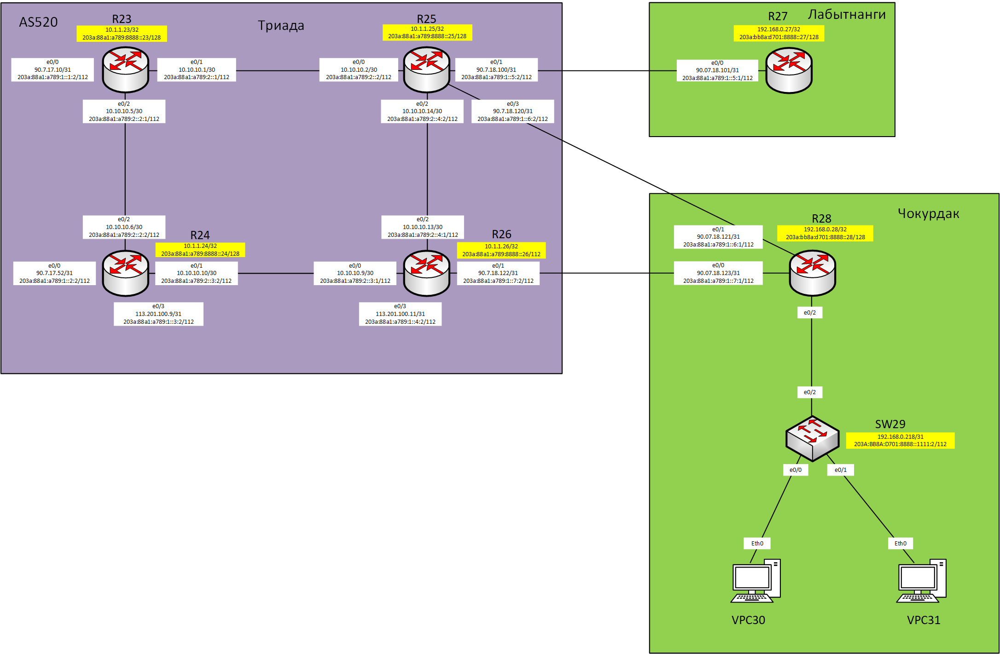
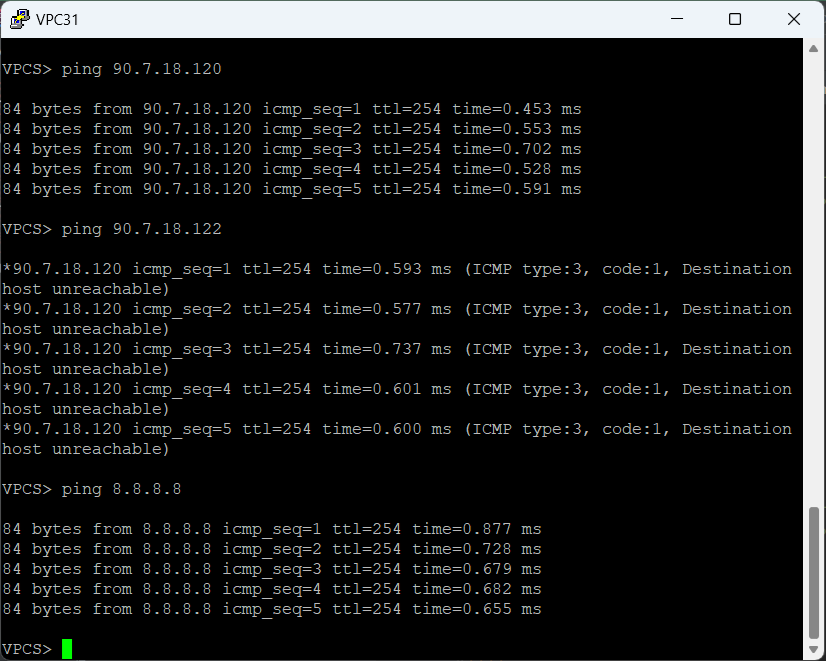

## Практическое задание №5
1. [Настроить политику маршрутизации для сетей офиса.](https://github.com/Neytrin/Network-ingeneer/blob/main/labs/lab05/readme.md#1-%D0%BD%D0%B0%D1%81%D1%82%D1%80%D0%BE%D0%B8%D1%82%D1%8C-%D0%BF%D0%BE%D0%BB%D0%B8%D1%82%D0%B8%D0%BA%D1%83-%D0%BC%D0%B0%D1%80%D1%88%D1%80%D1%83%D1%82%D0%B8%D0%B7%D0%B0%D1%86%D0%B8%D0%B8-%D0%B4%D0%BB%D1%8F-%D1%81%D0%B5%D1%82%D0%B5%D0%B9-%D0%BE%D1%84%D0%B8%D1%81%D0%B0)
2. [Распределить трафик между двумя линками с провайдером.](https://github.com/Neytrin/Network-ingeneer/blob/main/labs/lab05/readme.md#2-%D1%80%D0%B0%D1%81%D0%BF%D1%80%D0%B5%D0%B4%D0%B5%D0%BB%D0%B8%D1%82%D1%8C-%D1%82%D1%80%D0%B0%D1%84%D0%B8%D0%BA-%D0%BC%D0%B5%D0%B6%D0%B4%D1%83-%D0%B4%D0%B2%D1%83%D0%BC%D1%8F-%D0%BB%D0%B8%D0%BD%D0%BA%D0%B0%D0%BC%D0%B8-%D1%81-%D0%BF%D1%80%D0%BE%D0%B2%D0%B0%D0%B9%D0%B4%D0%B5%D1%80%D0%BE%D0%BC)
3. [Настроить отслеживание линка через технологию IP SLA.(только для IPv4)](https://github.com/Neytrin/Network-ingeneer/blob/main/labs/lab05/readme.md#3-%D0%BD%D0%B0%D1%81%D1%82%D1%80%D0%BE%D0%B8%D1%82%D1%8C-%D0%BE%D1%82%D1%81%D0%BB%D0%B5%D0%B6%D0%B8%D0%B2%D0%B0%D0%BD%D0%B8%D0%B5-%D0%BB%D0%B8%D0%BD%D0%BA%D0%B0-%D1%87%D0%B5%D1%80%D0%B5%D0%B7-%D1%82%D0%B5%D1%85%D0%BD%D0%BE%D0%BB%D0%BE%D0%B3%D0%B8%D1%8E-ip-sla%D1%82%D0%BE%D0%BB%D1%8C%D0%BA%D0%BE-%D0%B4%D0%BB%D1%8F-ipv4)
4. [Настроить для офиса Лабытнанги маршрут по-умолчанию.](https://github.com/Neytrin/Network-ingeneer/blob/main/labs/lab05/readme.md#4-%D0%BD%D0%B0%D1%81%D1%82%D1%80%D0%BE%D0%B8%D1%82%D1%8C-%D0%B4%D0%BB%D1%8F-%D0%BE%D1%84%D0%B8%D1%81%D0%B0-%D0%BB%D0%B0%D0%B1%D1%8B%D1%82%D0%BD%D0%B0%D0%BD%D0%B3%D0%B8-%D0%BC%D0%B0%D1%80%D1%88%D1%80%D1%83%D1%82-%D0%BF%D0%BE-%D1%83%D0%BC%D0%BE%D0%BB%D1%87%D0%B0%D0%BD%D0%B8%D1%8E)


### 1. Настроить политику маршрутизации для сетей офиса.

Приведена схема фрагмента сети лабораторного стенда в которой производим настройку оборудования.



Таблица адресов 

| Office     | Hostname | Interface | Description   | IPv4 address   | Subnet mask     | Gateway       | IPv6 address                    | IPV6 LLA    |
|------------|----------|-----------|---------------|----------------|-----------------|---------------|---------------------------------|-------------|
| Триада     | R23      | e0/0      | to_Kitorn     | 90.7.17.10     | 255.255.255.254 |               | 203a:88a1:a789:1::1:2/112       | FE80::23    |
|            |          | e0/1      | to_R25        | 10.10.10.1     | 255.255.255.252 |               | 203a:88a1:a789:2::1/112         | FE80::23    |
|            |          | e0/2      | to_R24        | 10.10.10.5     | 255.255.255.252 |               | 203a:88a1:a789:2::2:1/112       | FE80::23    |
|            |          | Loopback0 |               | 10.1.1.23      | 255.255.255.255 |               | 203a:88a1:a789:8888::23/128     |             |
|            | R24      | e0/0      | to_Lamas      | 90.7.17.52     | 255.255.255.254 |               | 203a:88a1:a789:1::2:2/112       | FE80::24    |
|            |          | e0/1      | to_R26        | 10.10.10.10    | 255.255.255.252 |               | 203a:88a1:a789:2::3:2/112       | FE80::24    |
|            |          | e0/2      | to_R23        | 10.10.10.6     | 255.255.255.252 |               | 203a:88a1:a789:2::2:2/112       | FE80::24    |
|            |          | e0/3      | to_SPeterburg | 113.201.100.9  | 255.255.255.254 |               | 203a:88a1:a789:1::3:2/112       | FE80::24    |
|            |          | Loopback0 |               | 10.1.1.24      | 255.255.255.255 |               | 203a:88a1:a789:8888::24/128     |             |
|            | R25      | e0/0      | to_R23        | 10.10.10.2     | 255.255.255.252 |               | 203a:88a1:a789:2::2/112         | FE80::25    |
|            |          | e0/1      | to_Labutnangi | 90.7.18.100    | 255.255.255.254 |               | 203a:88a1:a789:1::5:2/112       | FE80::25    |
|            |          | e0/2      | to_R26        | 10.10.10.14    | 255.255.255.252 |               | 203a:88a1:a789:2::4:2/112       | FE80::25    |
|            |          | e0/3      | to_Chokurdak  | 90.7.18.120    | 255.255.255.254 |               | 203a:88a1:a789:1::6:2/112       | FE80::25    |
|            |          | Loopback0 |               | 10.1.1.25      | 255.255.255.255 |               | 203a:88a1:a789:8888::25/128     |             |
|            | R26      | e0/0      | to_R24        | 10.10.10.9     | 255.255.255.252 |               | 203a:88a1:a789:2::3:1/112       | FE80::26    |
|            |          | e0/1      | to_Chokurdak  | 90.7.18.122    | 255.255.255.254 |               | 203a:88a1:a789:1::7:2/112       | FE80::26    |
|            |          | e0/2      | to_R25        | 10.10.10.13    | 255.255.255.252 |               | 203a:88a1:a789:2::4:1/112       | FE80::26    |
|            |          | e0/3      | to_SPeterburg | 113.201.100.11 | 255.255.255.254 |               | 203a:88a1:a789:1::4:2/112       | FE80::26    |
|            |          | Loopback0 |               | 10.1.1.26      | 255.255.255.255 |               | 203a:88a1:a789:8888::26/112     |             |
| Лабытнанги | R27      | e0/0      | to_Triada25   | 90.7.18.101    | 255.255.255.254 |               | 203a:88a1:a789:1::5:1/112       | fe80::27    |
|            |          | Loopback0 |               | 192.168.0.27   | 255.255.255.255 |               | 203a:bb8a:d701:8888::27/128     |             |
| Чокурдак   | R28      | e0/0      | to_Triada26   | 90.7.18.123    | 255.255.255.254 |               | 203a:88a1:a789:1::7:1/112       | fe80::28    |
|            |          | e0/1      | to_Triada25   | 90.7.18.121    | 255.255.255.254 |               | 203a:88a1:a789:1::6:1/112       | fe80::28    |
|            |          | e0/2.30   | Client30      | 172.16.30.1    | 255.255.255.0   |               | 203a:bb8a:d701:61::1/64         | fe80::28:30 |
|            |          | e0/2.31   | Client31      | 172.16.31.1    | 255.255.255.0   |               | 203a:bb8a:d701:62::1/64         | fe80::28:31 |
|            |          | e0/2.88   | Mgmt_SW29     | 192.168.0.217  | 255.255.255.252 |               | 203a:bb8a:d701:8888::1111:1/112 | fe80::28:88 |
|            |          | Loopback0 |               | 192.168.0.28   | 255.255.255.255 |               | 203a:bb8a:d701:8888::28/128     |             |
|            | SW29     | VLAN88    | Mgmt_SW29     | 192.168.0.218  | 255.255.255.252 | 192.168.0.217 | 203a:bb8a:d701:8888::1111:2/112 |             |
|            | VPC30    | NIC       |               | 172.16.30.2    | 255.255.255.0   | 172.16.30.1   | SLAAC+DHCPv6                    |             |
|            | VPC31    | NIC       |               | 172.16.31.2    | 255.255.255.0   | 172.16.31.1   | SLAAC+DHCPv6                    |             |

Для VPC30 и VPC31 назначены IP адреса из диапазона адресного пространства 172.16.0.0/12 частных сетей.
Пакеты с данных IP адресов могут, но не должны транслироваться в глобальную сеть Интернет, а должны быть направлены и обработаны на сервере NAT.
В данной работе сделаем исключение.

В целях выполнения задания настроим обратные статические маршруты для сетей 172.16.30.0/24 и 172.16.31.0/24 на R25 и R26.
Так-же для интерфейса e1/1 R26 присвоим IPv4 адрес 8.8.8.8 и IPv6 адрес 2001:4860:4860::8888 (DNS сервер Google), для имитации доступности внешнего ресурса в сети Интернет.
Настроим для R28 два маршрута по-умолчанию в направлении R25 и R26 для IPv4 и IPv6.
````
R28(config)#ip route 0.0.0.0 0.0.0.0 90.7.18.120
R28(config)#ip route 0.0.0.0 0.0.0.0 90.7.18.122
R28(config)#ipv6 route ::/0 203a:88a1:a789:1::6:2
R28(config)#ipv6 route ::/0 203a:88a1:a789:1::7:2
````
Проверяем утилитой Ping доступность портов e0/3 R25 и e0/1 R26, а так-же "внешнего ресурса" 8.8.8.8 и 2001:4860:4860::8888 со стороны хоста VPC30


и хоста VPC31

Как видим все ресурсы доступны. Приступаем к настройке маршрутизации на основе политик.
Для начала создаем правила, которые будут определяться на основе Access-List.
На R28 создаем расширенные access-list 100 и 101 для каждой из клиентских сетей
````
access-list 100 permit ip 172.16.30.0 0.0.0.255 any
access-list 100 remark Net30
access-list 101 permit ip 172.16.31.0 0.0.0.255 any
access-list 101 remark Net31
````
и для IPv6
````
ipv6 access-list Ext_net30
 permit ipv6 203A:BB8A:D701:61::/64 any
ipv6 access-list Ext_net31
 permit ipv6 203A:BB8A:D701:62::/64 any
````
тем самым создаем условие проверки разрешающее указанные сети на любые адреса назначения.

Следующим этапом конфигурируем маршрутные карты (далее route-map).
Предполагаем что все клиенты находящиеся в одной сети с VPC30 будут выходить в сеть через интерфейс e0/1 R26, 
а с VPC31 через интерфейс e0/3 R25

````
route-map Ext_R26 permit 10
 match ip address 100
 match ipv6 address Ext_net30
 set ip next-hop 90.7.18.122
 set ipv6 next-hop 203A:88A1:A789:1::7:2
````
В данном примере создается route-map Ext_R26 проверяющая два условия из ранее созданных access-list для IPv4 и IPv6
и в случае соответствия направлящая пакеты в сторону e0/1 R26

Так-же в качестве примера можно содать для IPv4 и IPv6 два разных route-map
````
route-map Ext_R25v6 permit 10
 match ipv6 address Ext_net31
 set ipv6 next-hop 203A:88A1:A789:1::6:2
route-map Ext_R25 permit 10
 match ip address 101
 set ip next-hop 90.7.18.120
````
Каждая route-map проверяет условия access-list и в случае соответствия направляет в сторону интерфейса
e0/3 R25.


### 2. Распределить трафик между двумя линками с провайдером.

Для распределения трафика добавим политики на основе route-map на соответствующих интерфейсах R28.
````
interface Ethernet0/2.30
 description Client30
 encapsulation dot1Q 30
 ip address 172.16.30.1 255.255.255.0
 ip policy route-map Ext_R26
 ipv6 address FE80::28:30 link-local
 ipv6 address 203A:BB8A:D701:61::1/64
 ipv6 enable
 ipv6 nd other-config-flag
 ipv6 dhcp server R28_Stateless
 ipv6 policy route-map Ext_R26
!
interface Ethernet0/2.31
 description Client31
 encapsulation dot1Q 31
 ip address 172.16.31.1 255.255.255.0
 ip policy route-map Ext_R25
 ipv6 address FE80::28:31 link-local
 ipv6 address 203A:BB8A:D701:62::1/64
 ipv6 enable
 ipv6 nd other-config-flag
 ipv6 dhcp server R28_Stateless
 ipv6 policy route-map Ext_R25v6
````
Осталось убедиться, что пакеты от VPC30 и VPC31 распределились между двумя линками.
Проверяем утилитой Ping.





Покажем настройки route-map на R28


### 3. Настроить отслеживание линка через технологию IP SLA.(только для IPv4)

Применим IP SLA для отслеживание состояния каналов до провайдера,а с изменением их состояния с помощью track будем выбирать 
доступный next-hop в PBR R28.

Для начала настроим и запустим IP SLA на R28
````
ip sla 1
icmp-echo 90.7.18.120 source-ip 90.7.18.121
threshold 1000
timeout 1500
frequency 3
ip sla schedule 1 life forever start-time now
ip sla 2
icmp-echo 90.7.18.122 source-interface Ethernet0/0
threshold 1000
timeout 1500
frequency 3
ip sla schedule 2 life forever start-time now
````
покажем их состояние


Настроим два track для отслеживания доступности интерфейсов e0/3 R25 и e0/1 R26
````
track 1 ip sla 1 reachability
 delay down 10 up 5
!
track 2 ip sla 2 reachability
 delay down 10 up 5
````
Уж коли я решил выбирать доступный next-hop c помощью track, то необходимо внести изменения в настройки route-map R28.
Привожу текущие настройки после проделанных изменений 
````
route-map Ext_R26 permit 10
 match ip address 100
 match ipv6 address Ext_net30
 set ip next-hop verify-availability 90.7.18.122 10 track 2
 set ipv6 next-hop 203A:88A1:A789:1::7:2
!
route-map Ext_R25 permit 10
 match ip address 101
 set ip next-hop verify-availability 90.7.18.120 10 track 1
````
Покажем как это работает на примере VPC30
При нормальном состоянии сети, оба маршрута в сторону провайдера рабочие, а предпочтительным маршрутом для VPC30 является 
линк через R26 на основе политики марштутизации.


Имитируем не доступность интерфейса e0/1 R26 его отключением
и получаем картинку


а VPC30 продолжит работу через маршрут по-умолчанию, но только уже через R25


После восстановления доступности интерфейса e0/1 R26 трафик от VPC30 снова пойдет через R26


### 4. Настроить для офиса Лабытнанги маршрут по-умолчанию.

````
R27(config)#ip route 0.0.0.0 0.0.0.0 90.7.18.100
R27(config)#ipv6
R27(config)#ipv6 route ::/0 203a:88a1:a789:1::5:2
R27(config)#do write
````
Настройки оборудования приведены [Здесь](https://github.com/Neytrin/Network-ingeneer/tree/main/labs/lab05/Configs)


