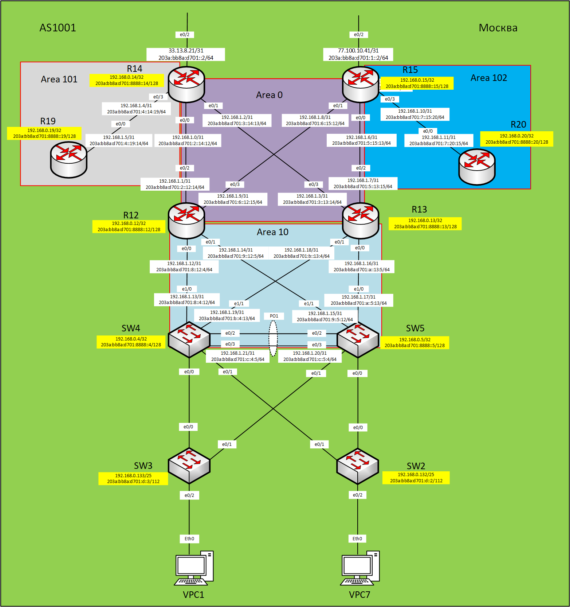

## Практическое задание №6
1. [Настроить маршрутизаторы R14-R15 в зоне 0 - backbone.](https://github.com/Neytrin/Network-ingeneer/blob/main/labs/lab06/readme.md#2-%D0%BD%D0%B0%D1%81%D1%82%D1%80%D0%BE%D0%B8%D0%BC-%D0%BC%D0%B0%D1%80%D1%88%D1%80%D1%83%D1%82%D0%B8%D0%B7%D0%B0%D1%82%D0%BE%D1%80%D1%8B-r12-r13-%D0%B2-%D0%B7%D0%BE%D0%BD%D0%B5-10-%D0%B4%D0%BE%D0%BF%D0%BE%D0%BB%D0%BD%D0%B8%D1%82%D0%B5%D0%BB%D1%8C%D0%BD%D0%BE-%D0%BA-%D0%BC%D0%B0%D1%80%D1%88%D1%80%D1%83%D1%82%D0%B0%D0%BC-%D0%B4%D0%BE%D0%BB%D0%B6%D0%BD%D1%8B-%D0%BF%D0%BE%D0%BB%D1%83%D1%87%D0%B0%D1%82%D1%8C-%D0%BC%D0%B0%D1%80%D1%88%D1%80%D1%83%D1%82-%D0%BF%D0%BE-%D1%83%D0%BC%D0%BE%D0%BB%D1%87%D0%B0%D0%BD%D0%B8%D1%8E)
2. [Настроить маршрутизаторы R12-R13 в зоне 10. Дополнительно к маршрутам должны получать маршрут по умолчанию.](https://github.com/Neytrin/Network-ingeneer/blob/main/labs/lab06/readme.md#2-%D0%BD%D0%B0%D1%81%D1%82%D1%80%D0%BE%D0%B8%D0%BC-%D0%BC%D0%B0%D1%80%D1%88%D1%80%D1%83%D1%82%D0%B8%D0%B7%D0%B0%D1%82%D0%BE%D1%80%D1%8B-r12-r13-%D0%B2-%D0%B7%D0%BE%D0%BD%D0%B5-10-%D0%B4%D0%BE%D0%BF%D0%BE%D0%BB%D0%BD%D0%B8%D1%82%D0%B5%D0%BB%D1%8C%D0%BD%D0%BE-%D0%BA-%D0%BC%D0%B0%D1%80%D1%88%D1%80%D1%83%D1%82%D0%B0%D0%BC-%D0%B4%D0%BE%D0%BB%D0%B6%D0%BD%D1%8B-%D0%BF%D0%BE%D0%BB%D1%83%D1%87%D0%B0%D1%82%D1%8C-%D0%BC%D0%B0%D1%80%D1%88%D1%80%D1%83%D1%82-%D0%BF%D0%BE-%D1%83%D0%BC%D0%BE%D0%BB%D1%87%D0%B0%D0%BD%D0%B8%D1%8E)
3. [Настроить маршрутизатор R19 в зоне 101 и получать только маршрут по умолчанию.](https://github.com/Neytrin/Network-ingeneer/blob/main/labs/lab06/readme.md#2-%D0%BD%D0%B0%D1%81%D1%82%D1%80%D0%BE%D0%B8%D0%BC-%D0%BC%D0%B0%D1%80%D1%88%D1%80%D1%83%D1%82%D0%B8%D0%B7%D0%B0%D1%82%D0%BE%D1%80%D1%8B-r12-r13-%D0%B2-%D0%B7%D0%BE%D0%BD%D0%B5-10-%D0%B4%D0%BE%D0%BF%D0%BE%D0%BB%D0%BD%D0%B8%D1%82%D0%B5%D0%BB%D1%8C%D0%BD%D0%BE-%D0%BA-%D0%BC%D0%B0%D1%80%D1%88%D1%80%D1%83%D1%82%D0%B0%D0%BC-%D0%B4%D0%BE%D0%BB%D0%B6%D0%BD%D1%8B-%D0%BF%D0%BE%D0%BB%D1%83%D1%87%D0%B0%D1%82%D1%8C-%D0%BC%D0%B0%D1%80%D1%88%D1%80%D1%83%D1%82-%D0%BF%D0%BE-%D1%83%D0%BC%D0%BE%D0%BB%D1%87%D0%B0%D0%BD%D0%B8%D1%8E)
4. [Настроить маршрутизатор R20 в зоне 102 и получать все маршруты, кроме маршрутов до сетей зоны 101.](https://github.com/Neytrin/Network-ingeneer/blob/main/labs/lab06/readme.md#2-%D0%BD%D0%B0%D1%81%D1%82%D1%80%D0%BE%D0%B8%D0%BC-%D0%BC%D0%B0%D1%80%D1%88%D1%80%D1%83%D1%82%D0%B8%D0%B7%D0%B0%D1%82%D0%BE%D1%80%D1%8B-r12-r13-%D0%B2-%D0%B7%D0%BE%D0%BD%D0%B5-10-%D0%B4%D0%BE%D0%BF%D0%BE%D0%BB%D0%BD%D0%B8%D1%82%D0%B5%D0%BB%D1%8C%D0%BD%D0%BE-%D0%BA-%D0%BC%D0%B0%D1%80%D1%88%D1%80%D1%83%D1%82%D0%B0%D0%BC-%D0%B4%D0%BE%D0%BB%D0%B6%D0%BD%D1%8B-%D0%BF%D0%BE%D0%BB%D1%83%D1%87%D0%B0%D1%82%D1%8C-%D0%BC%D0%B0%D1%80%D1%88%D1%80%D1%83%D1%82-%D0%BF%D0%BE-%D1%83%D0%BC%D0%BE%D0%BB%D1%87%D0%B0%D0%BD%D0%B8%D1%8E)

### 

Приводим часть схемы лабораторного стенда, на которой будет производится настройка протокола динамической маршрутизации OSPF



Таблица адресов.

| Office | Hostname | Interface              | Description    | IPv4 address  | Subnet mask     | Gateway       | IPv6 address                | IPV6 LLA  |
|--------|----------|------------------------|----------------|---------------|-----------------|---------------|-----------------------------|-----------|
| Москва | R14      | e0/0                   | to_R12         | 192.168.1.0   | 255.255.255.254 |               | 203a:bb8a:d701:2::14:12/64  | FE80::14  |
|        |          | e0/1                   | to_R13         | 192.168.1.2   | 255.255.255.254 |               | 203a:bb8a:d701:3::14:13/64  | FE80::14  |
|        |          | e0/2                   | to_Kitorn      | 33.13.8.21    | 255.255.255.254 |               | 203a:bb8a:d701::2/64        | FE80::14  |
|        |          | e0/3                   | to_R19         | 192.168.1.4   | 255.255.255.254 |               | 203a:bb8a:d701:4::14:19/64  | FE80::14  |
|        |          | Loopback0              |                | 192.168.0.14  | 255.255.255.255 |               | 203a:bb8a:d701:8888::14/128 |           |
|        | R15      | e0/0                   | to_R13         | 192.168.1.6   | 255.255.255.254 |               | 203a:bb8a:d701:5::15:13/64  | FE80::15  |
|        |          | e0/1                   | to_R12         | 192.168.1.8   | 255.255.255.254 |               | 203a:bb8a:d701:6::15:12/64  | FE80::15  |
|        |          | e0/2                   | to_Lamas       | 77.100.10.41  | 255.255.255.254 |               | 203a:bb8a:d701:1::2/64      | FE80::15  |
|        |          | e0/3                   | to_R20         | 192.168.1.10  | 255.255.255.254 |               | 203a:bb8a:d701:7::15:20/64  | FE80::15  |
|        |          | Loopback0              |                | 192.168.0.15  | 255.255.255.255 |               | 203a:bb8a:d701:8888::15/128 |           |
|        | R12      | e0/0                   | to_SW4         | 192.168.1.12  | 255.255.255.254 |               | 203a:bb8a:d701:8::12:4/64   | FE80::12  |
|        |          | e0/1                   | to_SW5         | 192.168.1.14  | 255.255.255.254 |               | 203a:bb8a:d701:9::12:5/64   | FE80::12  |
|        |          | e0/2                   | to_R14         | 192.168.1.1   | 255.255.255.254 |               | 203a:bb8a:d701:2::12:14/64  | FE80::12  |
|        |          | e0/3                   | to_R15         | 192.168.1.9   | 255.255.255.254 |               | 203a:bb8a:d701:6::12:15/64  | FE80::12  |
|        |          | Loopback0              |                | 192.168.0.12  | 255.255.255.255 |               | 203a:bb8a:d701:8888::12/128 |           |
|        | R13      | e0/0                   | to_SW5         | 192.168.1.16  | 255.255.255.254 |               | 203a:bb8a:d701:a::13:5/64   | FE80::13  |
|        |          | e0/1                   | to_SW4         | 192.168.1.18  | 255.255.255.254 |               | 203a:bb8a:d701:b::13:4/64   | FE80::13  |
|        |          | e0/2                   | to_R15         | 192.168.1.7   | 255.255.255.254 |               | 203a:bb8a:d701:5::13:15/64  | FE80::13  |
|        |          | e0/3                   | to_R14         | 192.168.1.3   | 255.255.255.254 |               | 203a:bb8a:d701:3::13:14/64  | FE80::13  |
|        |          | Loopback0              |                | 192.168.0.13  | 255.255.255.255 |               | 203a:bb8a:d701:8888::13/128 |           |
|        | R19      | e0/0                   | to_R14         | 192.168.1.5   | 255.255.255.254 |               | 203a:bb8a:d701:4::19:14/64  | FE80::19  |
|        |          | Loopback0              |                | 192.168.0.19  | 255.255.255.255 |               | 203a:bb8a:d701:8888::19/128 |           |
|        | R20      | e0/0                   | to_R15         | 192.168.1.11  | 255.255.255.254 |               | 203a:bb8a:d701:7::20:15/64  | FE80::20  |
|        |          | Loopback0              |                | 192.168.0.20  | 255.255.255.255 |               | 203a:bb8a:d701:8888::20/128 |           |
|        | SW4      | VLAN10                 | Client1        | 172.16.8.3    | 255.255.255.0   |               | 203a:bb8a:d701:1010::3/64   |           |
|        |          | VLAN20                 | Client7        | 172.16.12.3   | 255.255.255.0   |               | 203a:bb8a:d701:1020::3/64   |           |
|        |          | VLAN99                 | Mgmt_Access_SW | 192.168.0.131 | 255.255.255.128 |               | 203a:bb8a:d701:d::4/112     |           |
|        |          | Port-chanel 1 (e0/2-3) | to_PO1_SW5     | 192.168.1.21  | 255.255.255.254 |               | 203a:bb8a:d701:c::4:5/64    | FE80::4   |
|        |          | e1/0                   | to_R12         | 192.168.1.13  | 255.255.255.254 |               | 203a:bb8a:d701:8::4:12/64   | FE80::4   |
|        |          | e1/1                   | to_R13         | 192.168.1.19  | 255.255.255.254 |               | 203a:bb8a:d701:b::4:13/64   | FE80::4   |
|        |          | VRRP2                  | Client1_ipv4   | 172.16.8.1    | 255.255.255.0   |               |                             |           |
|        |          | VRRP21                 | Client1_ipv6   |               |                 |               |                             | FE80::4:4 |
|        |          | VRRP3                  | Client7_ipv4   | 172.16.12.1   | 255.255.255.0   |               |                             |           |
|        |          | VRRP31                 | Client7_ipv6   |               |                 |               |                             | FE80::4:5 |
|        |          | VRRP1                  | Mgmt_Access_SW | 192.168.0.129 | 255.255.255.128 |               |                             |           |
|        |          | VRRP11                 | Mgmt_Access_SW |               |                 |               |                             | FE80::4:1 |
|        |          | Loopback0              |                | 192.168.0.4   | 255.255.255.255 |               | 203a:bb8a:d701:8888::4/128  |           |
|        | SW5      | VLAN20                 | Client7        | 172.16.8.2    | 255.255.255.0   |               | 203a:bb8a:d701:1020::2/64   |           |
|        |          | VLAN99                 | Mgmt_Access_SW | 192.168.0.130 | 255.255.255.128 |               | 203a:bb8a:d701:d::5/112     |           |
|        |          | VLAN10                 | Client1        | 172.16.12.2   | 255.255.255.0   |               | 203a:bb8a:d701:1010::2/64   |           |
|        |          | Port-chanel 1 (e0/2-3) | to_PO1_SW4     | 192.168.1.20  | 255.255.255.254 |               | 203a:bb8a:d701:c::5:4/64    | FE80::5   |
|        |          | e1/0                   | to_R13         | 192.168.1.17  | 255.255.255.254 |               | 203a:bb8a:d701:a::5:13/64   | FE80::5   |
|        |          | e1/1                   | to_R12         | 192.168.1.15  | 255.255.255.254 |               | 203a:bb8a:d701:9::5:12/64   | FE80::5   |
|        |          | VRRP2                  | Client1_ipv4   | 172.16.8.1    | 255.255.255.0   |               |                             |           |
|        |          | VRRP21                 | Client1_ipv6   |               |                 |               |                             | FE80::4:4 |
|        |          | VRRP3                  | Client7_ipv4   | 172.16.12.1   | 255.255.255.0   |               |                             |           |
|        |          | VRRP31                 | Client7_ipv6   |               |                 |               |                             | FE80::4:5 |
|        |          | VRRP1                  | Mgmt_Access_SW | 192.168.0.129 | 255.255.255.128 |               |                             |           |
|        |          | VRRP11                 | Mgmt_Access_SW |               |                 |               |                             | FE80::4:1 |
|        |          | Loopback0              |                | 192.168.0.5   | 255.255.255.255 |               | 203a:bb8a:d701:8888::5/128  |           |
|        | SW3      | VLAN98                 | Mgmt_SW3       | 192.168.0.133 | 255.255.255.128 | 192.168.0.129 | 203a:bb8a:d701:d::3/112     | FE80::3   |
|        |          | e0/0                   | to_SW4         | NA            | NA              | NA            |                             |           |
|        |          | e0/1                   | to_SW5         | NA            | NA              | NA            |                             |           |
|        |          | e0/2                   | to_VPC1        | NA            | NA              | NA            |                             |           |
|        | SW2      | VLAN99                 | Mgmt_SW2       | 192.168.0.132 | 255.255.255.128 | 192.168.0.129 | 203a:bb8a:d701:d::2/112     | FE80::2   |
|        |          | e0/0                   | to_SW5         | NA            | NA              | NA            |                             |           |
|        |          | e0/1                   | to_SW4         | NA            | NA              | NA            |                             |           |
|        |          | e0/2                   | to_VPC7        | NA            | NA              | NA            |                             |           |
|        | VPC1     | NIC                    |                | DHCP          | DHCP            | DHCP          | SLAAC+DHCPv6                |           |
|        | VPC7     | NIC                    |                | DHCP          | DHCP            | DHCP          | SLAAC+DHCPv6                |           |

Согласно легенды SW4 и SW5 являются L3 коммутаторами

### 1. Настройка маршрутизаторы R14-R15 в зоне 0 - backbone.

Настройку протокола OSPF производим для каждого интерфейса маршрутизаторов 
с помощью команды 
````
R14(config-if)#ip ospf 1 area 0
````
в Area 0 включены 4 маршрутизатора R12, R13, R14 и R15.
Настройка RID не производилась, поэтому в качестве RID будут автоматически назначены адреса 
 Loopback 0 сконфигурированные на каждом из роутеров.
Другие параметры настройки OSPF такие как таймеры, аутентификация и метрики оставлены без изменений,
ввиду отсутствия необходимости в их использовании.

Покажем результат настройки на примере R14


Показаны интерфейсы на которых запущен процесс OSPF


sh ip protocols 


Установлено соседство с роутерами R12, R13


Выводим содержание базы LSDB.


Из которой видно, что существуют пока только типы LSA тип 1 и 2.

Таблица маршрутизации R14 приобрела вид


Добавилось два новых маршрута полученных по протоколу OSPF в сторону 
интерфейсов R15.

### 2. Настроим маршрутизаторы R12-R13 в зоне 10. Дополнительно к маршрутам должны получать маршрут по умолчанию.

Поскольку условились, что SW4 и SW5 являются L3 коммутаторами, то выполним настройку OSPF и на их интерфейсах.
Таким образом R12 и R13 становятся ABR. 
Делаем зону 10 тупиковой (Area тип Stub). Будем помимо маршрутов из Area 0 LSA тип 3, автоматически получать маршруты по умолчанию 
в сторону ABR R12 и R13.

Приведем в качестве примера настройки часть конфигурации SW4.
````
interface Loopback0
 ip address 192.168.0.4 255.255.255.255
 ipv6 address 203A:BB8A:D701:8888::4/128
 ipv6 enable
!
interface Port-channel1
 no switchport
 ip address 192.168.1.21 255.255.255.254
 ip ospf 1 area 10
 ipv6 address FE80::4 link-local
 ipv6 address 203A:BB8A:D701:C::4:5/64
 ipv6 enable
!
interface Ethernet0/0
 description to_SW3
 switchport trunk allowed vlan 10,99
 switchport trunk encapsulation dot1q
 switchport trunk native vlan 999
 switchport mode trunk
!
interface Ethernet0/1
 description to_SW2
 switchport trunk allowed vlan 20,99
 switchport trunk encapsulation dot1q
 switchport trunk native vlan 999
 switchport mode trunk
!
interface Ethernet0/2
 no switchport
 no ip address
 duplex auto
 channel-group 1 mode active
!
interface Ethernet0/3
 no switchport
 no ip address
 duplex auto
 channel-group 1 mode active
!
interface Ethernet1/0
 description to_R12
 no switchport
 ip address 192.168.1.13 255.255.255.254
 ip ospf 1 area 10
 duplex auto
 ipv6 address FE80::4 link-local
 ipv6 address 203A:BB8A:D701:8::4:12/64
 ipv6 enable
!
interface Ethernet1/1
 description to_R13
 no switchport
 ip address 192.168.1.19 255.255.255.254
 ip ospf 1 area 10
 duplex auto
 ipv6 address FE80::4 link-local
 ipv6 address 203A:BB8A:D701:B::4:13/64
 ipv6 enable
!
interface Ethernet1/2
!
interface Ethernet1/3
!
interface Vlan10
 description Client1
 ip address 172.16.8.3 255.255.255.0
 ip ospf 1 area 10
 ipv6 address 203A:BB8A:D701:1010::3/64
 ipv6 nd other-config-flag
 ipv6 dhcp server SW4-Stateless
 vrrp 2 address-family ipv4
  description Client1_ipv4
  priority 150
  address 172.16.8.1 primary
  exit-vrrp
 vrrp 21 address-family ipv6
  description Client1_ipv6
  priority 150
  address FE80::4:4 primary
  exit-vrrp
!
interface Vlan20
 description Client7
 ip address 172.16.12.3 255.255.255.0
 ip ospf 1 area 10
 ipv6 address 203A:BB8A:D701:1020::3/64
 ipv6 nd other-config-flag
 ipv6 dhcp server SW4-Stateless
 vrrp 3 address-family ipv4
  description Client7_ipv4
  address 172.16.12.1 primary
  exit-vrrp
 vrrp 31 address-family ipv6
  description Client7_ipv6
  address FE80::4:5 primary
  exit-vrrp
!
interface Vlan99
 description Mgmt_Access_SW
 ip address 192.168.0.131 255.255.255.128
 ipv6 address 203A:BB8A:D701:D::4/112
 ipv6 enable
 vrrp 1 address-family ipv4
  description Mgmt_Access_SW
  priority 150
  address 192.168.0.129 primary
  exit-vrrp
 vrrp 11 address-family ipv6
  description Mgmt_Access_SW
  priority 150
  address FE80::4:1 primary
  exit-vrrp
!
router ospf 1
 area 10 stub
 passive-interface Vlan10
 passive-interface Vlan20
!
````
Команда passive-interface Vlan10 запрещает отправку Hello пакетов OSPF с указанного интерфейса.

Пару иллюстраций для демонстрации

Отобразим получение маршрутов из Area 0 и маршрутов по умолчанию на SW4.


Отобразим содержание базы LSDB R12, ставшего ABR-ом, но не полностью а только те LSA которые он сам м создал


видны LSA тип 3, что говорит о том что R12 является ABR между Area 0 и 10.

Ну и в завершении выполнения этого пункта, зафиксируем изменение в таблице маршрутизации R14.


Из таблицы видно созданный статический маршрут по умолчанию, а так-же полученные маршруты на клиентские сети 172.16.8.0 и 
172.16.12.0 с одинаковыми метриками (выполнено условие для балансировки трафика).


В случае создания Area 10 как стандарной (тип normal). Заранее настроенные и инжектированные в OSPF маршруты по умолчанию на R14 и R15 поступили на SW4 в LSA тип 5.

### 3. Настроим маршрутизатор R19 в зоне 101 для получения только маршрута по умолчанию.

Для выполнения заданного условия необходимо настроить Area 101 как Totaly stab

Здесь применим другой подход в настройке OSPF на интерфесах R19 и зададим RID вручную.
````
R19(config)#router ospf 1
R19(config-router)#network 192.168.1.5 0.0.0.1 area 101
R19(config-router)#router-id 19.19.19.19
R19(config-router)#area 101 stub
````
Для конфигурации Totaly stub на ABR R14 выполним команду 
````
R14(config-router)#area 101 stub no-summary
````


В подтверждение выполнения условий отобразим таблицу маршрутизации для R19


Кроме маршрута по-умолчанию других маршрутов по OSPF R19 не получает.
А получем этот маршрут со стороны ABR R14 в LSA тип 3.


Таким образом 

### 4. Настроим маршрутизатор R20 в зоне 102 для получения всех маршрутов, кроме маршрутов до сетей зоны 101.

Настроим тип Area 102 как normal.

Покажем доступность интерфейса R19 с помощью утилиты Ping


Определить доступность интерфейса R19 из Area 102 можно так-же по таблице маршрутизации R20 или содержимому базы LSDB R20
Вывод таблицы маршрутизации R20


Вывод содержимого LSDB R20


Настроим фильтрацию LSA тип 3 на ABR R15 на входе в Area 102.
Производить фильтрацию будем с помощью prefix-list

Задаем комвнды 
````
R15(config)#ip prefix-list Deny_Area101 seq 5 deny 192.168.1.4/31
R15(config)#ip prefix-list Deny_Area101 seq 10 permit 0.0.0.0/0 le 32
R15(config)router ospf 1
R15(config-router)#area 102 filter-list prefix Deny_Area101 in
````
Настройка завершена, убедимся что R19 уже не получает маршруты в Area 101 .


Ранее существующие маршруты в сеть  192.168.1.4/31 полученные по протоколу OSPF в LSA тип 3 отсутствуют.

Обратим внимание что R20 получил настроенные на R14 и R15 маршруты по-умолчанию в LSA тип 5.
Таким образом командой _**default-information originate**_ передали не только defsult-route R14 и R15, но и назначили маршрутизаторам роль ASBR

Аналогично выполним настройки OSPFv3 для IPv6.
Приведем для иллюстрации пару примеров без описания в подтверждение выполнения условий задания
Вывод таблицы LSDB R20


Вывод таблицы маршрутизации IPv6 на R20


Очевидно, что получены маршруты в том числе и до клиентских сетей.
````
OI  203A:BB8A:D701:1010::/64 [110/31]
     via FE80::15, Ethernet0/0
OI  203A:BB8A:D701:1020::/64 [110/31]
     via FE80::15, Ethernet0/0
````
Настройки оборудование приведены [здесь](https://github.com/Neytrin/Network-ingeneer/blob/9cd66e11633d272ea44bf2e241d982531b324ee9/labs/lab06/Config)

