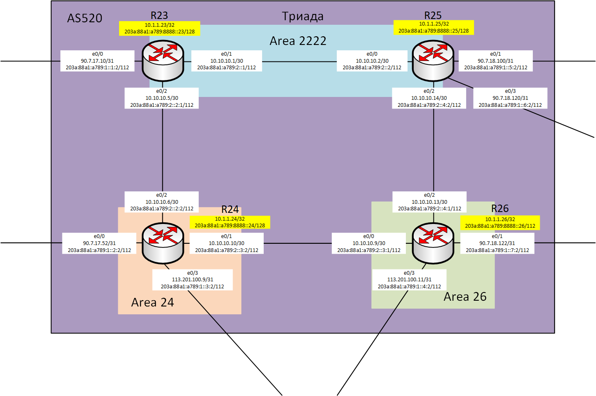

## Практическое задание №7
Настроить IS-IS в ISP Триада.

1. [Настроить маршрутизаторы R23 и R25 в зоне 2222.]()
2. [Настроить маршрутизатор R24 в зоне 24.]()
3. [Настроить маршрутизатор R26 в зоне 26.]()

Настройка осуществляется одновременно для IPv4 и IPv6.

Отобразим фрагмент лабораторного стенда на котором будет произведена настройка протокола динамической маршрутизации IS-IS.


Таблица маршрутизации

| Office | Hostname | Interface | Description   | IPv4 address   | Subnet mask     | Gateway | IPv6 address                | IPV6 LLA |
|--------|----------|-----------|---------------|----------------|-----------------|---------|-----------------------------|----------|
| Триада | R23      | e0/0      | to_Kitorn     | 90.7.17.10     | 255.255.255.254 |         | 203a:88a1:a789:1::1:2/112   | FE80::23 |
|        |          | e0/1      | to_R25        | 10.10.10.1     | 255.255.255.252 |         | 203a:88a1:a789:2::1/112     | FE80::23 |
|        |          | e0/2      | to_R24        | 10.10.10.5     | 255.255.255.252 |         | 203a:88a1:a789:2::2:1/112   | FE80::23 |
|        |          | Loopback0 |               | 10.1.1.23      | 255.255.255.255 |         | 203a:88a1:a789:8888::23/128 |          |
|        | R24      | e0/0      | to_Lamas      | 90.7.17.52     | 255.255.255.254 |         | 203a:88a1:a789:1::2:2/112   | FE80::24 |
|        |          | e0/1      | to_R26        | 10.10.10.10    | 255.255.255.252 |         | 203a:88a1:a789:2::3:2/112   | FE80::24 |
|        |          | e0/2      | to_R23        | 10.10.10.6     | 255.255.255.252 |         | 203a:88a1:a789:2::2:2/112   | FE80::24 |
|        |          | e0/3      | to_SPeterburg | 113.201.100.9  | 255.255.255.254 |         | 203a:88a1:a789:1::3:2/112   | FE80::24 |
|        |          | Loopback0 |               | 10.1.1.24      | 255.255.255.255 |         | 203a:88a1:a789:8888::24/128 |          |
|        | R25      | e0/0      | to_R23        | 10.10.10.2     | 255.255.255.252 |         | 203a:88a1:a789:2::2/112     | FE80::25 |
|        |          | e0/1      | to_Labutnangi | 90.7.18.100    | 255.255.255.254 |         | 203a:88a1:a789:1::5:2/112   | FE80::25 |
|        |          | e0/2      | to_R26        | 10.10.10.14    | 255.255.255.252 |         | 203a:88a1:a789:2::4:2/112   | FE80::25 |
|        |          | e0/3      | to_Chokurdak  | 90.7.18.120    | 255.255.255.254 |         | 203a:88a1:a789:1::6:2/112   | FE80::25 |
|        |          | Loopback0 |               | 10.1.1.25      | 255.255.255.255 |         | 203a:88a1:a789:8888::25/128 |          |
|        | R26      | e0/0      | to_R24        | 10.10.10.9     | 255.255.255.252 |         | 203a:88a1:a789:2::3:1/112   | FE80::26 |
|        |          | e0/1      | to_Chokurdak  | 90.7.18.122    | 255.255.255.254 |         | 203a:88a1:a789:1::7:2/112   | FE80::26 |
|        |          | e0/2      | to_R25        | 10.10.10.13    | 255.255.255.252 |         | 203a:88a1:a789:2::4:1/112   | FE80::26 |
|        |          | e0/3      | to_SPeterburg | 113.201.100.11 | 255.255.255.254 |         | 203a:88a1:a789:1::4:2/112   | FE80::26 |
|        |          | Loopback0 |               | 10.1.1.26      | 255.255.255.255 |         | 203a:88a1:a789:8888::26/112 |          |

### Настроить маршрутизаторы R23 и R25 в зоне 2222.

Используем смешанный тип уровня отношений L1-2 между R23 и R25.
Покажем принцип настройки протокола IS-IS на примере маршрутизатора R3
````
R23(config)#router isis Area2222
R23(config-router)#net 49.2222.0100.0100.1023.00
R23(config-router)#passive-interface Loopback0
R23(config-router)#passive-interface e0/0
````
При запуске процесса IS-IS было присвоено имя Area2222, можно было не делать, поскольку более одного процесса на маршрутизаторе не планировалось.
В качестве System identifier выбран IPv4 адрес Loopback 0 R23.
И объявлены два интерфеса passive-interface. Их состояние отслеживается и анонсятся протоколом IS-IS, но не участвуют в рассылке Hello пакетов IS-IS.

Теперь запустим процесс IS-IS на интерфейсах e0/1 и e0/2 R23
````
R23(config)#interface range e0/1-2
R23(config-if-range)#ip router isis Area2222
R23(config-if-range)#ipv6 router isis Area2222
````
После выполнения настроек на R25 проверим состояние соседства между R23 и R25, содержание базы данных IS-IS и таблицы маршрутизации на R23.


По протоколу по Level 1 IS-IS получены маршруты со стороны R25.

Интересная команда _**sh isis database verbose**_ - выводит подробную информацию о содержании базы данных.


2. Настроить маршрутизатор R24 в зоне 24.
Выполним настройки с использованием уровня отношений L2.
Покажем часть конфигурации мапршрутизатора R24 касатено настройки процесса IS-IS.
````
!
router isis
 net 49.0024.0100.0100.1024.00
 is-type level-2-only
 passive-interface Ethernet0/0
 passive-interface Ethernet0/3
 passive-interface Loopback0
!
````
и конфигурацию интерфейсов принимающих в нем участие.
````
!
interface Ethernet0/1
 description to_R26
 ip address 10.10.10.10 255.255.255.252
 ip router isis
 ipv6 address FE80::24 link-local
 ipv6 address 203A:88A1:A789:2::3:2/112
 ipv6 enable
 ipv6 router isis
!
interface Ethernet0/2
 description to_R23
 ip address 10.10.10.6 255.255.255.252
 ip router isis
 ipv6 address FE80::24 link-local
 ipv6 address 203A:88A1:A789:2::2:2/112
 ipv6 enable
 ipv6 router isis
!
````
3. Настроить маршрутизатор R26 в зоне 26.

При настройке IS-IS намеренно оставлена настройка отношений смешанного типа L1-2 используемая по-умолчанию.
Цель - показать что в приведенной топологии сети настройку уровня отношений можно было и не делать.
В итоге состояние соседства между маршрутизаторами будет приведена к виду как и при явной настройке отношений.
````
R26#sh run | sec isi
 ip router isis
 ipv6 router isis
 ip router isis
 ipv6 router isis
router isis
 net 49.0026.0100.0100.1026.00
 passive-interface Ethernet0/1
 passive-interface Ethernet0/3
 passive-interface Loopback0
R26#
````
На этом базовая настройка IS-IS завершена
Проверяем что в итоге получили.

Покажем соседей на R26


Выводим запущенные протолы IP маршрутизации на R23


Покажем таблицу маршрутизации на R23


Отобразим топологию сети как ее видит R23


Содержание базы данных IS-IS R23
````
R23#sh isis database

Tag Area2222:
IS-IS Level-1 Link State Database:
LSPID                 LSP Seq Num  LSP Checksum  LSP Holdtime      ATT/P/OL
R23.00-00           * 0x00000012   0x8517        467               1/0/0
R23.01-00           * 0x0000000E   0xE594        913               0/0/0
R25.00-00             0x00000017   0x6CFB        1110              1/0/0
IS-IS Level-2 Link State Database:
LSPID                 LSP Seq Num  LSP Checksum  LSP Holdtime      ATT/P/OL
R23.00-00           * 0x00000017   0xAA2B        734               0/0/0
R23.01-00           * 0x0000000D   0x778C        599               0/0/0
R23.02-00           * 0x00000007   0x63A6        1004              0/0/0
R24.00-00             0x0000000F   0xA88F        1119              0/0/0
R25.00-00             0x00000018   0x8F4F        1066              0/0/0
R25.02-00             0x00000006   0xA361        1062              0/0/0
R26.00-00             0x0000000F   0x9175        891               0/0/0
R26.02-00             0x00000006   0x778D        1034              0/0/0
R23#sh isis database det
R23#sh isis database detail

Tag Area2222:
IS-IS Level-1 Link State Database:
LSPID                 LSP Seq Num  LSP Checksum  LSP Holdtime      ATT/P/OL
R23.00-00           * 0x00000012   0x8517        454               1/0/0
  Area Address: 49.2222
  NLPID:        0xCC 0x8E
  Hostname: R23
  IP Address:   10.1.1.23
  Metric: 10         IP 10.10.10.0 255.255.255.252
  Metric: 10         IP 10.10.10.4 255.255.255.252
  Metric: 0          IP 10.1.1.23 255.255.255.255
  Metric: 0          IP 90.7.17.10 255.255.255.254
  IPv6 Address: 203A:88A1:A789:8888::23
  Metric: 0          IPv6 203A:88A1:A789:1::1:0/112
  Metric: 10         IPv6 203A:88A1:A789:2::/112
  Metric: 10         IPv6 203A:88A1:A789:2::2:0/112
  Metric: 0          IPv6 203A:88A1:A789:8888::23/128
  Metric: 10         IS R23.01
R23.01-00           * 0x0000000E   0xE594        900               0/0/0
  Metric: 0          IS R23.00
  Metric: 0          IS R25.00
R25.00-00             0x00000017   0x6CFB        1097              1/0/0
  Area Address: 49.2222
  NLPID:        0xCC 0x8E
  Hostname: R25
  IP Address:   10.1.1.25
  Metric: 10         IP 10.10.10.0 255.255.255.252
  Metric: 10         IP 10.10.10.12 255.255.255.252
  Metric: 0          IP 10.1.1.25 255.255.255.255
  Metric: 0          IP 90.7.18.100 255.255.255.254
  Metric: 0          IP 90.7.18.120 255.255.255.254
  IPv6 Address: 203A:88A1:A789:8888::25
  Metric: 10         IPv6 203A:88A1:A789:2::/112
  Metric: 0          IPv6 203A:88A1:A789:1::5:0/112
  Metric: 10         IPv6 203A:88A1:A789:2::4:0/112
  Metric: 0          IPv6 203A:88A1:A789:1::6:0/112
  Metric: 0          IPv6 203A:88A1:A789:8888::25/128
  Metric: 10         IS R23.01
IS-IS Level-2 Link State Database:
LSPID                 LSP Seq Num  LSP Checksum  LSP Holdtime      ATT/P/OL
R23.00-00           * 0x00000017   0xAA2B        721               0/0/0
  Area Address: 49.2222
  NLPID:        0xCC 0x8E
  Hostname: R23
  IP Address:   10.1.1.23
  IPv6 Address: 203A:88A1:A789:8888::23
  Metric: 10         IS R23.02
  Metric: 10         IS R23.01
  Metric: 0          IP 10.1.1.23 255.255.255.255
  Metric: 10         IP 10.1.1.25 255.255.255.255
  Metric: 10         IP 10.10.10.0 255.255.255.252
  Metric: 10         IP 10.10.10.4 255.255.255.252
  Metric: 20         IP 10.10.10.12 255.255.255.252
  Metric: 0          IP 90.7.17.10 255.255.255.254
  Metric: 10         IP 90.7.18.100 255.255.255.254
  Metric: 10         IP 90.7.18.120 255.255.255.254
  Metric: 0          IPv6 203A:88A1:A789:1::1:0/112
  Metric: 10         IPv6 203A:88A1:A789:2::/112
  Metric: 10         IPv6 203A:88A1:A789:2::2:0/112
  Metric: 0          IPv6 203A:88A1:A789:8888::23/128
  Metric: 10         IPv6 203A:88A1:A789:1::5:0/112
  Metric: 10         IPv6 203A:88A1:A789:1::6:0/112
  Metric: 20         IPv6 203A:88A1:A789:2::4:0/112
  Metric: 10         IPv6 203A:88A1:A789:8888::25/128
R23.01-00           * 0x0000000D   0x778C        586               0/0/0
  Metric: 0          IS R23.00
  Metric: 0          IS R25.00
R23.02-00           * 0x00000007   0x63A6        991               0/0/0
  Metric: 0          IS R23.00
  Metric: 0          IS R24.00
R24.00-00             0x0000000F   0xA88F        1106              0/0/0
  Area Address: 49.0024
  NLPID:        0xCC 0x8E
  Hostname: R24
  IP Address:   10.1.1.24
  IPv6 Address: 203A:88A1:A789:8888::24
  Metric: 10         IS R23.02
  Metric: 10         IS R26.02
  Metric: 0          IP 10.1.1.24 255.255.255.255
  Metric: 10         IP 10.10.10.4 255.255.255.252
  Metric: 10         IP 10.10.10.8 255.255.255.252
  Metric: 0          IP 90.7.17.52 255.255.255.254
  Metric: 0          IP 113.201.100.8 255.255.255.254
  Metric: 0          IPv6 203A:88A1:A789:1::2:0/112
  Metric: 10         IPv6 203A:88A1:A789:2::3:0/112
  Metric: 10         IPv6 203A:88A1:A789:2::2:0/112
  Metric: 0          IPv6 203A:88A1:A789:1::3:0/112
  Metric: 0          IPv6 203A:88A1:A789:8888::24/128
R25.00-00             0x00000018   0x8F4F        1053              0/0/0
  Area Address: 49.2222
  NLPID:        0xCC 0x8E
  Hostname: R25
  IP Address:   10.1.1.25
  IPv6 Address: 203A:88A1:A789:8888::25
  Metric: 10         IS R25.02
  Metric: 10         IS R23.01
  Metric: 10         IP 10.1.1.23 255.255.255.255
  Metric: 0          IP 10.1.1.25 255.255.255.255
  Metric: 10         IP 10.10.10.0 255.255.255.252
  Metric: 20         IP 10.10.10.4 255.255.255.252
  Metric: 10         IP 10.10.10.12 255.255.255.252
  Metric: 10         IP 90.7.17.10 255.255.255.254
  Metric: 0          IP 90.7.18.100 255.255.255.254
  Metric: 0          IP 90.7.18.120 255.255.255.254
  Metric: 10         IPv6 203A:88A1:A789:2::/112
  Metric: 0          IPv6 203A:88A1:A789:1::5:0/112
  Metric: 10         IPv6 203A:88A1:A789:2::4:0/112
  Metric: 0          IPv6 203A:88A1:A789:1::6:0/112
  Metric: 0          IPv6 203A:88A1:A789:8888::25/128
  Metric: 10         IPv6 203A:88A1:A789:1::1:0/112
  Metric: 20         IPv6 203A:88A1:A789:2::2:0/112
  Metric: 10         IPv6 203A:88A1:A789:8888::23/128
R25.02-00             0x00000006   0xA361        1049              0/0/0
  Metric: 0          IS R25.00
  Metric: 0          IS R26.00
R26.00-00             0x0000000F   0x9175        879               0/0/0
  Area Address: 49.0026
  NLPID:        0xCC 0x8E
  Hostname: R26
  IP Address:   10.1.1.26
  IPv6 Address: 203A:88A1:A789:8888::26
  Metric: 10         IS R26.02
  Metric: 10         IS R25.02
  Metric: 0          IP 10.1.1.26 255.255.255.255
  Metric: 10         IP 10.10.10.8 255.255.255.252
  Metric: 10         IP 10.10.10.12 255.255.255.252
  Metric: 0          IP 90.7.18.122 255.255.255.254
  Metric: 0          IP 113.201.100.10 255.255.255.254
  Metric: 10         IPv6 203A:88A1:A789:2::3:0/112
  Metric: 0          IPv6 203A:88A1:A789:1::7:0/112
  Metric: 10         IPv6 203A:88A1:A789:2::4:0/112
  Metric: 0          IPv6 203A:88A1:A789:1::4:0/112
  Metric: 0          IPv6 203A:88A1:A789:8888::/112
R26.02-00             0x00000006   0x778D        1021              0/0/0
  Metric: 0          IS R26.00
  Metric: 0          IS R24.00
R23#
````
В заверешении проверим утилитой Ping доступность интерфейса Loopback0 R26


Все изменения в настройки конфигурации оборудования [здесь](https://github.com/Neytrin/Network-ingeneer/blob/bd5cb12344e4b37e53685b7bc7297b7993e83454/labs/lab07/Configs)