## Практическое задание №8

1. Настроить EIGRP в офисе С.-Петербург.
2. Настроить R32 для получения только маршрута по умолчанию.
3. Настроить R16-17 для анонсирования только суммарных префиксов.

Использовать EIGRP named-mode для настройки сети.
Настройка осуществляется одновременно для IPv4 и IPv6.

Приведена схема части лабораторного стенда для офиса С-Петербург.   

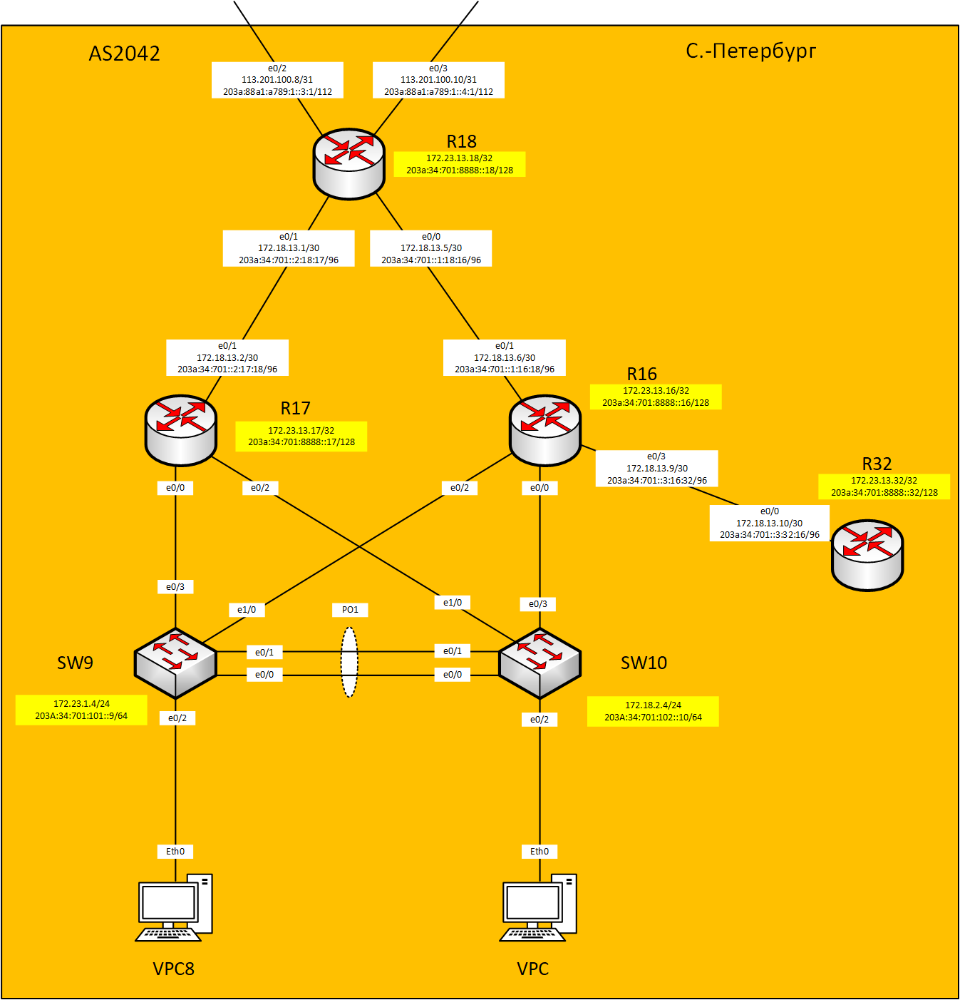

Таблица адресов.

| Office      | Hostname | Interface | Description | IPv4 address   | Subnet mask     | Gateway    | IPv6 address              | IPV6 LLA     |
|-------------|----------|-----------|-------------|----------------|-----------------|------------|---------------------------|--------------|
| С-Петербург | R18      | e0/0      | to_R16      | 172.18.13.5    | 255.255.255.252 |            | 203a:34:701::1:18:16/96   | FE80::18     |
|             |          | e0/1      | to_R17      | 172.18.13.1    | 255.255.255.252 |            | 203a:34:701::2:18:17/96   | FE80::18     |
|             |          | e0/2      | to_Triada24 | 113.201.100.8  | 255.255.255.254 |            | 203a:88a1:a789:1::3:1/112 | FE80::18     |
|             |          | e0/3      | to_Triada26 | 113.201.100.10 | 255.255.255.254 |            | 203a:88a1:a789:1::4:1/112 | FE80::18     |
|             |          | Loopback0 |             | 172.23.13.18   | 255.255.255.255 |            | 203a:34:701:8888::18/128  |              |
|             | R17      | e0/0.101  | Client9     | 172.18.1.3     | 255.255.255.0   |            | 203a:34:701:101::2/64     | FE80::17:101 |
|             |          | e0/1      | to_R18      | 172.18.13.2    | 255.255.255.252 |            | 203a:34:701::2:17:18/96   | FE80::17     |
|             |          | e0/2.102  | Client10    | 172.18.2.3     | 255.255.255.0   |            | 203a:34:701:102::2/64     | FE80::17:102 |
|             |          | HSRP1     | Client9v4   | 172.18.1.1     |                 |            |                           |              |
|             |          | HSRP2     | Client10v4  | 172.18.2.1     |                 |            |                           |              |
|             |          | HSRP3     | Client9v6   |                |                 |            | 203a:34:701:101::1/64     | FE80::17:3   |
|             |          | HSRP4     | Client10v6  |                |                 |            | 203a:34:701:102::1/64     | FE80::17:4   |
|             |          | Loopback0 |             | 172.23.13.17   | 255.255.255.255 |            | 203a:34:701:8888::17/128  |              |
|             | R16      | e0/0.102  | Client10    | 172.18.2.2     | 255.255.255.0   |            | 203a:34:701:102::3/64     | FE80::16:102 |
|             |          | e0/1      | to_R18      | 172.18.13.6    | 255.255.255.252 |            | 203a:34:701::1:16:18/96   | FE80::16     |
|             |          | e0/2.101  | Client9     | 172.18.1.2     | 255.255.255.0   |            | 203a:34:701:101::3/64     | FE80::16:101 |
|             |          | e0/3      | to_R32      | 172.18.13.9    | 255.255.255.252 |            | 203a:34:701::3:16:32/96   | FE80::16     |
|             |          | HSRP1     | Client9v4   | 172.18.1.1     |                 |            |                           |              |
|             |          | HSRP2     | Client10v4  | 172.18.2.1     |                 |            |                           |              |
|             |          | HSRP3     | Client9v6   |                |                 |            | 203a:34:701:101::1/64     | FE80::17:3   |
|             |          | HSRP4     | Client10v6  |                |                 |            | 203a:34:701:102::1/64     | FE80::17:4   |
|             |          | Loopback0 |             | 172.23.13.16   | 255.255.255.255 |            | 203a:34:701:8888::16/128  |              |
|             | R32      | e0/0      | to_R16      | 172.18.13.10   | 255.255.255.252 |            | 203a:34:701::3:32:16/96   | FE80::32     |
|             |          | Loopback0 |             | 172.23.13.32   | 255.255.255.255 |            | 203a:34:701:8888::32/128  |              |
|             | SW9      | e0/0      | PO1_to_SW10 | NA             | NA              | NA         |                           |              |
|             |          | e0/1      | PO1_to_SW10 | NA             | NA              | NA         |                           |              |
|             |          | e0/2      | to_VPC8     | NA             | NA              | NA         |                           |              |
|             |          | e0/3      | to_R17      | NA             | NA              | NA         |                           |              |
|             |          | e1/0      | to_R16      | NA             | NA              | NA         |                           |              |
|             |          | VLAN101   | Mgmt_SW9    | 172.18.1.4     | 255.255.255.0   | 172.18.1.1 | 203a:34:701:101::9/64     |              |
|             | SW10     | e0/0      | PO1_to_SW10 | NA             | NA              | NA         |                           |              |
|             |          | e0/1      | PO1_to_SW10 | NA             | NA              | NA         | `                         |              |
|             |          | e0/2      | to_VPC      | NA             | NA              | NA         |                           |              |
|             |          | e0/3      | to_R16      | NA             | NA              | NA         |                           |              |
|             |          | e1/0      | to_R17      | NA             | NA              | NA         |                           |              |
|             |          | VLAN102   | Mgmt_SW10   | 172.18.2.4     | 255.255.255.0   | 172.18.2.1 | 203a:34:701:102::10/64    |              |
|             | VPC8     | NIC       |             | DHCP           | DHCP            | DHCP       | SLAAC                     |              |
|             | VPC      | NIC       |             | DHCP           | DHCP            | DHCP       | SLAAC                     |              |

1. Настроим EIGRP в офисе С.-Петербург.

Здесь для всех роутеров в качестве router-ID процесса EIGRP назначены вручную 32 битные идентификаторы совпадающие с IPv4 адресами интерфейсов Loopback0.
На портах участвующих в формировании соседских отнощений процесса EIGRP между роутерами домена настроим аутентификацию. 

Пример настройки приведем на примере R17

Создаем ключевую цепочку с названием EIGRP

````
key chain EIGRP
 key 1
  key-string 7 072C285F4D0659
  cryptographic-algorithm hmac-sha-256
````
Настройка EIGRP в именованном режиме для IPv4 и IPv6.

````
router eigrp SPB
 !
 address-family ipv4 unicast autonomous-system 1
  !
  af-interface Ethernet0/0.101
   passive-interface
  exit-af-interface
  !
  af-interface Ethernet0/2.102
   passive-interface
  exit-af-interface
  !
  af-interface Ethernet0/1
   authentication mode hmac-sha-256 7 01100F175804
   authentication key-chain EIGRP
  exit-af-interface
  !
  topology base
  exit-af-topology
  network 172.18.0.0 0.0.3.255
  network 172.18.13.0 0.0.0.3
  network 172.23.13.17 0.0.0.0
  eigrp router-id 172.23.13.17
 exit-address-family
 !
 address-family ipv6 unicast autonomous-system 1
  !
  af-interface Ethernet0/1
   authentication mode hmac-sha-256 7 110A1016141D
   authentication key-chain EIGRP
  exit-af-interface
  !
  af-interface Ethernet0/0.101
   passive-interface
  exit-af-interface
  !
  af-interface Ethernet0/2.102
   passive-interface
  exit-af-interface
  !
  topology base
  exit-af-topology
  eigrp router-id 172.23.13.17
 exit-address-family
````

Отобразим результаты настройки на примере R17

Просмотр роутеров с которыми установлено соседство

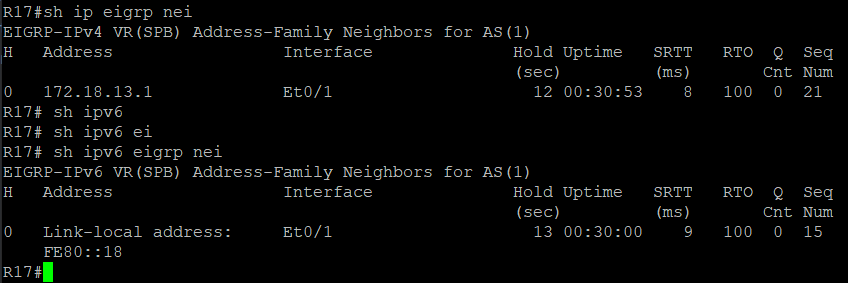

Вывод настройки протокола динамической маршрутизации
````
R17# sh ip protocols
*** IP Routing is NSF aware ***

Routing Protocol is "application"
  Sending updates every 0 seconds
  Invalid after 0 seconds, hold down 0, flushed after 0
  Outgoing update filter list for all interfaces is not set
  Incoming update filter list for all interfaces is not set
  Maximum path: 32
  Routing for Networks:
  Routing Information Sources:
    Gateway         Distance      Last Update
  Distance: (default is 4)

Routing Protocol is "eigrp 1"
  Outgoing update filter list for all interfaces is not set
  Incoming update filter list for all interfaces is not set
  Default networks flagged in outgoing updates
  Default networks accepted from incoming updates
  EIGRP-IPv4 VR(SPB) Address-Family Protocol for AS(1)
    Metric weight K1=1, K2=0, K3=1, K4=0, K5=0 K6=0
    Metric rib-scale 128
    Metric version 64bit
    NSF-aware route hold timer is 240
    Router-ID: 172.23.13.17
    Topology : 0 (base)
      Active Timer: 3 min
      Distance: internal 90 external 170
      Maximum path: 4
      Maximum hopcount 100
      Maximum metric variance 1
      Total Prefix Count: 9
      Total Redist Count: 0

  Automatic Summarization: disabled
  Maximum path: 4
  Routing for Networks:
    172.18.0.0/22
    172.18.13.0/30
    172.23.13.17/32
  Passive Interface(s):
    Ethernet0/0.101
    Ethernet0/2.102
  Routing Information Sources:
    Gateway         Distance      Last Update
    172.18.13.1           90      00:13:20
  Distance: internal 90 external 170

R17#
````
Просмотр топологии EIGRP

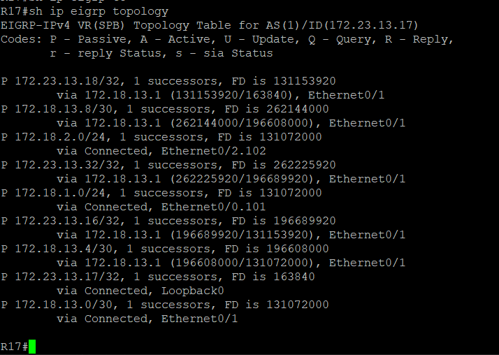


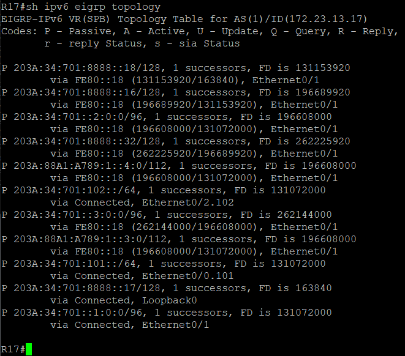

Покажем какие маршруты в таблице маршрутизации были получены по алгоритму DUAL EIGRP


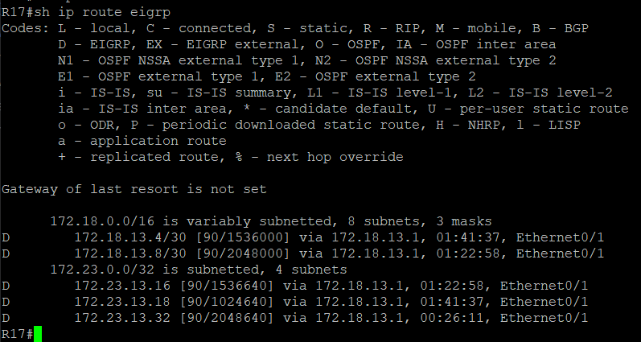

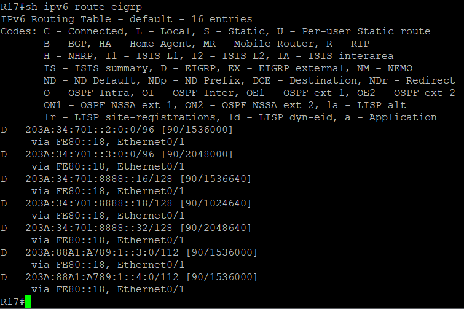

На роутере R18 настроим маршруты по умолчанию

````
R18(config)#ip route 0.0.0.0 0.0.0.0 113.201.100.9
R18(config)#ip route 0.0.0.0 0.0.0.0 113.201.100.11
R18(config)#ipv6 route ::/0 203a:88a1:a789:1::3:2
R18(config)#ipv6 route ::/0 203a:88a1:a789:1::4:2
````
И проведем редистрибьюцию этих статических маршрутов по протоколу EIGRP командой **_redistribute static_**

Проверим изменения в таблице маршрутизации IPv4 для EIGRP

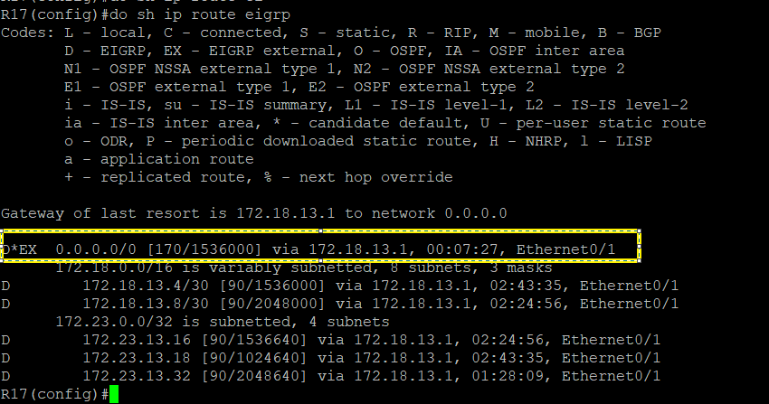
  
и для IPv6    
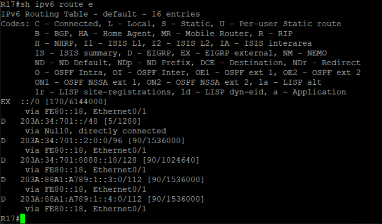

Редистрибьюция статического маршрута для IPv6 в протоколe EIGRP не произошла.
Тогда попробуем на R18 передать суммарный марщрут по-умолчанию на интерфейсах в сторону соседей.

````
R18(config-router-af-interface)#summary-address ::/0
````
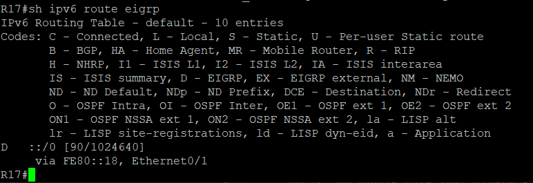  

### 2. Настроить сеть так, что-бы R32 получал только маршрут по умолчанию.

Все настройки будут производится на R16. Применим фильтрацию маршрута на выходе интерфейса в сторону R32.

````
R16(config)#ip prefix-list DEFv4_R32 permit 0.0.0.0/0
R16(config)#ipv6 prefix-list DEFv6_R32 seq 5 permit ::/0

R16(config-router-af-topology)#distribute-list prefix-list DEFv4_R32 out e0/3
R16(config-router-af-topology)#distribute-list prefix-list DEFv6_R32 out e0/3
````


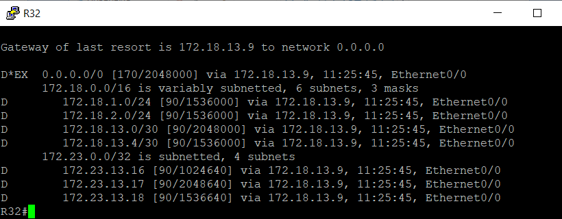
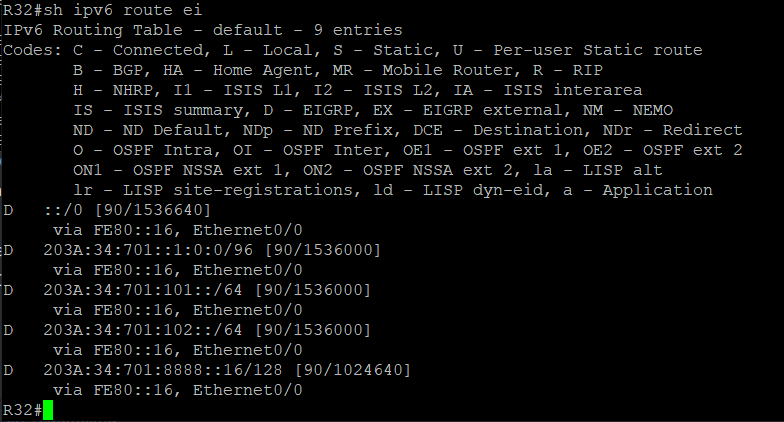

Отобразим cостояние после фильтрации маршрутов на выходе интерфейса e0/3 R16.

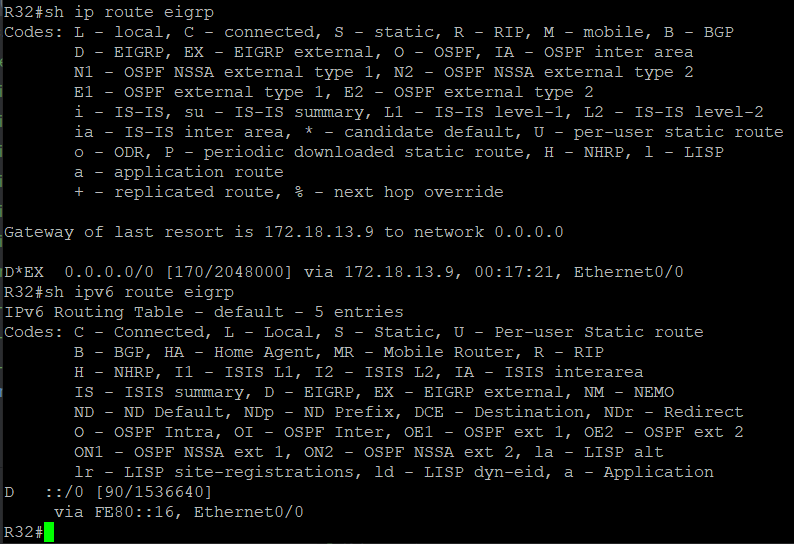

Как видим по протоколу EIGRP R32 получил только маршруты по умолчанию.

### 3. Настроим R16-17 для анонсирования только суммарных префиксов.

Для выполнения этого условия потребуется настроить суммаризацию маршрутов EIGRP 
для интерфейсов e0/1 R16 и R17.
Задаем команды на примере R17
````
R17(config-router-af-interface)#summary-address 172.16.0.0 255.240.0.0
R17(config-router-af-interface)#summary-address 203A:34:701::/48
````
Проверку производим на R18

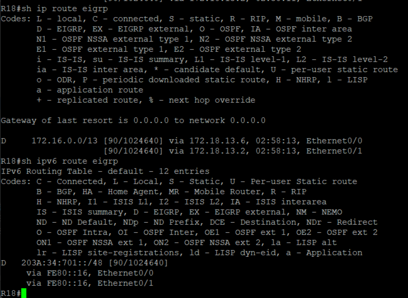


