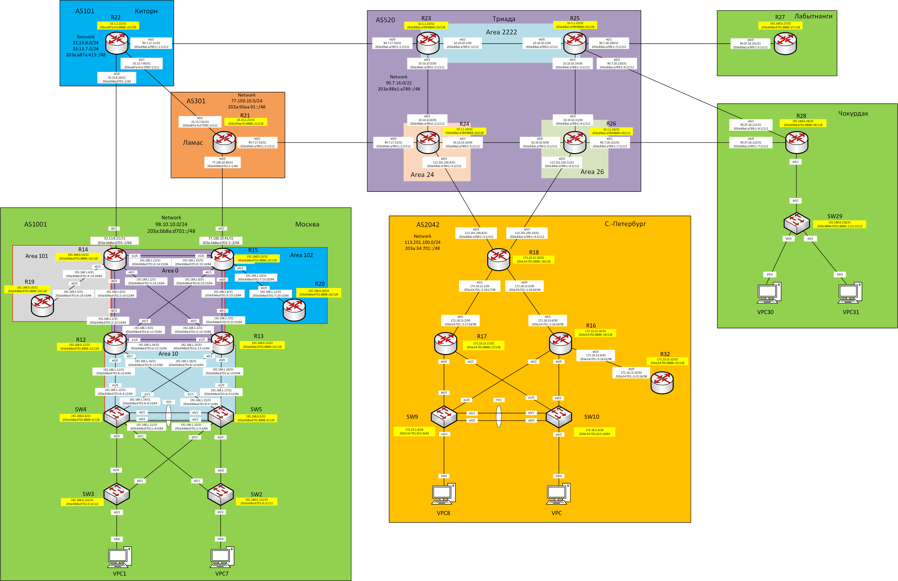

## Практическое задание №9

1. [Настроить eBGP между офисом Москва и двумя провайдерами - Киторн и Ламас.](https://github.com/Neytrin/Network-ingeneer/blob/main/labs/lab09/readme.md#1-%D0%BD%D0%B0%D1%81%D1%82%D1%80%D0%BE%D0%B8%D1%82%D1%8C-ebgp-%D0%BC%D0%B5%D0%B6%D0%B4%D1%83-%D0%BE%D1%84%D0%B8%D1%81%D0%BE%D0%BC-%D0%BC%D0%BE%D1%81%D0%BA%D0%B2%D0%B0-%D0%B8-%D0%B4%D0%B2%D1%83%D0%BC%D1%8F-%D0%BF%D1%80%D0%BE%D0%B2%D0%B0%D0%B9%D0%B4%D0%B5%D1%80%D0%B0%D0%BC%D0%B8---%D0%BA%D0%B8%D1%82%D0%BE%D1%80%D0%BD-%D0%B8-%D0%BB%D0%B0%D0%BC%D0%B0%D1%81)
2. [Настроить eBGP между провайдерами Киторн и Ламас.](https://github.com/Neytrin/Network-ingeneer/blob/main/labs/lab09/readme.md#2-%D0%BD%D0%B0%D1%81%D1%82%D1%80%D0%BE%D0%B8%D1%82%D1%8C-ebgp-%D0%BC%D0%B5%D0%B6%D0%B4%D1%83-%D0%BF%D1%80%D0%BE%D0%B2%D0%B0%D0%B9%D0%B4%D0%B5%D1%80%D0%B0%D0%BC%D0%B8-%D0%BA%D0%B8%D1%82%D0%BE%D1%80%D0%BD-%D0%B8-%D0%BB%D0%B0%D0%BC%D0%B0%D1%81)
3. [Настроить eBGP между Ламас и Триада.](https://github.com/Neytrin/Network-ingeneer/blob/main/labs/lab09/readme.md#3-%D0%BD%D0%B0%D1%81%D1%82%D1%80%D0%BE%D0%B8%D1%82%D1%8C-ebgp-%D0%BC%D0%B5%D0%B6%D0%B4%D1%83-%D0%BB%D0%B0%D0%BC%D0%B0%D1%81-%D0%B8-%D1%82%D1%80%D0%B8%D0%B0%D0%B4%D0%B0)
4. [Настроить eBGP между офисом С.-Петербург и провайдером Триада.](https://github.com/Neytrin/Network-ingeneer/blob/main/labs/lab09/readme.md#4-%D0%BD%D0%B0%D1%81%D1%82%D1%80%D0%BE%D0%B8%D1%82%D1%8C-ebgp-%D0%BC%D0%B5%D0%B6%D0%B4%D1%83-%D0%BE%D1%84%D0%B8%D1%81%D0%BE%D0%BC-%D1%81-%D0%BF%D0%B5%D1%82%D0%B5%D1%80%D0%B1%D1%83%D1%80%D0%B3-%D0%B8-%D0%BF%D1%80%D0%BE%D0%B2%D0%B0%D0%B9%D0%B4%D0%B5%D1%80%D0%BE%D0%BC-%D1%82%D1%80%D0%B8%D0%B0%D0%B4%D0%B0)
5. [Организовать IP доступность между пограничным роутерами офисов Москва и С.-Петербург.](https://github.com/Neytrin/Network-ingeneer/blob/main/labs/lab09/readme.md#5-%D0%BE%D1%80%D0%B3%D0%B0%D0%BD%D0%B8%D0%B7%D0%BE%D0%B2%D0%B0%D1%82%D1%8C-ip-%D0%B4%D0%BE%D1%81%D1%82%D1%83%D0%BF%D0%BD%D0%BE%D1%81%D1%82%D1%8C-%D0%BC%D0%B5%D0%B6%D0%B4%D1%83-%D0%BF%D0%BE%D0%B3%D1%80%D0%B0%D0%BD%D0%B8%D1%87%D0%BD%D1%8B%D0%BC-%D1%80%D0%BE%D1%83%D1%82%D0%B5%D1%80%D0%B0%D0%BC%D0%B8-%D0%BE%D1%84%D0%B8%D1%81%D0%BE%D0%B2-%D0%BC%D0%BE%D1%81%D0%BA%D0%B2%D0%B0-%D0%B8-%D1%81-%D0%BF%D0%B5%D1%82%D0%B5%D1%80%D0%B1%D1%83%D1%80%D0%B3)


Представленная схема лабораторного стенда притерпела изменения в результате выполнения условия 
практического задания по настройке протокола OSPF в офисе Москва.
Повышение отказоустойчивости Area0 OSPF.



Таблица адресов

| Office      | Hostname | Interface | Description   | IPv4 address   | Subnet mask       | Gateway | IPv6 address                | IPV6 LLA | Network             |
|-------------|----------|-----------|---------------|----------------|-------------------|---------|-----------------------------|----------|---------------------|
| Москва      | R14      | e0/2      | to_Kitorn     | 33.13.8.21     | 255.255.255.254   |         | 203a:bb8a:d701::2/64        | FE80::14 | 98.10.10.0/24       |
|             |          | Loopback0 |               | 192.168.0.14   | 255.255.255.255   |         | 203a:bb8a:d701:8888::14/128 |          | 203a:bb8a:d701::/48 |
|             |          | Loopback1 |               | 98.10.10.2     | 255.255.255.255   |         |                             |          |                     |
|             | R15      | e0/2      | to_Lamas      | 77.100.10.41   | 255.255.255.254   |         | 203a:bb8a:d701:1::2/64      | FE80::15 |                     |
|             |          | Loopback0 |               | 192.168.0.15   | 255.255.255.255   |         | 203a:bb8a:d701:8888::15/128 |          |                     |
|             |          | Loopback1 |               | 98.10.10.1     | 255.255.255.255   |         |                             |          |                     |
| Киторн      | R22      | e0/0      | to_Moscow     | 33.13.8.20     | 255.255.255.254   |         | 203a:bb8a:d701::1/64        | FE80::22 | 33.13.8.0/24        |
|             |          | e0/1      | to_Lamas      | 33.13.7.60     | 255.255.255.254   |         | 203a:a87a:413:7000::1/112   | FE80::22 | 33.13.7.0/24        |
|             |          | e0/2      | to_Triada     | 90.7.17.11     | 255.255.255.254   |         | 203a:88a1:a789:1::1:1/112   | FE80::22 | 203a:a87a:413::/48  |
|             |          | Loopback0 |               | 10.1.1.22      | 255.255.255.255   |         | 203a:a87a:413:8888::22/128  |          |                     |
|             |          | Loopback1 |               | 33.13.7.1      | 255.255.255.255   |         |                             |          |                     |
| Ламас       | R21      | e0/0      | to_Moscow     | 77.100.10.40   | 255.255.255.254   |         | 203a:bb8a:d701:1::1/64      | FE80::21 | 77.100.10.0/24      |
|             |          | e0/1      | to_Kitorn     | 33.13.7.61     | 255.255.255.254   |         | 203a:a87a:413:7000::2/112   | FE80::21 | 203a:90aa:91::/48   |
|             |          | e0/2      | to_Triada     | 90.7.17.53     | 255.255.255.254   |         | 203a:88a1:a789:1::2:1/112   | FE80::21 |                     |
|             |          | Loopback0 |               | 10.10.2.22     | 255.255.255.255   |         | 203a:90aa:91:8888::21/128   |          |                     |
|             |          | Loopback1 |               | 77.100.10.1    | 77.100.10.0/24    |         |                             |          |                     |
| Триада      | R23      | e0/0      | to_Kitorn     | 90.7.17.10     | 203a:90aa:91::/48 |         | 203a:88a1:a789:1::1:2/112   | FE80::23 | 90.7.16.0/22        |
|             |          | e0/1      | to_R25        | 10.10.10.1     | 255.255.255.252   |         | 203a:88a1:a789:2::1/112     | FE80::23 | 203a:88a1:a789::/48 |
|             |          | e0/2      | to_R24        | 10.10.10.5     | 255.255.255.252   |         | 203a:88a1:a789:2::2:1/112   | FE80::23 |                     |
|             |          | Loopback0 |               | 10.1.1.23      | 255.255.255.255   |         | 203a:88a1:a789:8888::23/128 |          |                     |
|             | R24      | e0/0      | to_Lamas      | 90.7.17.52     | 255.255.255.254   |         | 203a:88a1:a789:1::2:2/112   | FE80::24 |                     |
|             |          | e0/1      | to_R26        | 10.10.10.10    | 255.255.255.252   |         | 203a:88a1:a789:2::3:2/112   | FE80::24 |                     |
|             |          | e0/2      | to_R23        | 10.10.10.6     | 255.255.255.252   |         | 203a:88a1:a789:2::2:2/112   | FE80::24 |                     |
|             |          | e0/3      | to_SPeterburg | 113.201.100.9  | 255.255.255.254   |         | 203a:88a1:a789:1::3:2/112   | FE80::24 |                     |
|             |          | Loopback0 |               | 10.1.1.24      | 255.255.255.255   |         | 203a:88a1:a789:8888::24/128 |          |                     |
|             |          | Loopback1 |               | 90.7.16.1      | 255.255.255.255   |         |                             |          |                     |
|             | R25      | e0/0      | to_R23        | 10.10.10.2     | 255.255.255.252   |         | 203a:88a1:a789:2::2/112     | FE80::25 |                     |
|             |          | e0/1      | to_Labutnangi | 90.7.18.100    | 255.255.255.254   |         | 203a:88a1:a789:1::5:2/112   | FE80::25 |                     |
|             |          | e0/2      | to_R26        | 10.10.10.14    | 255.255.255.252   |         | 203a:88a1:a789:2::4:2/112   | FE80::25 |                     |
|             |          | e0/3      | to_Chokurdak  | 90.7.18.120    | 255.255.255.254   |         | 203a:88a1:a789:1::6:2/112   | FE80::25 |                     |
|             |          | Loopback0 |               | 10.1.1.25      | 255.255.255.255   |         | 203a:88a1:a789:8888::25/128 |          |                     |
|             | R26      | e0/0      | to_R24        | 10.10.10.9     | 255.255.255.252   |         | 203a:88a1:a789:2::3:1/112   | FE80::26 |                     |
|             |          | e0/1      | to_Chokurdak  | 90.7.18.122    | 255.255.255.254   |         | 203a:88a1:a789:1::7:2/112   | FE80::26 |                     |
|             |          | e0/2      | to_R25        | 10.10.10.13    | 255.255.255.252   |         | 203a:88a1:a789:2::4:1/112   | FE80::26 |                     |
|             |          | e0/3      | to_SPeterburg | 113.201.100.11 | 255.255.255.254   |         | 203a:88a1:a789:1::4:2/112   | FE80::26 |                     |
|             |          | Loopback0 |               | 10.1.1.26      | 255.255.255.255   |         | 203a:88a1:a789:8888::26/112 |          |                     |
|             |          | Loopback1 |               | 90.7.16.2      | 255.255.255.255   |         |                             |          |                     |
| С-Петербург | R18      | e0/2      | to_Triada24   | 113.201.100.8  | 255.255.255.254   |         | 203a:88a1:a789:1::3:1/112   | FE80::18 | 113.201.100.0/24    |
|             |          | e0/3      | to_Triada26   | 113.201.100.10 | 255.255.255.254   |         | 203a:88a1:a789:1::4:1/112   | FE80::18 | 203a:34:701::/48    |
|             |          | Loopback0 |               | 172.23.13.18   | 255.255.255.255   |         | 203a:34:701:8888::18/128    |          |                     |
|             |          | Loopback1 |               | 113.201.100.1  | 255.255.255.255   |         |                             |          |                     |


### 1. Настроить eBGP между офисом Москва и двумя провайдерами - Киторн и Ламас.

Настройку протокола EBGP для IPv4 и IPv6 покажем на примере R14 в офисе Москва.
Выполним последовательность команд
````
R14(config)#router bgp 1001
R14(config-router)# bgp router-id 14.14.14.14
R14(config-router)#neighbor 33.13.8.20 remote-as 101
R14(config-router)#neighbor 203A:BB8A:D701::1 remote-as 101
R14(config-router)#address-family ipv4
R14(config-router-af)#network 98.10.10.0 mask 255.255.255.0
R14(config-router-af)exit
R14(config-router)#address-family ipv4
R14(config-router-af)network 203A:BB8A:D701::/48
R14(config-router-af)neighbor 203A:BB8A:D701::1 activate
````
На этом первичную натсройку можно считать завершенной.
Аналогичные настройки выполнены на R22 со стороны Киторн.
````
R22#sh run | sec bgp
router bgp 101
 bgp router-id 22.22.22.22
 bgp log-neighbor-changes
 neighbor 203A:BB8A:D701::2 remote-as 1001
 neighbor 33.13.8.21 remote-as 1001
 !
 address-family ipv4
  network 33.13.7.0 mask 255.255.255.0
  network 33.13.8.0 mask 255.255.255.0
  no neighbor 203A:BB8A:D701::2 activate
  neighbor 33.13.8.21 activate
 exit-address-family
 !
 address-family ipv6
  network 203A:A87A:413::/48
  neighbor 203A:BB8A:D701::2 activate
 exit-address-family
````
Проверим состояние соседства по BGP.


Проверим маршруты в таблице BGP R14 полученные от R22.
Но до этого создадим интерфейсы Loopback 1 и статические машруты на обоих роутерах, в противном случае при отсутствии
маршрута к этой сети таблица BGP будет пустой. Через интерфейсы Loopback будем проверять IP связанность.
Настройка на примере R14.

````
interface Loopback0
 ip address 192.168.0.14 255.255.255.255
 ipv6 address 203A:BB8A:D701:8888::14/128
 ipv6 enable
!
interface Loopback1
 ip address 98.10.10.2 255.255.255.255
 
ip route 98.10.10.0 255.255.255.0 Null0
!
ipv6 route 203A:BB8A:D701::/48 Null0
````
В таблице BGP появились записи о полученных маршрутах к объявленным сетям.


В таблицу маршрутизации роутера были добавлены сети полученные по BGP.


Проверим IP связанность между Loopback1 R14 и R22 по IPv4 и Loopback0 R14 и R22 по IPv6.


Аналогично производим настройку соседства по BGP между R15 и R21.

Для R15
````
R15(config)#do sh run | sec bgp
router bgp 1001
 bgp router-id 15.15.15.15
 bgp log-neighbor-changes
 neighbor 203A:BB8A:D701:1::1 remote-as 301
 neighbor 77.100.10.40 remote-as 301
 !
 address-family ipv4
  network 98.10.10.0 mask 255.255.255.0
  no neighbor 203A:BB8A:D701:1::1 activate
  neighbor 77.100.10.40 activate
 exit-address-family
 !
 address-family ipv6
  network 203A:BB8A:D701::/48
  neighbor 203A:BB8A:D701:1::1 activate
 exit-address-family
````
и R21
````
R21#sh run | sec bgp
router bgp 301
 bgp router-id 21.21.21.21
 bgp log-neighbor-changes
 neighbor 203A:BB8A:D701:1::2 remote-as 1001
 neighbor 77.100.10.41 remote-as 1001
 !
 address-family ipv4
  network 77.100.10.0 mask 255.255.255.0
  no neighbor 203A:BB8A:D701:1::2 activate
  neighbor 77.100.10.41 activate
 exit-address-family
 !
 address-family ipv6
  network 203A:90AA:91::/48
  neighbor 203A:BB8A:D701:1::2 activate
 exit-address-family
````
В доказательство успешной настройки покажем содержание таблицы BGP R21.


### 2. Настроить eBGP между провайдерами Киторн и Ламас.

Процедура настройки достаточно проста, но требует внимания.
Приводить здесь и далее непосредственно настройки конфигурации маршрутизаторов особого смысла нет.
Они и так отображены в полной кофигурации оборудования для лабораторного стенда.

Куда больший интерес представляет изменения в таблицах BGP роутеров и IP доступность между роутерами.


Не трудно понять изменения. На примере IPv4 ранее доступная сеть 98.10.10.0/24 маршруту с AS1001 теперь доступна и через 
AS101, а так-же добавлены маршруты на сети 33.13.7.0/24 и 33.13.8.0/24 объявленные внутри AS101.

Больший интерес представляет таблица маршрутов BGP и таблицы маршрутизации роутеров R21 и R22 в направлении сети 98.10.10.0/24.


Занесены оба маршрута полученные по BGP. Однако в таблицу маршрутизации роутера R21 добавлен только один наилучший маршрут через интерфейс
77.100.10.41 (видимо, про критерию AS Path как самый короткий).


Аналогичная картина складывается и на R22. 


Но в данном случае выбран маршрут через next-hop 33.13.8.21.

Проверим доступность интерфейса Loopback 1 R15 со стороны R14.


Протокол EBGP фактически исключил возможность образование петли по сети 98.10.10.0/24, а других маршрутоа для этой сети 
внутри AS1001 офиса Москва нет. (нет ни статических маршрутов, ни полученных по IGP).
Пожалуй не лучшая затея гонять трафик внутри одной AS по внешним маршрутам. Вернемся к этому вопросу в 5 пункте этой работы.

### 3. Настроить eBGP между Ламас и Триада.

В доказательство успешно выполненных настроек покажем на R21 установленное соседства по BGP.


Полученные маршруты в базе BGP R21 от R24 (объявлена собственная сеть AS520).


### 4. Настроить eBGP между офисом С.-Петербург и провайдером Триада.

Ограничимся демонстрацией успешно выполненных настроек EBGP на стороне R18.


Получены маршруты по BGP от всех AS на которых производилась настройка пограничных маршрутизаторов.

### 5. Организовать IP доступность между пограничным роутерами офисов Москва и С.-Петербург.

Проверим доступность интерфейсов роутеров e0/2 R14 и R15 AS1001 cо стороны R18


Маршрут на R14 проходит через AS101


Маршрут на R15 проходит через AS101

А что касательно доступности интерфейсов Loopback 1 на R14 и R15.


Интерфейс Lo1 R14 ожидаемо не ответил.
Попробуем устранить это включив на интерфейсе Loopback 1 R14 процесс OSPF в Area0.
````
R14(config)#int lo1
R14(config-if)#ip ospf 1 area 0
````
Тогда по IGP на R15 появится более специфичный маршрут в сторону Lo1 R14 и пакеты в направлении адреса 98.10.10.2 дойдут до адресата.


В результате получена IP связанность между R18 и роутерами R14 и R15

Осталось настроить IP связанность между интерфейсами Loopback1 R14 и R15.
Выполним команды на R15
````
R15(config)#int lo1
R15(config-if)#ip ospf 1 area 0
````
Проверяем утилитой ping доступность Lo1 R15 cо стороны R14.


Обязательная проверка, что есть связанность по IPv6 между роутерами AS1001 и AS2024.


Все изменения в настройках оборудования приведены [здесь](https://github.com/Neytrin/Network-ingeneer/tree/main/labs/lab09/Configs)