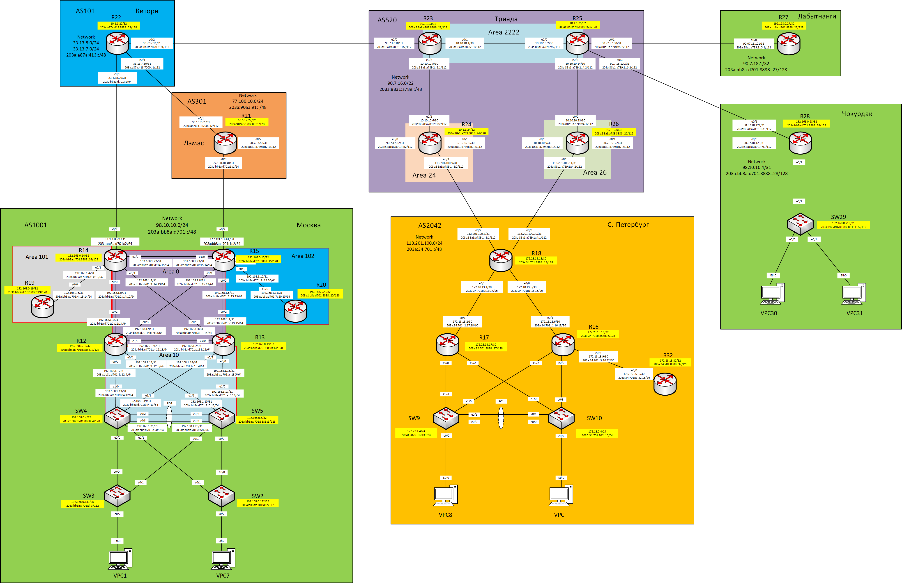

## Практическое задание №10

1. Настроить iBGP в офисом Москва между маршрутизаторами R14 и R15.
2. Настроить iBGP в провайдере Триада, с использованием RR.
3. Настроить сеть офиса Москва так, чтобы приоритетным провайдером стал Ламас.
4. Настроить сеть офиса С.-Петербург так, чтобы трафик до любого офиса распределялся по двум линкам одновременно.

Схема лабораторного стенда



Таблица адресов

| Office      | Hostname | Interface              | Description    | IPv4 address   | Subnet mask     | Gateway       | IPv6 address                    | IPV6 LLA     | Network                     |
|-------------|----------|------------------------|----------------|----------------|-----------------|---------------|---------------------------------|--------------|-----------------------------|
| Москва      | R14      | e0/0                   | to_R12         | 192.168.1.0    | 255.255.255.254 |               | 203a:bb8a:d701:2::14:12/64      | FE80::14     | 98.10.10.0/24               |
|             |          | e0/1                   | to_R13         | 192.168.1.2    | 255.255.255.254 |               | 203a:bb8a:d701:3::14:13/64      | FE80::14     | 203a:bb8a:d701::/48         |
|             |          | e0/2                   | to_Kitorn      | 33.13.8.21     | 255.255.255.254 |               | 203a:bb8a:d701::2/64            | FE80::14     |                             |
|             |          | e0/3                   | to_R19         | 192.168.1.4    | 255.255.255.254 |               | 203a:bb8a:d701:4::14:19/64      | FE80::14     |                             |
|             |          | e1/0                   | to_R15         | 192.168.1.22   | 255.255.255.254 |               | 203a:bb8a:d701:d::14:15/64      | FE80::14     |                             |
|             |          | Loopback0              |                | 192.168.0.14   | 255.255.255.255 |               | 203a:bb8a:d701:8888::14/128     |              |                             |
|             |          | Loopback1              |                | 98.10.10.2     | 255.255.255.255 |               |                                 |              |                             |
|             | R15      | e0/0                   | to_R13         | 192.168.1.6    | 255.255.255.254 |               | 203a:bb8a:d701:5::15:13/64      | FE80::15     |                             |
|             |          | e0/1                   | to_R12         | 192.168.1.8    | 255.255.255.254 |               | 203a:bb8a:d701:6::15:12/64      | FE80::15     |                             |
|             |          | e0/2                   | to_Lamas       | 77.100.10.41   | 255.255.255.254 |               | 203a:bb8a:d701:1::2/64          | FE80::15     |                             |
|             |          | e0/3                   | to_R20         | 192.168.1.10   | 255.255.255.254 |               | 203a:bb8a:d701:7::15:20/64      | FE80::15     |                             |
|             |          | e1/0                   | to_R14         | 192.168.1.23   | 255.255.255.254 |               | 203a:bb8a:d701:d::15:14/64      | FE80::15     |                             |
|             |          | Loopback0              |                | 192.168.0.15   | 255.255.255.255 |               | 203a:bb8a:d701:8888::15/128     |              |                             |
|             |          | Loopback1              |                | 98.10.10.1     | 255.255.255.255 |               |                                 |              |                             |
|             | R12      | e0/0                   | to_SW4         | 192.168.1.12   | 255.255.255.254 |               | 203a:bb8a:d701:8::12:4/64       | FE80::12     |                             |
|             |          | e0/1                   | to_SW5         | 192.168.1.14   | 255.255.255.254 |               | 203a:bb8a:d701:9::12:5/64       | FE80::12     |                             |
|             |          | e0/2                   | to_R14         | 192.168.1.1    | 255.255.255.254 |               | 203a:bb8a:d701:2::12:14/64      | FE80::12     |                             |
|             |          | e0/3                   | to_R15         | 192.168.1.9    | 255.255.255.254 |               | 203a:bb8a:d701:6::12:15/64      | FE80::12     |                             |
|             |          | e1/0                   | to_R13         | 192.168.1.24   | 255.255.255.254 |               | 203a:bb8a:d701:e::12:13/64      | FE80::12     |                             |
|             |          | Loopback0              |                | 192.168.0.12   | 255.255.255.255 |               | 203a:bb8a:d701:8888::12/128     |              |                             |
|             | R13      | e0/0                   | to_SW5         | 192.168.1.16   | 255.255.255.254 |               | 203a:bb8a:d701:a::13:5/64       | FE80::13     |                             |
|             |          | e0/1                   | to_SW4         | 192.168.1.18   | 255.255.255.254 |               | 203a:bb8a:d701:b::13:4/64       | FE80::13     |                             |
|             |          | e0/2                   | to_R15         | 192.168.1.7    | 255.255.255.254 |               | 203a:bb8a:d701:5::13:15/64      | FE80::13     |                             |
|             |          | e0/3                   | to_R14         | 192.168.1.3    | 255.255.255.254 |               | 203a:bb8a:d701:3::13:14/64      | FE80::13     |                             |
|             |          | e1/0                   | to_R12         | 192.168.1.25   | 255.255.255.254 |               | 203a:bb8a:d701:e::13:12/64      | FE80::13     |                             |
|             |          | Loopback0              |                | 192.168.0.13   | 255.255.255.255 |               | 203a:bb8a:d701:8888::13/128     |              |                             |
|             | R19      | e0/0                   | to_R14         | 192.168.1.5    | 255.255.255.254 |               | 203a:bb8a:d701:4::19:14/64      | FE80::19     |                             |
|             |          | Loopback0              |                | 192.168.0.19   | 255.255.255.255 |               | 203a:bb8a:d701:8888::19/128     |              |                             |
|             | R20      | e0/0                   | to_R15         | 192.168.1.11   | 255.255.255.254 |               | 203a:bb8a:d701:7::20:15/64      | FE80::20     |                             |
|             |          | Loopback0              |                | 192.168.0.20   | 255.255.255.255 |               | 203a:bb8a:d701:8888::20/128     |              |                             |
|             | SW4      | VLAN10                 | Client1        | 172.16.8.3     | 255.255.255.0   |               | 203a:bb8a:d701:1010::3/64       |              |                             |
|             |          | VLAN20                 | Client7        | 172.16.12.3    | 255.255.255.0   |               | 203a:bb8a:d701:1020::3/64       |              |                             |
|             |          | VLAN99                 | Mgmt_Access_SW | 192.168.0.131  | 255.255.255.128 |               | 203a:bb8a:d701:d::4/112         |              |                             |
|             |          | Port-chanel 1 (e0/2-3) | to_PO1_SW5     | 192.168.1.21   | 255.255.255.254 |               | 203a:bb8a:d701:c::4:5/64        | FE80::4      |                             |
|             |          | e1/0                   | to_R12         | 192.168.1.13   | 255.255.255.254 |               | 203a:bb8a:d701:8::4:12/64       | FE80::4      |                             |
|             |          | e1/1                   | to_R13         | 192.168.1.19   | 255.255.255.254 |               | 203a:bb8a:d701:b::4:13/64       | FE80::4      |                             |
|             |          | VRRP2                  | Client1_ipv4   | 172.16.8.1     | 255.255.255.0   |               |                                 |              |                             |
|             |          | VRRP21                 | Client1_ipv6   |                |                 |               |                                 | FE80::4:4    |                             |
|             |          | VRRP3                  | Client7_ipv4   | 172.16.12.1    | 255.255.255.0   |               |                                 |              |                             |
|             |          | VRRP31                 | Client7_ipv6   |                |                 |               |                                 | FE80::4:5    |                             |
|             |          | VRRP1                  | Mgmt_Access_SW | 192.168.0.129  | 255.255.255.128 |               |                                 |              |                             |
|             |          | VRRP11                 | Mgmt_Access_SW |                |                 |               |                                 | FE80::4:1    |                             |
|             |          | Loopback0              |                | 192.168.0.4    | 255.255.255.255 |               | 203a:bb8a:d701:8888::4/128      |              |                             |
|             | SW5      | VLAN20                 | Client7        | 172.16.8.2     | 255.255.255.0   |               | 203a:bb8a:d701:1020::2/64       |              |                             |
|             |          | VLAN99                 | Mgmt_Access_SW | 192.168.0.130  | 255.255.255.128 |               | 203a:bb8a:d701:d::5/112         |              |                             |
|             |          | VLAN10                 | Client1        | 172.16.12.2    | 255.255.255.0   |               | 203a:bb8a:d701:1010::2/64       |              |                             |
|             |          | Port-chanel 1 (e0/2-3) | to_PO1_SW4     | 192.168.1.20   | 255.255.255.254 |               | 203a:bb8a:d701:c::5:4/64        | FE80::5      |                             |
|             |          | e1/0                   | to_R13         | 192.168.1.17   | 255.255.255.254 |               | 203a:bb8a:d701:a::5:13/64       | FE80::5      |                             |
|             |          | e1/1                   | to_R12         | 192.168.1.15   | 255.255.255.254 |               | 203a:bb8a:d701:9::5:12/64       | FE80::5      |                             |
|             |          | VRRP2                  | Client1_ipv4   | 172.16.8.1     | 255.255.255.0   |               |                                 |              |                             |
|             |          | VRRP21                 | Client1_ipv6   |                |                 |               |                                 | FE80::4:4    |                             |
|             |          | VRRP3                  | Client7_ipv4   | 172.16.12.1    | 255.255.255.0   |               |                                 |              |                             |
|             |          | VRRP31                 | Client7_ipv6   |                |                 |               |                                 | FE80::4:5    |                             |
|             |          | VRRP1                  | Mgmt_Access_SW | 192.168.0.129  | 255.255.255.128 |               |                                 |              |                             |
|             |          | VRRP11                 | Mgmt_Access_SW |                |                 |               |                                 | FE80::4:1    |                             |
|             |          | Loopback0              |                | 192.168.0.5    | 255.255.255.255 |               | 203a:bb8a:d701:8888::5/128      |              |                             |
|             | SW3      | VLAN98                 | Mgmt_SW3       | 192.168.0.133  | 255.255.255.128 | 192.168.0.129 | 203a:bb8a:d701:d::3/112         | FE80::3      |                             |
|             |          | e0/0                   | to_SW4         | NA             | NA              | NA            |                                 |              |                             |
|             |          | e0/1                   | to_SW5         | NA             | NA              | NA            |                                 |              |                             |
|             |          | e0/2                   | to_VPC1        | NA             | NA              | NA            |                                 |              |                             |
|             | SW2      | VLAN99                 | Mgmt_SW2       | 192.168.0.132  | 255.255.255.128 | 192.168.0.129 | 203a:bb8a:d701:d::2/112         | FE80::2      |                             |
|             |          | e0/0                   | to_SW5         | NA             | NA              | NA            |                                 |              |                             |
|             |          | e0/1                   | to_SW4         | NA             | NA              | NA            |                                 |              |                             |
|             |          | e0/2                   | to_VPC7        | NA             | NA              | NA            |                                 |              |                             |
|             | VPC1     | NIC                    |                | DHCP           | DHCP            | DHCP          | SLAAC+DHCPv6                    |              |                             |
|             | VPC7     | NIC                    |                | DHCP           | DHCP            | DHCP          | SLAAC+DHCPv6                    |              |                             |
| Киторн      | R22      | e0/0                   | to_Moscow      | 33.13.8.20     | 255.255.255.254 |               | 203a:bb8a:d701::1/64            | FE80::22     | 33.13.8.0/24                |
|             |          | e0/1                   | to_Lamas       | 33.13.7.60     | 255.255.255.254 |               | 203a:a87a:413:7000::1/112       | FE80::22     | 33.13.7.0/24                |
|             |          | e0/2                   | to_Triada      | 90.7.17.11     | 255.255.255.254 |               | 203a:88a1:a789:1::1:1/112       | FE80::22     | 203a:a87a:413::/48          |
|             |          | Loopback0              |                | 10.1.1.22      | 255.255.255.255 |               | 203a:a87a:413:8888::22/128      |              |                             |
|             |          | Loopback1              |                | 33.13.7.1      | 255.255.255.255 |               |                                 |              |                             |
| Ламас       | R21      | e0/0                   | to_Moscow      | 77.100.10.40   | 255.255.255.254 |               | 203a:bb8a:d701:1::1/64          | FE80::21     | 77.100.10.0/24              |
|             |          | e0/1                   | to_Kitorn      | 33.13.7.61     | 255.255.255.254 |               | 203a:a87a:413:7000::2/112       | FE80::21     | 203a:90aa:91::/48           |
|             |          | e0/2                   | to_Triada      | 90.7.17.53     | 255.255.255.254 |               | 203a:88a1:a789:1::2:1/112       | FE80::21     |                             |
|             |          | Loopback0              |                | 10.10.2.22     | 255.255.255.255 |               | 203a:90aa:91:8888::21/128       |              |                             |
|             |          | Loopback1              |                | 77.100.10.1    | 77.100.10.0/24  |               |                                 |              |                             |
| Триада      | R23      | e0/0                   | to_Kitorn      | 90.7.17.10     | 255.255.255.254 |               | 203a:88a1:a789:1::1:2/112       | FE80::23     | 90.7.16.0/22                |
|             |          | e0/1                   | to_R25         | 10.10.10.1     | 255.255.255.252 |               | 203a:88a1:a789:2::1/112         | FE80::23     | 203a:88a1:a789::/48         |
|             |          | e0/2                   | to_R24         | 10.10.10.5     | 255.255.255.252 |               | 203a:88a1:a789:2::2:1/112       | FE80::23     |                             |
|             |          | Loopback0              |                | 10.1.1.23      | 255.255.255.255 |               | 203a:88a1:a789:8888::23/128     |              |                             |
|             | R24      | e0/0                   | to_Lamas       | 90.7.17.52     | 255.255.255.254 |               | 203a:88a1:a789:1::2:2/112       | FE80::24     |                             |
|             |          | e0/1                   | to_R26         | 10.10.10.10    | 255.255.255.252 |               | 203a:88a1:a789:2::3:2/112       | FE80::24     |                             |
|             |          | e0/2                   | to_R23         | 10.10.10.6     | 255.255.255.252 |               | 203a:88a1:a789:2::2:2/112       | FE80::24     |                             |
|             |          | e0/3                   | to_SPeterburg  | 113.201.100.9  | 255.255.255.254 |               | 203a:88a1:a789:1::3:2/112       | FE80::24     |                             |
|             |          | Loopback0              |                | 10.1.1.24      | 255.255.255.255 |               | 203a:88a1:a789:8888::24/128     |              |                             |
|             |          | Loopback1              |                | 90.7.16.1      | 255.255.255.255 |               |                                 |              |                             |
|             | R25      | e0/0                   | to_R23         | 10.10.10.2     | 255.255.255.252 |               | 203a:88a1:a789:2::2/112         | FE80::25     |                             |
|             |          | e0/1                   | to_Labutnangi  | 90.7.18.100    | 255.255.255.254 |               | 203a:88a1:a789:1::5:2/112       | FE80::25     |                             |
|             |          | e0/2                   | to_R26         | 10.10.10.14    | 255.255.255.252 |               | 203a:88a1:a789:2::4:2/112       | FE80::25     |                             |
|             |          | e0/3                   | to_Chokurdak   | 90.7.18.120    | 255.255.255.254 |               | 203a:88a1:a789:1::6:2/112       | FE80::25     |                             |
|             |          | Loopback0              |                | 10.1.1.25      | 255.255.255.255 |               | 203a:88a1:a789:8888::25/128     |              |                             |
|             | R26      | e0/0                   | to_R24         | 10.10.10.9     | 255.255.255.252 |               | 203a:88a1:a789:2::3:1/112       | FE80::26     |                             |
|             |          | e0/1                   | to_Chokurdak   | 90.7.18.122    | 255.255.255.254 |               | 203a:88a1:a789:1::7:2/112       | FE80::26     |                             |
|             |          | e0/2                   | to_R25         | 10.10.10.13    | 255.255.255.252 |               | 203a:88a1:a789:2::4:1/112       | FE80::26     |                             |
|             |          | e0/3                   | to_SPeterburg  | 113.201.100.11 | 255.255.255.254 |               | 203a:88a1:a789:1::4:2/112       | FE80::26     |                             |
|             |          | Loopback0              |                | 10.1.1.26      | 255.255.255.255 |               | 203a:88a1:a789:8888::26/112     |              | 113.201.100.0/24            |
| С-Петербург | R18      | e0/0                   | to_R16         | 172.18.13.5    | 255.255.255.252 |               | 203a:34:701::1:18:16/96         | FE80::18     | 203a:34:701::/48            |
|             |          | e0/1                   | to_R17         | 172.18.13.1    | 255.255.255.252 |               | 203a:34:701::2:18:17/96         | FE80::18     |                             |
|             |          | e0/2                   | to_Triada24    | 113.201.100.8  | 255.255.255.254 |               | 203a:88a1:a789:1::3:1/112       | FE80::18     |                             |
|             |          | e0/3                   | to_Triada26    | 113.201.100.10 | 255.255.255.254 |               | 203a:88a1:a789:1::4:1/112       | FE80::18     |                             |
|             |          | Loopback0              |                | 172.23.13.18   | 255.255.255.255 |               | 203a:34:701:8888::18/128        |              |                             |
|             |          | Loopback1              |                | 113.201.100.1  | 255.255.255.255 |               |                                 |              |                             |
|             | R17      | e0/0.101               | Client9        | 172.18.1.3     | 255.255.255.0   |               | 203a:34:701:101::2/64           | FE80::17:101 |                             |
|             |          | e0/1                   | to_R18         | 172.18.13.2    | 255.255.255.252 |               | 203a:34:701::2:17:18/96         | FE80::17     |                             |
|             |          | e0/2.102               | Client10       | 172.18.2.3     | 255.255.255.0   |               | 203a:34:701:102::2/64           | FE80::17:102 |                             |
|             |          | HSRP1                  | Client9v4      | 172.18.1.1     |                 |               |                                 |              |                             |
|             |          | HSRP2                  | Client10v4     | 172.18.2.1     |                 |               |                                 |              |                             |
|             |          | HSRP3                  | Client9v6      |                |                 |               | 203a:34:701:101::1/64           | FE80::17:3   |                             |
|             |          | HSRP4                  | Client10v6     |                |                 |               | 203a:34:701:102::1/64           | FE80::17:4   |                             |
|             |          | Loopback0              |                | 172.23.13.17   | 255.255.255.255 |               | 203a:34:701:8888::17/128        |              |                             |
|             | R16      | e0/0.102               | Client10       | 172.18.2.2     | 255.255.255.0   |               | 203a:34:701:102::3/64           | FE80::16:102 |                             |
|             |          | e0/1                   | to_R18         | 172.18.13.6    | 255.255.255.252 |               | 203a:34:701::1:16:18/96         | FE80::16     |                             |
|             |          | e0/2.101               | Client9        | 172.18.1.2     | 255.255.255.0   |               | 203a:34:701:101::3/64           | FE80::16:101 |                             |
|             |          | e0/3                   | to_R32         | 172.18.13.9    | 255.255.255.252 |               | 203a:34:701::3:16:32/96         | FE80::16     |                             |
|             |          | HSRP1                  | Client9v4      | 172.18.1.1     |                 |               |                                 |              |                             |
|             |          | HSRP2                  | Client10v4     | 172.18.2.1     |                 |               |                                 |              |                             |
|             |          | HSRP3                  | Client9v6      |                |                 |               | 203a:34:701:101::1/64           | FE80::17:3   |                             |
|             |          | HSRP4                  | Client10v6     |                |                 |               | 203a:34:701:102::1/64           | FE80::17:4   |                             |
|             |          | Loopback0              |                | 172.23.13.16   | 255.255.255.255 |               | 203a:34:701:8888::16/128        |              |                             |
|             | R32      | e0/0                   | to_R16         | 172.18.13.10   | 255.255.255.252 |               | 203a:34:701::3:32:16/96         | FE80::32     |                             |
|             |          | Loopback0              |                | 172.23.13.32   | 255.255.255.255 |               | 203a:34:701:8888::32/128        |              |                             |
|             | SW9      | e0/0                   | PO1_to_SW10    | NA             | NA              | NA            |                                 |              |                             |
|             |          | e0/1                   | PO1_to_SW10    | NA             | NA              | NA            |                                 |              |                             |
|             |          | e0/2                   | to_VPC8        | NA             | NA              | NA            |                                 |              |                             |
|             |          | e0/3                   | to_R17         | NA             | NA              | NA            |                                 |              |                             |
|             |          | e1/0                   | to_R16         | NA             | NA              | NA            |                                 |              |                             |
|             |          | VLAN101                | Mgmt_SW9       | 172.18.1.4     | 255.255.255.0   | 172.18.1.1    | 203a:34:701:101::9/64           |              |                             |
|             | SW10     | e0/0                   | PO1_to_SW10    | NA             | NA              | NA            |                                 |              |                             |
|             |          | e0/1                   | PO1_to_SW10    | NA             | NA              | NA            | `                               |              |                             |
|             |          | e0/2                   | to_VPC         | NA             | NA              | NA            |                                 |              |                             |
|             |          | e0/3                   | to_R16         | NA             | NA              | NA            |                                 |              |                             |
|             |          | e1/0                   | to_R17         | NA             | NA              | NA            |                                 |              |                             |
|             |          | VLAN102                | Mgmt_SW10      | 172.18.2.4     | 255.255.255.0   | 172.18.2.1    | 203a:34:701:102::10/64          |              |                             |
|             | VPC8     | NIC                    |                | DHCP           | DHCP            | DHCP          | SLAAC                           |              |                             |
|             | VPC      | NIC                    |                | DHCP           | DHCP            | DHCP          | SLAAC                           |              |                             |
| Лабытнанги  | R27      | e0/0                   | to_Triada25    | 90.7.18.101    | 255.255.255.254 |               | 203a:88a1:a789:1::5:1/112       | fe80::27     | 90.7.18.1/32                |
|             |          | Loopback0              |                | 192.168.0.27   | 255.255.255.255 |               | 203a:bb8a:d701:8888::27/128     |              | 203a:bb8a:d701:8888::27/128 |
| Чокурдак    | R28      | e0/0                   | to_Triada26    | 90.7.18.123    | 255.255.255.254 |               | 203a:88a1:a789:1::1:1/112       | fe80::28     | 98.10.10.4/31               |
|             |          | e0/1                   | to_Triada25    | 90.7.18.121    | 255.255.255.254 |               | 203a:88a1:a789:1::6:1/112       | fe80::28     | 203a:bb8a:d701:8888::28/128 |
|             |          | e0/2.30                | Client30       | 172.16.30.1    | 255.255.255.0   |               | 203a:bb8a:d701:61::1/64         | fe80::28:30  | 203a:bb8a:d701:61::1/64     |
|             |          | e0/2.31                | Client31       | 172.16.31.1    | 255.255.255.0   |               | 203a:bb8a:d701:62::1/64         | fe80::28:31  | 203a:bb8a:d701:62::1/64     |
|             |          | e0/2.88                | Mgmt_SW29      | 192.168.0.217  | 255.255.255.252 |               | 203a:bb8a:d701:8888::1111:1/112 | fe80::28:88  |                             |
|             |          | Loopback0              |                | 192.168.0.28   | 255.255.255.255 |               | 203a:bb8a:d701:8888::28/128     |              |                             |
|             | SW29     | VLAN88                 | Mgmt_SW29      | 192.168.0.218  | 255.255.255.252 | 192.168.0.217 | 203a:bb8a:d701:8888::1111:2/112 |              |                             |
|             | VPC30    | NIC                    |                | 172.16.30.2    | 255.255.255.0   | 172.16.30.1   | SLAAC+DHCPv6                    |              |                             |
|             | VPC31    | NIC                    |                | 172.16.31.2    | 255.255.255.0   | 172.16.31.1   | SLAAC+DHCPv6                    |


### 1. Настроить iBGP в офисом Москва между маршрутизаторами R14 и R15.
Для настройки iBGP соседства для передачи маршрутной информации можно установить TCP сессию между физическими интерфейсами e1/0 роутеров 
R14 и R15. Но это не надежно, по причине если пропадет линк, то пропадет и iBGP соседство между R14 и R15, а вместе с ним и информация о маршрутах.
Конечно можно установить дополнительное BGP соседство через транзитные роутеры R12 и R13. В таком случае соседсво на R14
будет выглядеть так


А так выглядит список маршрутов в базе BGP.


Видно, что получены маршруты по iBGP (internal), все они valid, а лучшим выбран прямой маршрут R14-R15.

Но есть более элегантное решение.
В качестве интерфейсов для установления соседства по BGP использовать TCP сессию установленную между интерфейсами Loopback0
роутеров R14 и R15. Виртуальный сетевой интерфейс будет доступен всегда, а надежность связанности между Loopback интерфейсами 
R14 и R15 обеспечивается избыточностью связей Backbone area OSPF.

Запускаем процесс OSPF на интерфейсах Loopbak0 R14, R15. Покажем на примере R14.
````
R14(config)#int loopback 0
R14(config-if)#ip ospf 1 area 0
````
Теперь настраиваем процесс iBGP на роутерах одновременно для IPv4 и IPv6.
````
R14(config)#router bgp 1001
R14(config-router)#neighbor 192.168.0.15 remote-as 1001
R14(config-router)#neighbor 192.168.0.15 update-source loopback 0
R14(config-router)#neighbor 203a:bb8a:d701:8888::15 remote-as 1001
R14(config-router)#address-family ipv4
R14(config-router-af)#neighbor 192.168.0.15 next-hop-self
R14(config-router-af)#address-family ipv6
R14(config-router-af)#neighbor 203a:bb8a:d701:8888::15 activate
R14(config-router-af)#neighbor 203a:bb8a:d701:8888::15 next-hop-self
````
Меньше соседей и меньше записей маршрутов в базе BGP.  


Маршрутная информация получена, а в качестве Next Hop указан IPv4 адрес Loopback0 R15.

### 2. Настроить iBGP в провайдере Триада, с использованием RR.

Для начала настроим eBGP между Киторн и Триада, которую не учли в предыдущей работе.
Отобразим установевление соседских отношений по eBGP между R22 и R23.


и полученные маршруты в базе BGP R23. 


Распределим роли маршрутизаторов в процессе iBGP AS 520 Триада.
Пусть R24 и R26 будут выполнять роль Route reflector далее RR, а R23 и R25 - RR клиенты.
Сеть на кластеры не разбивалась.

По легенде Триада является крупным ISP и для упрощения приведен только фрагмент его сети.
В таком случае использование Full-Mesh топологии будет не оптимальным решением, но на приведенном фрагменте это не очевидно,
ввиду небольшого кол-ва роутеров.

Кол-во связей рассчитывается по формуле n*(n-1)/2

при Full-Mesh - потребуется установление 6 связей

при одном RR - потребуется установить 3 связи

при двух RR - потребуется установить 5 связей.

При двух RR потребуется установить больше связанностей чем при одном RR, но наличие альтернативного RR повышает надежность 
сохранения маршрутной информации в случае возникновения проблем на одном из них.

Пример настройки RR на R24
````
R24#sh run | sec bgp
router bgp 520
 bgp router-id 24.24.24.24
 bgp log-neighbor-changes
 neighbor 10.1.1.23 remote-as 520
 neighbor 10.1.1.23 update-source Loopback0
 neighbor 10.1.1.25 remote-as 520
 neighbor 10.1.1.25 update-source Loopback0
 neighbor 10.1.1.26 remote-as 520
 neighbor 10.1.1.26 update-source Loopback0
 neighbor 203A:88A1:A789:1::2:1 remote-as 301
 neighbor 203A:88A1:A789:1::3:1 remote-as 2042
 neighbor 203A:88A1:A789:8888::23 remote-as 520
 neighbor 203A:88A1:A789:8888::23 update-source Loopback0
 neighbor 203A:88A1:A789:8888::25 remote-as 520
 neighbor 203A:88A1:A789:8888::25 update-source Loopback0
 neighbor 203A:88A1:A789:8888::26 remote-as 520
 neighbor 203A:88A1:A789:8888::26 update-source Loopback0
 neighbor 90.7.17.53 remote-as 301
 neighbor 113.201.100.8 remote-as 2042
 !
 address-family ipv4
  network 90.7.16.0 mask 255.255.252.0
  neighbor 10.1.1.23 activate
  neighbor 10.1.1.23 route-reflector-client
  neighbor 10.1.1.25 activate
  neighbor 10.1.1.25 route-reflector-client
  neighbor 10.1.1.26 activate
  no neighbor 203A:88A1:A789:1::2:1 activate
  no neighbor 203A:88A1:A789:1::3:1 activate
  no neighbor 203A:88A1:A789:8888::23 activate
  no neighbor 203A:88A1:A789:8888::25 activate
  no neighbor 203A:88A1:A789:8888::26 activate
  neighbor 90.7.17.53 activate
  neighbor 113.201.100.8 activate
 exit-address-family
 !
 address-family ipv6
  network 203A:88A1:A789::/48
  neighbor 203A:88A1:A789:1::2:1 activate
  neighbor 203A:88A1:A789:1::3:1 activate
  neighbor 203A:88A1:A789:8888::23 activate
  neighbor 203A:88A1:A789:8888::23 route-reflector-client
  neighbor 203A:88A1:A789:8888::25 activate
  neighbor 203A:88A1:A789:8888::25 route-reflector-client
  neighbor 203A:88A1:A789:8888::26 activate
 exit-address-family
R24#
````
Настройки RR клиента покажем на R23
````
R23#sh run | sec bgp
router bgp 520
 bgp log-neighbor-changes
 neighbor 10.1.1.24 remote-as 520
 neighbor 10.1.1.24 update-source Loopback0
 neighbor 10.1.1.26 remote-as 520
 neighbor 10.1.1.26 update-source Loopback0
 neighbor 203A:88A1:A789:1::1:1 remote-as 101
 neighbor 203A:88A1:A789:8888::24 remote-as 520
 neighbor 203A:88A1:A789:8888::24 update-source Loopback0
 neighbor 203A:88A1:A789:8888::26 remote-as 520
 neighbor 203A:88A1:A789:8888::26 update-source Loopback0
 neighbor 90.7.17.11 remote-as 101
 !
 address-family ipv4
  neighbor 10.1.1.24 activate
  neighbor 10.1.1.26 activate
  no neighbor 203A:88A1:A789:1::1:1 activate
  no neighbor 203A:88A1:A789:8888::24 activate
  no neighbor 203A:88A1:A789:8888::26 activate
  neighbor 90.7.17.11 activate
 exit-address-family
 !
 address-family ipv6
  neighbor 203A:88A1:A789:1::1:1 activate
  neighbor 203A:88A1:A789:8888::24 activate
  neighbor 203A:88A1:A789:8888::26 activate
 exit-address-family
R23#
````
Покажем установление соседства по iBGP на примере RR R26


а так-же RR клинта на R25


База данных маршрутов BGP для IPv4 на R26


Маршруты полученные по BGP d таблицe маршрутизации IPv4 R26


Маршруты по iBGP получены и добавлены в таблицу маршрутизации роутера.

Для проверки надежности сети построенной на двух RR проведем имитацию отключения одного из RR.
Выберем RR на R24, так будет нагляднее увидим как изменится список маршрутов в базе BGP на R26, и проверим
наличие IP связанности между сетями офисов Москва и С.-Петербург.

Покажем что на R26 пропало соседство по iBGP с К24.


Из-за нарушенного соседства пропала часть маршрутов iBGP, ожидаемо


Теперь в AS 1001 и 301 можем попасть только через AS101 ISP Киторн.

Проверяем IP связанность между интерфесами Loopback1 роутеров R15 и R18
cо стороны R18.


Доказали, что сеть в топологии с двумя RR более отказоустойчива и проверили сохранение IP связанности между
сетями офисов Москва и С.-Петербург.

Стоит обратить внимание, что при настройке iBGP в сети Триада атрибут Next hop оставлен по умолчанию, а маршруты до
сетей назначения получен с помощью механизма рекурсивной маршрутизации.
Покажем на примере маршрута в сеть 98.10.10.0/24 в таблице маршрутизации IPv4 R26. (R24 по-прежнему отключен)


Таким образом роутер R26 определяет интерфейс куда направить пакет в эту сеть.

### 3. Настроить сеть офиса Москва так, чтобы приоритетным провайдером стал Ламас.


### 4. Настроить сеть офиса С.-Петербург так, чтобы трафик до любого офиса распределялся по двум линкам одновременно.


