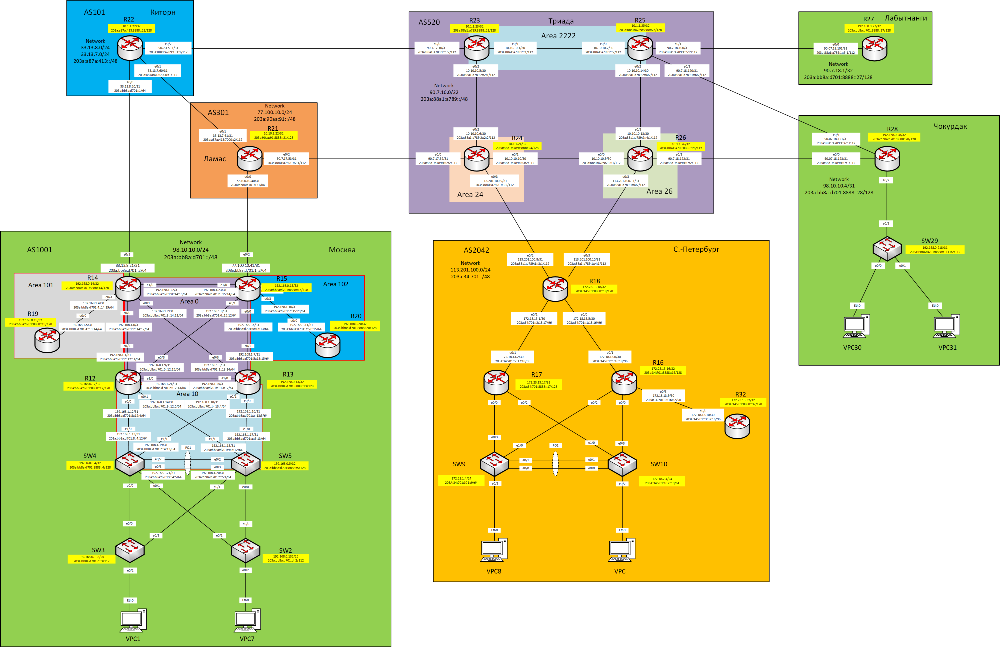

## Практическое задание №11

1. Настроить фильтрацию в офисе Москва так, чтобы не появилось транзитного трафика(As-path).
2. Настроить фильтрацию в офисе С.-Петербург так, чтобы не появилось транзитного трафика(Prefix-list).
3. Настроить провайдера Киторн так, чтобы в офис Москва отдавался только маршрут по умолчанию.
4. Настроить провайдера Ламас так, чтобы в офис Москва отдавался только маршрут по умолчанию и префикс офиса С.-Петербург.
5. Все сети в лабораторной работе должны иметь IP связность.

Схема лабораторного стенда.



Таблица адресов

| Office      | Hostname | Interface              | Description    | IPv4 address   | Subnet mask     | Gateway       | IPv6 address                    | IPV6 LLA     | Network                     |   |   |   |   |   |
|-------------|----------|------------------------|----------------|----------------|-----------------|---------------|---------------------------------|--------------|-----------------------------|---|---|---|---|---|
| Москва      | R14      | e0/0                   | to_R12         | 192.168.1.0    | 255.255.255.254 |               | 203a:bb8a:d701:2::14:12/64      | FE80::14     | 98.10.10.0/24               |   |   |   |   |   |
|             |          | e0/1                   | to_R13         | 192.168.1.2    | 255.255.255.254 |               | 203a:bb8a:d701:3::14:13/64      | FE80::14     | 203a:bb8a:d701::/48         |   |   |   |   |   |
|             |          | e0/2                   | to_Kitorn      | 33.13.8.21     | 255.255.255.254 |               | 203a:bb8a:d701::2/64            | FE80::14     |                             |   |   |   |   |   |
|             |          | e0/3                   | to_R19         | 192.168.1.4    | 255.255.255.254 |               | 203a:bb8a:d701:4::14:19/64      | FE80::14     |                             |   |   |   |   |   |
|             |          | e1/0                   | to_R15         | 192.168.1.22   | 255.255.255.254 |               | 203a:bb8a:d701:d::14:15/64      | FE80::14     |                             |   |   |   |   |   |
|             |          | Loopback0              |                | 192.168.0.14   | 255.255.255.255 |               | 203a:bb8a:d701:8888::14/128     |              |                             |   |   |   |   |   |
|             |          | Loopback1              |                | 98.10.10.2     | 255.255.255.255 |               |                                 |              |                             |   |   |   |   |   |
|             | R15      | e0/0                   | to_R13         | 192.168.1.6    | 255.255.255.254 |               | 203a:bb8a:d701:5::15:13/64      | FE80::15     |                             |   |   |   |   |   |
|             |          | e0/1                   | to_R12         | 192.168.1.8    | 255.255.255.254 |               | 203a:bb8a:d701:6::15:12/64      | FE80::15     |                             |   |   |   |   |   |
|             |          | e0/2                   | to_Lamas       | 77.100.10.41   | 255.255.255.254 |               | 203a:bb8a:d701:1::2/64          | FE80::15     |                             |   |   |   |   |   |
|             |          | e0/3                   | to_R20         | 192.168.1.10   | 255.255.255.254 |               | 203a:bb8a:d701:7::15:20/64      | FE80::15     |                             |   |   |   |   |   |
|             |          | e1/0                   | to_R14         | 192.168.1.23   | 255.255.255.254 |               | 203a:bb8a:d701:d::15:14/64      | FE80::15     |                             |   |   |   |   |   |
|             |          | Loopback0              |                | 192.168.0.15   | 255.255.255.255 |               | 203a:bb8a:d701:8888::15/128     |              |                             |   |   |   |   |   |
|             |          | Loopback1              |                | 98.10.10.1     | 255.255.255.255 |               |                                 |              |                             |   |   |   |   |   |
|             | R12      | e0/0                   | to_SW4         | 192.168.1.12   | 255.255.255.254 |               | 203a:bb8a:d701:8::12:4/64       | FE80::12     |                             |   |   |   |   |   |
|             |          | e0/1                   | to_SW5         | 192.168.1.14   | 255.255.255.254 |               | 203a:bb8a:d701:9::12:5/64       | FE80::12     |                             |   |   |   |   |   |
|             |          | e0/2                   | to_R14         | 192.168.1.1    | 255.255.255.254 |               | 203a:bb8a:d701:2::12:14/64      | FE80::12     |                             |   |   |   |   |   |
|             |          | e0/3                   | to_R15         | 192.168.1.9    | 255.255.255.254 |               | 203a:bb8a:d701:6::12:15/64      | FE80::12     |                             |   |   |   |   |   |
|             |          | e1/0                   | to_R13         | 192.168.1.24   | 255.255.255.254 |               | 203a:bb8a:d701:e::12:13/64      | FE80::12     |                             |   |   |   |   |   |
|             |          | Loopback0              |                | 192.168.0.12   | 255.255.255.255 |               | 203a:bb8a:d701:8888::12/128     |              |                             |   |   |   |   |   |
|             | R13      | e0/0                   | to_SW5         | 192.168.1.16   | 255.255.255.254 |               | 203a:bb8a:d701:a::13:5/64       | FE80::13     |                             |   |   |   |   |   |
|             |          | e0/1                   | to_SW4         | 192.168.1.18   | 255.255.255.254 |               | 203a:bb8a:d701:b::13:4/64       | FE80::13     |                             |   |   |   |   |   |
|             |          | e0/2                   | to_R15         | 192.168.1.7    | 255.255.255.254 |               | 203a:bb8a:d701:5::13:15/64      | FE80::13     |                             |   |   |   |   |   |
|             |          | e0/3                   | to_R14         | 192.168.1.3    | 255.255.255.254 |               | 203a:bb8a:d701:3::13:14/64      | FE80::13     |                             |   |   |   |   |   |
|             |          | e1/0                   | to_R12         | 192.168.1.25   | 255.255.255.254 |               | 203a:bb8a:d701:e::13:12/64      | FE80::13     |                             |   |   |   |   |   |
|             |          | Loopback0              |                | 192.168.0.13   | 255.255.255.255 |               | 203a:bb8a:d701:8888::13/128     |              |                             |   |   |   |   |   |
|             | R19      | e0/0                   | to_R14         | 192.168.1.5    | 255.255.255.254 |               | 203a:bb8a:d701:4::19:14/64      | FE80::19     |                             |   |   |   |   |   |
|             |          | Loopback0              |                | 192.168.0.19   | 255.255.255.255 |               | 203a:bb8a:d701:8888::19/128     |              |                             |   |   |   |   |   |
|             | R20      | e0/0                   | to_R15         | 192.168.1.11   | 255.255.255.254 |               | 203a:bb8a:d701:7::20:15/64      | FE80::20     |                             |   |   |   |   |   |
|             |          | Loopback0              |                | 192.168.0.20   | 255.255.255.255 |               | 203a:bb8a:d701:8888::20/128     |              |                             |   |   |   |   |   |
|             | SW4      | VLAN10                 | Client1        | 172.16.8.3     | 255.255.255.0   |               | 203a:bb8a:d701:1010::3/64       |              |                             |   |   |   |   |   |
|             |          | VLAN20                 | Client7        | 172.16.12.3    | 255.255.255.0   |               | 203a:bb8a:d701:1020::3/64       |              |                             |   |   |   |   |   |
|             |          | VLAN99                 | Mgmt_Access_SW | 192.168.0.131  | 255.255.255.128 |               | 203a:bb8a:d701:d::4/112         |              |                             |   |   |   |   |   |
|             |          | Port-chanel 1 (e0/2-3) | to_PO1_SW5     | 192.168.1.21   | 255.255.255.254 |               | 203a:bb8a:d701:c::4:5/64        | FE80::4      |                             |   |   |   |   |   |
|             |          | e1/0                   | to_R12         | 192.168.1.13   | 255.255.255.254 |               | 203a:bb8a:d701:8::4:12/64       | FE80::4      |                             |   |   |   |   |   |
|             |          | e1/1                   | to_R13         | 192.168.1.19   | 255.255.255.254 |               | 203a:bb8a:d701:b::4:13/64       | FE80::4      |                             |   |   |   |   |   |
|             |          | VRRP2                  | Client1_ipv4   | 172.16.8.1     | 255.255.255.0   |               |                                 |              |                             |   |   |   |   |   |
|             |          | VRRP21                 | Client1_ipv6   |                |                 |               |                                 | FE80::4:4    |                             |   |   |   |   |   |
|             |          | VRRP3                  | Client7_ipv4   | 172.16.12.1    | 255.255.255.0   |               |                                 |              |                             |   |   |   |   |   |
|             |          | VRRP31                 | Client7_ipv6   |                |                 |               |                                 | FE80::4:5    |                             |   |   |   |   |   |
|             |          | VRRP1                  | Mgmt_Access_SW | 192.168.0.129  | 255.255.255.128 |               |                                 |              |                             |   |   |   |   |   |
|             |          | VRRP11                 | Mgmt_Access_SW |                |                 |               |                                 | FE80::4:1    |                             |   |   |   |   |   |
|             |          | Loopback0              |                | 192.168.0.4    | 255.255.255.255 |               | 203a:bb8a:d701:8888::4/128      |              |                             |   |   |   |   |   |
|             | SW5      | VLAN20                 | Client7        | 172.16.8.2     | 255.255.255.0   |               | 203a:bb8a:d701:1020::2/64       |              |                             |   |   |   |   |   |
|             |          | VLAN99                 | Mgmt_Access_SW | 192.168.0.130  | 255.255.255.128 |               | 203a:bb8a:d701:d::5/112         |              |                             |   |   |   |   |   |
|             |          | VLAN10                 | Client1        | 172.16.12.2    | 255.255.255.0   |               | 203a:bb8a:d701:1010::2/64       |              |                             |   |   |   |   |   |
|             |          | Port-chanel 1 (e0/2-3) | to_PO1_SW4     | 192.168.1.20   | 255.255.255.254 |               | 203a:bb8a:d701:c::5:4/64        | FE80::5      |                             |   |   |   |   |   |
|             |          | e1/0                   | to_R13         | 192.168.1.17   | 255.255.255.254 |               | 203a:bb8a:d701:a::5:13/64       | FE80::5      |                             |   |   |   |   |   |
|             |          | e1/1                   | to_R12         | 192.168.1.15   | 255.255.255.254 |               | 203a:bb8a:d701:9::5:12/64       | FE80::5      |                             |   |   |   |   |   |
|             |          | VRRP2                  | Client1_ipv4   | 172.16.8.1     | 255.255.255.0   |               |                                 |              |                             |   |   |   |   |   |
|             |          | VRRP21                 | Client1_ipv6   |                |                 |               |                                 | FE80::4:4    |                             |   |   |   |   |   |
|             |          | VRRP3                  | Client7_ipv4   | 172.16.12.1    | 255.255.255.0   |               |                                 |              |                             |   |   |   |   |   |
|             |          | VRRP31                 | Client7_ipv6   |                |                 |               |                                 | FE80::4:5    |                             |   |   |   |   |   |
|             |          | VRRP1                  | Mgmt_Access_SW | 192.168.0.129  | 255.255.255.128 |               |                                 |              |                             |   |   |   |   |   |
|             |          | VRRP11                 | Mgmt_Access_SW |                |                 |               |                                 | FE80::4:1    |                             |   |   |   |   |   |
|             |          | Loopback0              |                | 192.168.0.5    | 255.255.255.255 |               | 203a:bb8a:d701:8888::5/128      |              |                             |   |   |   |   |   |
|             | SW3      | VLAN98                 | Mgmt_SW3       | 192.168.0.133  | 255.255.255.128 | 192.168.0.129 | 203a:bb8a:d701:d::3/112         | FE80::3      |                             |   |   |   |   |   |
|             |          | e0/0                   | to_SW4         | NA             | NA              | NA            |                                 |              |                             |   |   |   |   |   |
|             |          | e0/1                   | to_SW5         | NA             | NA              | NA            |                                 |              |                             |   |   |   |   |   |
|             |          | e0/2                   | to_VPC1        | NA             | NA              | NA            |                                 |              |                             |   |   |   |   |   |
|             | SW2      | VLAN99                 | Mgmt_SW2       | 192.168.0.132  | 255.255.255.128 | 192.168.0.129 | 203a:bb8a:d701:d::2/112         | FE80::2      |                             |   |   |   |   |   |
|             |          | e0/0                   | to_SW5         | NA             | NA              | NA            |                                 |              |                             |   |   |   |   |   |
|             |          | e0/1                   | to_SW4         | NA             | NA              | NA            |                                 |              |                             |   |   |   |   |   |
|             |          | e0/2                   | to_VPC7        | NA             | NA              | NA            |                                 |              |                             |   |   |   |   |   |
|             | VPC1     | NIC                    |                | DHCP           | DHCP            | DHCP          | SLAAC+DHCPv6                    |              |                             |   |   |   |   |   |
|             | VPC7     | NIC                    |                | DHCP           | DHCP            | DHCP          | SLAAC+DHCPv6                    |              |                             |   |   |   |   |   |
| Киторн      | R22      | e0/0                   | to_Moscow      | 33.13.8.20     | 255.255.255.254 |               | 203a:bb8a:d701::1/64            | FE80::22     | 33.13.8.0/24                |   |   |   |   |   |
|             |          | e0/1                   | to_Lamas       | 33.13.7.60     | 255.255.255.254 |               | 203a:a87a:413:7000::1/112       | FE80::22     | 33.13.7.0/24                |   |   |   |   |   |
|             |          | e0/2                   | to_Triada      | 90.7.17.11     | 255.255.255.254 |               | 203a:88a1:a789:1::1:1/112       | FE80::22     | 203a:a87a:413::/48          |   |   |   |   |   |
|             |          | Loopback0              |                | 10.1.1.22      | 255.255.255.255 |               | 203a:a87a:413:8888::22/128      |              |                             |   |   |   |   |   |
|             |          | Loopback1              |                | 33.13.7.1      | 255.255.255.255 |               |                                 |              |                             |   |   |   |   |   |
| Ламас       | R21      | e0/0                   | to_Moscow      | 77.100.10.40   | 255.255.255.254 |               | 203a:bb8a:d701:1::1/64          | FE80::21     | 77.100.10.0/24              |   |   |   |   |   |
|             |          | e0/1                   | to_Kitorn      | 33.13.7.61     | 255.255.255.254 |               | 203a:a87a:413:7000::2/112       | FE80::21     | 203a:90aa:91::/48           |   |   |   |   |   |
|             |          | e0/2                   | to_Triada      | 90.7.17.53     | 255.255.255.254 |               | 203a:88a1:a789:1::2:1/112       | FE80::21     |                             |   |   |   |   |   |
|             |          | Loopback0              |                | 10.10.2.22     | 255.255.255.255 |               | 203a:90aa:91:8888::21/128       |              |                             |   |   |   |   |   |
|             |          | Loopback1              |                | 77.100.10.1    | 77.100.10.0/24  |               |                                 |              |                             |   |   |   |   |   |
| Триада      | R23      | e0/0                   | to_Kitorn      | 90.7.17.10     | 255.255.255.254 |               | 203a:88a1:a789:1::1:2/112       | FE80::23     | 90.7.16.0/22                |   |   |   |   |   |
|             |          | e0/1                   | to_R25         | 10.10.10.1     | 255.255.255.252 |               | 203a:88a1:a789:2::1/112         | FE80::23     | 203a:88a1:a789::/48         |   |   |   |   |   |
|             |          | e0/2                   | to_R24         | 10.10.10.5     | 255.255.255.252 |               | 203a:88a1:a789:2::2:1/112       | FE80::23     |                             |   |   |   |   |   |
|             |          | Loopback0              |                | 10.1.1.23      | 255.255.255.255 |               | 203a:88a1:a789:8888::23/128     |              |                             |   |   |   |   |   |
|             | R24      | e0/0                   | to_Lamas       | 90.7.17.52     | 255.255.255.254 |               | 203a:88a1:a789:1::2:2/112       | FE80::24     |                             |   |   |   |   |   |
|             |          | e0/1                   | to_R26         | 10.10.10.10    | 255.255.255.252 |               | 203a:88a1:a789:2::3:2/112       | FE80::24     |                             |   |   |   |   |   |
|             |          | e0/2                   | to_R23         | 10.10.10.6     | 255.255.255.252 |               | 203a:88a1:a789:2::2:2/112       | FE80::24     |                             |   |   |   |   |   |
|             |          | e0/3                   | to_SPeterburg  | 113.201.100.9  | 255.255.255.254 |               | 203a:88a1:a789:1::3:2/112       | FE80::24     |                             |   |   |   |   |   |
|             |          | Loopback0              |                | 10.1.1.24      | 255.255.255.255 |               | 203a:88a1:a789:8888::24/128     |              |                             |   |   |   |   |   |
|             |          | Loopback1              |                | 90.7.16.1      | 255.255.255.255 |               |                                 |              |                             |   |   |   |   |   |
|             | R25      | e0/0                   | to_R23         | 10.10.10.2     | 255.255.255.252 |               | 203a:88a1:a789:2::2/112         | FE80::25     |                             |   |   |   |   |   |
|             |          | e0/1                   | to_Labutnangi  | 90.7.18.100    | 255.255.255.254 |               | 203a:88a1:a789:1::5:2/112       | FE80::25     |                             |   |   |   |   |   |
|             |          | e0/2                   | to_R26         | 10.10.10.14    | 255.255.255.252 |               | 203a:88a1:a789:2::4:2/112       | FE80::25     |                             |   |   |   |   |   |
|             |          | e0/3                   | to_Chokurdak   | 90.7.18.120    | 255.255.255.254 |               | 203a:88a1:a789:1::6:2/112       | FE80::25     |                             |   |   |   |   |   |
|             |          | Loopback0              |                | 10.1.1.25      | 255.255.255.255 |               | 203a:88a1:a789:8888::25/128     |              |                             |   |   |   |   |   |
|             | R26      | e0/0                   | to_R24         | 10.10.10.9     | 255.255.255.252 |               | 203a:88a1:a789:2::3:1/112       | FE80::26     |                             |   |   |   |   |   |
|             |          | e0/1                   | to_Chokurdak   | 90.7.18.122    | 255.255.255.254 |               | 203a:88a1:a789:1::7:2/112       | FE80::26     |                             |   |   |   |   |   |
|             |          | e0/2                   | to_R25         | 10.10.10.13    | 255.255.255.252 |               | 203a:88a1:a789:2::4:1/112       | FE80::26     |                             |   |   |   |   |   |
|             |          | e0/3                   | to_SPeterburg  | 113.201.100.11 | 255.255.255.254 |               | 203a:88a1:a789:1::4:2/112       | FE80::26     |                             |   |   |   |   |   |
|             |          | Loopback0              |                | 10.1.1.26      | 255.255.255.255 |               | 203a:88a1:a789:8888::26/112     |              | 113.201.100.0/24            |   |   |   |   |   |
| С-Петербург | R18      | e0/0                   | to_R16         | 172.18.13.5    | 255.255.255.252 |               | 203a:34:701::1:18:16/96         | FE80::18     | 203a:34:701::/48            |   |   |   |   |   |
|             |          | e0/1                   | to_R17         | 172.18.13.1    | 255.255.255.252 |               | 203a:34:701::2:18:17/96         | FE80::18     |                             |   |   |   |   |   |
|             |          | e0/2                   | to_Triada24    | 113.201.100.8  | 255.255.255.254 |               | 203a:88a1:a789:1::3:1/112       | FE80::18     |                             |   |   |   |   |   |
|             |          | e0/3                   | to_Triada26    | 113.201.100.10 | 255.255.255.254 |               | 203a:88a1:a789:1::4:1/112       | FE80::18     |                             |   |   |   |   |   |
|             |          | Loopback0              |                | 172.23.13.18   | 255.255.255.255 |               | 203a:34:701:8888::18/128        |              |                             |   |   |   |   |   |
|             |          | Loopback1              |                | 113.201.100.1  | 255.255.255.255 |               |                                 |              |                             |   |   |   |   |   |
|             | R17      | e0/0.101               | Client9        | 172.18.1.3     | 255.255.255.0   |               | 203a:34:701:101::2/64           | FE80::17:101 |                             |   |   |   |   |   |
|             |          | e0/1                   | to_R18         | 172.18.13.2    | 255.255.255.252 |               | 203a:34:701::2:17:18/96         | FE80::17     |                             |   |   |   |   |   |
|             |          | e0/2.102               | Client10       | 172.18.2.3     | 255.255.255.0   |               | 203a:34:701:102::2/64           | FE80::17:102 |                             |   |   |   |   |   |
|             |          | HSRP1                  | Client9v4      | 172.18.1.1     |                 |               |                                 |              |                             |   |   |   |   |   |
|             |          | HSRP2                  | Client10v4     | 172.18.2.1     |                 |               |                                 |              |                             |   |   |   |   |   |
|             |          | HSRP3                  | Client9v6      |                |                 |               | 203a:34:701:101::1/64           | FE80::17:3   |                             |   |   |   |   |   |
|             |          | HSRP4                  | Client10v6     |                |                 |               | 203a:34:701:102::1/64           | FE80::17:4   |                             |   |   |   |   |   |
|             |          | Loopback0              |                | 172.23.13.17   | 255.255.255.255 |               | 203a:34:701:8888::17/128        |              |                             |   |   |   |   |   |
|             | R16      | e0/0.102               | Client10       | 172.18.2.2     | 255.255.255.0   |               | 203a:34:701:102::3/64           | FE80::16:102 |                             |   |   |   |   |   |
|             |          | e0/1                   | to_R18         | 172.18.13.6    | 255.255.255.252 |               | 203a:34:701::1:16:18/96         | FE80::16     |                             |   |   |   |   |   |
|             |          | e0/2.101               | Client9        | 172.18.1.2     | 255.255.255.0   |               | 203a:34:701:101::3/64           | FE80::16:101 |                             |   |   |   |   |   |
|             |          | e0/3                   | to_R32         | 172.18.13.9    | 255.255.255.252 |               | 203a:34:701::3:16:32/96         | FE80::16     |                             |   |   |   |   |   |
|             |          | HSRP1                  | Client9v4      | 172.18.1.1     |                 |               |                                 |              |                             |   |   |   |   |   |
|             |          | HSRP2                  | Client10v4     | 172.18.2.1     |                 |               |                                 |              |                             |   |   |   |   |   |
|             |          | HSRP3                  | Client9v6      |                |                 |               | 203a:34:701:101::1/64           | FE80::17:3   |                             |   |   |   |   |   |
|             |          | HSRP4                  | Client10v6     |                |                 |               | 203a:34:701:102::1/64           | FE80::17:4   |                             |   |   |   |   |   |
|             |          | Loopback0              |                | 172.23.13.16   | 255.255.255.255 |               | 203a:34:701:8888::16/128        |              |                             |   |   |   |   |   |
|             | R32      | e0/0                   | to_R16         | 172.18.13.10   | 255.255.255.252 |               | 203a:34:701::3:32:16/96         | FE80::32     |                             |   |   |   |   |   |
|             |          | Loopback0              |                | 172.23.13.32   | 255.255.255.255 |               | 203a:34:701:8888::32/128        |              |                             |   |   |   |   |   |
|             | SW9      | e0/0                   | PO1_to_SW10    | NA             | NA              | NA            |                                 |              |                             |   |   |   |   |   |
|             |          | e0/1                   | PO1_to_SW10    | NA             | NA              | NA            |                                 |              |                             |   |   |   |   |   |
|             |          | e0/2                   | to_VPC8        | NA             | NA              | NA            |                                 |              |                             |   |   |   |   |   |
|             |          | e0/3                   | to_R17         | NA             | NA              | NA            |                                 |              |                             |   |   |   |   |   |
|             |          | e1/0                   | to_R16         | NA             | NA              | NA            |                                 |              |                             |   |   |   |   |   |
|             |          | VLAN101                | Mgmt_SW9       | 172.18.1.4     | 255.255.255.0   | 172.18.1.1    | 203a:34:701:101::9/64           |              |                             |   |   |   |   |   |
|             | SW10     | e0/0                   | PO1_to_SW10    | NA             | NA              | NA            |                                 |              |                             |   |   |   |   |   |
|             |          | e0/1                   | PO1_to_SW10    | NA             | NA              | NA            | `                               |              |                             |   |   |   |   |   |
|             |          | e0/2                   | to_VPC         | NA             | NA              | NA            |                                 |              |                             |   |   |   |   |   |
|             |          | e0/3                   | to_R16         | NA             | NA              | NA            |                                 |              |                             |   |   |   |   |   |
|             |          | e1/0                   | to_R17         | NA             | NA              | NA            |                                 |              |                             |   |   |   |   |   |
|             |          | VLAN102                | Mgmt_SW10      | 172.18.2.4     | 255.255.255.0   | 172.18.2.1    | 203a:34:701:102::10/64          |              |                             |   |   |   |   |   |
|             | VPC8     | NIC                    |                | DHCP           | DHCP            | DHCP          | SLAAC                           |              |                             |   |   |   |   |   |
|             | VPC      | NIC                    |                | DHCP           | DHCP            | DHCP          | SLAAC                           |              |                             |   |   |   |   |   |
| Лабытнанги  | R27      | e0/0                   | to_Triada25    | 90.7.18.101    | 255.255.255.254 |               | 203a:88a1:a789:1::5:1/112       | fe80::27     | 90.7.18.1/32                |   |   |   |   |   |
|             |          | Loopback0              |                | 192.168.0.27   | 255.255.255.255 |               | 203a:bb8a:d701:8888::27/128     |              | 203a:bb8a:d701:8888::27/128 |   |   |   |   |   |
| Чокурдак    | R28      | e0/0                   | to_Triada26    | 90.7.18.123    | 255.255.255.254 |               | 203a:88a1:a789:1::1:1/112       | fe80::28     | 98.10.10.4/31               |   |   |   |   |   |
|             |          | e0/1                   | to_Triada25    | 90.7.18.121    | 255.255.255.254 |               | 203a:88a1:a789:1::6:1/112       | fe80::28     | 203a:bb8a:d701:8888::28/128 |   |   |   |   |   |
|             |          | e0/2.30                | Client30       | 172.16.30.1    | 255.255.255.0   |               | 203a:bb8a:d701:61::1/64         | fe80::28:30  | 203a:bb8a:d701:61::1/64     |   |   |   |   |   |
|             |          | e0/2.31                | Client31       | 172.16.31.1    | 255.255.255.0   |               | 203a:bb8a:d701:62::1/64         | fe80::28:31  | 203a:bb8a:d701:62::1/64     |   |   |   |   |   |
|             |          | e0/2.88                | Mgmt_SW29      | 192.168.0.217  | 255.255.255.252 |               | 203a:bb8a:d701:8888::1111:1/112 | fe80::28:88  |                             |   |   |   |   |   |
|             |          | Loopback0              |                | 192.168.0.28   | 255.255.255.255 |               | 203a:bb8a:d701:8888::28/128     |              |                             |   |   |   |   |   |
|             | SW29     | VLAN88                 | Mgmt_SW29      | 192.168.0.218  | 255.255.255.252 | 192.168.0.217 | 203a:bb8a:d701:8888::1111:2/112 |              |                             |   |   |   |   |   |
|             | VPC30    | NIC                    |                | 172.16.30.2    | 255.255.255.0   | 172.16.30.1   | SLAAC+DHCPv6                    |              |                             |   |   |   |   |   |
|             | VPC31    | NIC                    |                | 172.16.31.2    | 255.255.255.0   | 172.16.31.1   | SLAAC+DHCPv6                    |


### 1. Настроить фильтрацию в офисе Москва так, чтобы не появилось транзитного трафика(As-path).
Нужно защититься от возникновения транзитного трафика через AS1001.
Эмитируем такой случай разрывом соединения между маршрутизаторами R22(AS101) и R21(AS301),а так-же  
R22(AS101) и R23(AS520). Отключим интерфейсы e0/1 и e0/2 R22.
Покажем на примере R22, что все доступные маршруты BGP на другие AS получены через AS1001


Выполняем настройку фильтрации маршрутов BGP на R14 c использованием Route-map.

````
R14(config)#route-map BGP_no_transit
R14(config-route-map)#match as-path 1

R14(config)#ip as-path access-list 1 permit ^$
R14(config)#router bgp 1001
R14(config-router)#address-family ipv4
R14(config-router-af)# neighbor 33.13.8.20 route-map BGP_no_transit out

R14(config-router)#address-family ipv6
R14(config-router-af)#neighbor 203A:BB8A:D701:8888::15 route-map BGP_no_transit out

````
 и на R15 c помощью Filter list

````
R15(config)#ip as-path access-list 1 permit ^$
R15(config)#router bgp 1001
R15(config-router)#address-family ipv4
R15(config-router-af)# neighbor 192.168.0.14 filter-list 1 out

R15(config-router)#address-family ipv6
R15(config-router-af)#neighbor 203A:BB8A:D701:8888::14 filter-list 1 out
````
Таким образом применяем фильтрацию по AS-path на iBGP между R14 и R15 отсекая префиксы анонсированные вне AS1001.

Проверяем на R22, что отсутствуют IPv4 маршруты BGP полученные транзитом через AS1001.


Остались только собственные сети анонсированные внутри собственной AS101 и префикс анонсированный в AS1001. 

Ну и для R21 база маршрутов BGP так-же не содержит маршруты из AS101.


### 2. Настроить фильтрацию в офисе С.-Петербург так, чтобы не появилось транзитного трафика(Prefix-list).

Для наглядности создадим условия возникновения транзитного трафика через AS2042. Как отображено на схеме, стрелками
покажем возможное распространение трафика с учетом, что в AS1001 уже выполнена фильтрация маршрутного трафика.


Стоит отметить, что в AS520 Триада внутри произведена настройка iBGP так, что-бы каждый из соседей смог найти следующий переход
без использования протокола IGP.

При нормальных условиях протокол eBGP должен предотвращать возможность возникновения петель. Тоесть маршруты BGP, 
где в атрибуте AS Path присутствует номер собственной AS, в нашем случае 520, будет отброшен роутером на входе в эту-же AS.
Это условие можно обойти командой **_neighbor <ip-address> allowas-in_** отключающей предотвращение петель AS_PATH для маршрутов BGP, полученных от определенного соседнего узла. 
Пример на R26
````
R26(config-router-af)#neighbor 113.201.100.10 allowas-in 1
````
Для наглядности будем смотреть на R22 (AS101) доступность сети объявленной в AS301.


Получено два маршрута на сети из/через AS301 транзитом через AS2042.

C помощью prefix-list побробуем настроить на R18 фильтрацию всех маршрутов проходящих через AS520
так, что-бы остались только маршруты из собственной сети.

````
R18(config)# ip prefix-list BGP_no_trasit seq 5 permit 113.201.100.0/24
R18(config)#router bgp 2042
R18(config-router)#address-family ipv4
R18(config-router-af)#neighbor 113.201.100.11 prefix-list BGP_no_trasit out
R18(config-router-af)#neighbor 113.201.100.9 prefix-list BGP_no_trasit out
````


В результате транзитные маршруты BGP через AS2042 отсутствуют.

Приведем схему в рабочее состояние

### 3. Настроить провайдера Киторн так, чтобы в офис Москва отдавался только маршрут по умолчанию.

Согласно условия R22 Киторн должен передавать в сторону R14 только маршруты по умолчанию.

Покажем текущую таблицу маршрутов BGP на R14 


Выполним команду
````
R22(config-router-af)#neighbor 33.13.8.21 default-originate
````


 
Добавился один маршрут по умолчанию от AS101

С помощью prefix-list выполним фильтрацию всех маршрутов в сторону соседа R14 кроме маршрута по-умолчанию.

````
R22(config)#ip prefix-list Only_def_BGP seq 5 permit 0.0.0.0/0

R22(config-router-af)#neighbor 33.13.8.21 prefix-list Only_def_BGP out
````


Выполнено

### 4. Настроить провайдера Ламас так, чтобы в офис Москва отдавался только маршрут по умолчанию и префикс офиса С.-Петербург.

Настройки производим на R21 Ламас, они практически не отличаются от предыдущих настроек для Киторн.
Поэтому приводим команды настроек и покажем результат на R15.

````
````


Все необходимое настройки выполнены и для IPv6.

Все изменения в настройках оборудования приведены [здесь]()

