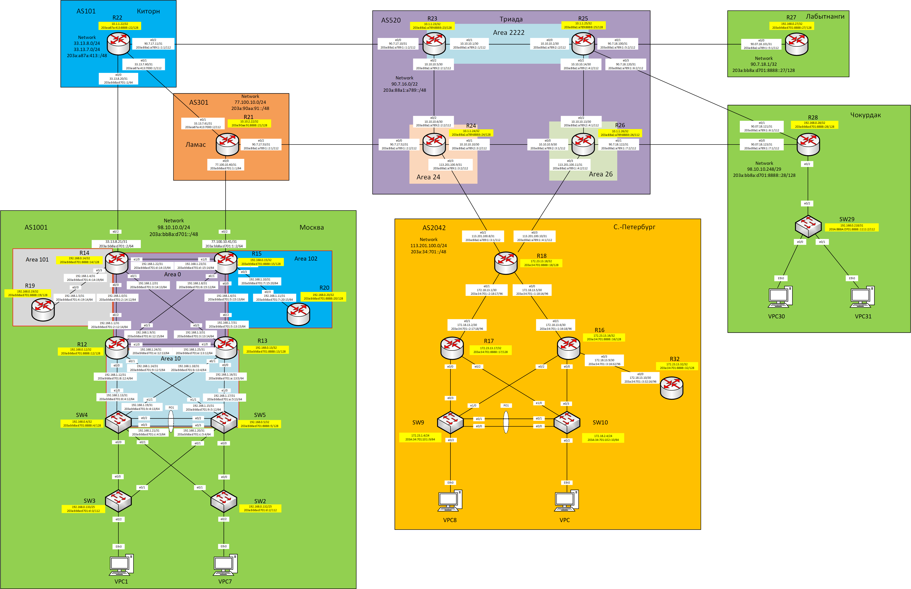
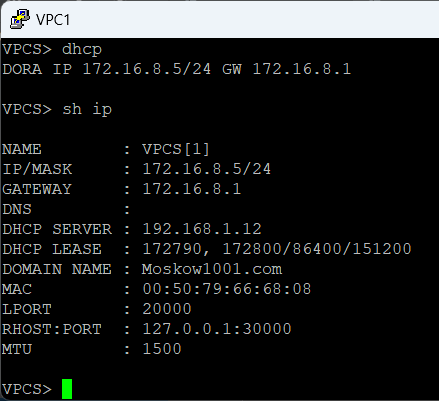
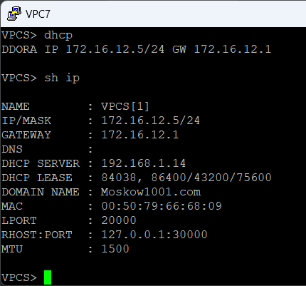
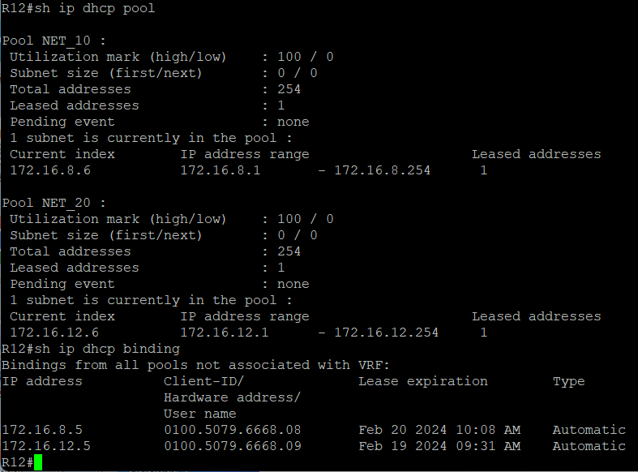
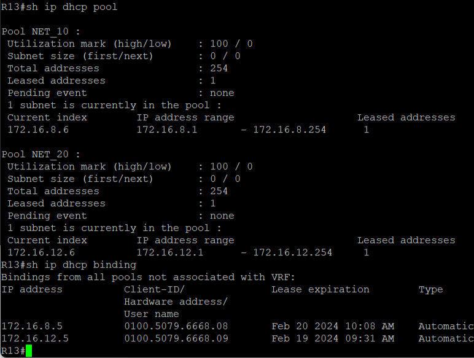

## Практическое задание №12

1. Настроить NAT(PAT) на R14 и R15. Трансляция должна осуществляться в адрес автономной системы AS1001.
2. Настроить NAT(PAT) на R18. Трансляция должна осуществляться в пул из 5 адресов автономной системы AS2042.
3. Настроить статический NAT для R20.
4. Настроить NAT так, чтобы R19 был доступен с любого узла для удаленного управления.
5*. Настроить статический NAT(PAT) для офиса Чокурдак.
5. Настроить IPv4 DHCP сервер в офисе Москва на маршрутизаторах R12 и R13. VPC1 и VPC7 должны получать сетевые настройки по DHCP.
6. Настроить NTP сервер на R12 и R13. Все устройства в офисе Москва должны синхронизировать время с R12 и R13.

Схема лабораторного стенда.



Таблица адресов

| Office      | Hostname | Interface              | Description    | IPv4 address   | Subnet mask     | Gateway       | IPv6 address                    | IPV6 LLA     | Network                     |
|-------------|----------|------------------------|----------------|----------------|-----------------|---------------|---------------------------------|--------------|-----------------------------|
| Москва      | R14      | e0/0                   | to_R12         | 192.168.1.0    | 255.255.255.254 |               | 203a:bb8a:d701:2::14:12/64      | FE80::14     | 98.10.10.0/24               |
|             |          | e0/1                   | to_R13         | 192.168.1.2    | 255.255.255.254 |               | 203a:bb8a:d701:3::14:13/64      | FE80::14     | 203a:bb8a:d701::/48         |
|             |          | e0/2                   | to_Kitorn      | 33.13.8.21     | 255.255.255.254 |               | 203a:bb8a:d701::2/64            | FE80::14     |                             |
|             |          | e0/3                   | to_R19         | 192.168.1.4    | 255.255.255.254 |               | 203a:bb8a:d701:4::14:19/64      | FE80::14     |                             |
|             |          | e1/0                   | to_R15         | 192.168.1.22   | 255.255.255.254 |               | 203a:bb8a:d701:d::14:15/64      | FE80::14     |                             |
|             |          | Loopback0              |                | 192.168.0.14   | 255.255.255.255 |               | 203a:bb8a:d701:8888::14/128     |              |                             |
|             |          | Loopback1              |                | 98.10.10.2     | 255.255.255.255 |               |                                 |              |                             |
|             | R15      | e0/0                   | to_R13         | 192.168.1.6    | 255.255.255.254 |               | 203a:bb8a:d701:5::15:13/64      | FE80::15     |                             |
|             |          | e0/1                   | to_R12         | 192.168.1.8    | 255.255.255.254 |               | 203a:bb8a:d701:6::15:12/64      | FE80::15     |                             |
|             |          | e0/2                   | to_Lamas       | 77.100.10.41   | 255.255.255.254 |               | 203a:bb8a:d701:1::2/64          | FE80::15     |                             |
|             |          | e0/3                   | to_R20         | 192.168.1.10   | 255.255.255.254 |               | 203a:bb8a:d701:7::15:20/64      | FE80::15     |                             |
|             |          | e1/0                   | to_R14         | 192.168.1.23   | 255.255.255.254 |               | 203a:bb8a:d701:d::15:14/64      | FE80::15     |                             |
|             |          | Loopback0              |                | 192.168.0.15   | 255.255.255.255 |               | 203a:bb8a:d701:8888::15/128     |              |                             |
|             |          | Loopback1              |                | 98.10.10.1     | 255.255.255.255 |               |                                 |              |                             |
|             | R12      | e0/0                   | to_SW4         | 192.168.1.12   | 255.255.255.254 |               | 203a:bb8a:d701:8::12:4/64       | FE80::12     |                             |
|             |          | e0/1                   | to_SW5         | 192.168.1.14   | 255.255.255.254 |               | 203a:bb8a:d701:9::12:5/64       | FE80::12     |                             |
|             |          | e0/2                   | to_R14         | 192.168.1.1    | 255.255.255.254 |               | 203a:bb8a:d701:2::12:14/64      | FE80::12     |                             |
|             |          | e0/3                   | to_R15         | 192.168.1.9    | 255.255.255.254 |               | 203a:bb8a:d701:6::12:15/64      | FE80::12     |                             |
|             |          | e1/0                   | to_R13         | 192.168.1.24   | 255.255.255.254 |               | 203a:bb8a:d701:e::12:13/64      | FE80::12     |                             |
|             |          | Loopback0              |                | 192.168.0.12   | 255.255.255.255 |               | 203a:bb8a:d701:8888::12/128     |              |                             |
|             | R13      | e0/0                   | to_SW5         | 192.168.1.16   | 255.255.255.254 |               | 203a:bb8a:d701:a::13:5/64       | FE80::13     |                             |
|             |          | e0/1                   | to_SW4         | 192.168.1.18   | 255.255.255.254 |               | 203a:bb8a:d701:b::13:4/64       | FE80::13     |                             |
|             |          | e0/2                   | to_R15         | 192.168.1.7    | 255.255.255.254 |               | 203a:bb8a:d701:5::13:15/64      | FE80::13     |                             |
|             |          | e0/3                   | to_R14         | 192.168.1.3    | 255.255.255.254 |               | 203a:bb8a:d701:3::13:14/64      | FE80::13     |                             |
|             |          | e1/0                   | to_R12         | 192.168.1.25   | 255.255.255.254 |               | 203a:bb8a:d701:e::13:12/64      | FE80::13     |                             |
|             |          | Loopback0              |                | 192.168.0.13   | 255.255.255.255 |               | 203a:bb8a:d701:8888::13/128     |              |                             |
|             | R19      | e0/0                   | to_R14         | 192.168.1.5    | 255.255.255.254 |               | 203a:bb8a:d701:4::19:14/64      | FE80::19     |                             |
|             |          | Loopback0              |                | 192.168.0.19   | 255.255.255.255 |               | 203a:bb8a:d701:8888::19/128     |              |                             |
|             | R20      | e0/0                   | to_R15         | 192.168.1.11   | 255.255.255.254 |               | 203a:bb8a:d701:7::20:15/64      | FE80::20     |                             |
|             |          | Loopback0              |                | 192.168.0.20   | 255.255.255.255 |               | 203a:bb8a:d701:8888::20/128     |              |                             |
|             | SW4      | VLAN10                 | Client1        | 172.16.8.3     | 255.255.255.0   |               | 203a:bb8a:d701:1010::3/64       |              |                             |
|             |          | VLAN20                 | Client7        | 172.16.12.3    | 255.255.255.0   |               | 203a:bb8a:d701:1020::3/64       |              |                             |
|             |          | VLAN99                 | Mgmt_Access_SW | 192.168.0.131  | 255.255.255.128 |               | 203a:bb8a:d701:d::4/112         |              |                             |
|             |          | Port-chanel 1 (e0/2-3) | to_PO1_SW5     | 192.168.1.21   | 255.255.255.254 |               | 203a:bb8a:d701:c::4:5/64        | FE80::4      |                             |
|             |          | e1/0                   | to_R12         | 192.168.1.13   | 255.255.255.254 |               | 203a:bb8a:d701:8::4:12/64       | FE80::4      |                             |
|             |          | e1/1                   | to_R13         | 192.168.1.19   | 255.255.255.254 |               | 203a:bb8a:d701:b::4:13/64       | FE80::4      |                             |
|             |          | VRRP2                  | Client1_ipv4   | 172.16.8.1     | 255.255.255.0   |               |                                 |              |                             |
|             |          | VRRP21                 | Client1_ipv6   |                |                 |               |                                 | FE80::4:4    |                             |
|             |          | VRRP3                  | Client7_ipv4   | 172.16.12.1    | 255.255.255.0   |               |                                 |              |                             |
|             |          | VRRP31                 | Client7_ipv6   |                |                 |               |                                 | FE80::4:5    |                             |
|             |          | VRRP1                  | Mgmt_Access_SW | 192.168.0.129  | 255.255.255.128 |               |                                 |              |                             |
|             |          | VRRP11                 | Mgmt_Access_SW |                |                 |               |                                 | FE80::4:1    |                             |
|             |          | Loopback0              |                | 192.168.0.4    | 255.255.255.255 |               | 203a:bb8a:d701:8888::4/128      |              |                             |
|             | SW5      | VLAN20                 | Client7        | 172.16.8.2     | 255.255.255.0   |               | 203a:bb8a:d701:1020::2/64       |              |                             |
|             |          | VLAN99                 | Mgmt_Access_SW | 192.168.0.130  | 255.255.255.128 |               | 203a:bb8a:d701:d::5/112         |              |                             |
|             |          | VLAN10                 | Client1        | 172.16.12.2    | 255.255.255.0   |               | 203a:bb8a:d701:1010::2/64       |              |                             |
|             |          | Port-chanel 1 (e0/2-3) | to_PO1_SW4     | 192.168.1.20   | 255.255.255.254 |               | 203a:bb8a:d701:c::5:4/64        | FE80::5      |                             |
|             |          | e1/0                   | to_R13         | 192.168.1.17   | 255.255.255.254 |               | 203a:bb8a:d701:a::5:13/64       | FE80::5      |                             |
|             |          | e1/1                   | to_R12         | 192.168.1.15   | 255.255.255.254 |               | 203a:bb8a:d701:9::5:12/64       | FE80::5      |                             |
|             |          | VRRP2                  | Client1_ipv4   | 172.16.8.1     | 255.255.255.0   |               |                                 |              |                             |
|             |          | VRRP21                 | Client1_ipv6   |                |                 |               |                                 | FE80::4:4    |                             |
|             |          | VRRP3                  | Client7_ipv4   | 172.16.12.1    | 255.255.255.0   |               |                                 |              |                             |
|             |          | VRRP31                 | Client7_ipv6   |                |                 |               |                                 | FE80::4:5    |                             |
|             |          | VRRP1                  | Mgmt_Access_SW | 192.168.0.129  | 255.255.255.128 |               |                                 |              |                             |
|             |          | VRRP11                 | Mgmt_Access_SW |                |                 |               |                                 | FE80::4:1    |                             |
|             |          | Loopback0              |                | 192.168.0.5    | 255.255.255.255 |               | 203a:bb8a:d701:8888::5/128      |              |                             |
|             | SW3      | VLAN98                 | Mgmt_SW3       | 192.168.0.133  | 255.255.255.128 | 192.168.0.129 | 203a:bb8a:d701:d::3/112         | FE80::3      |                             |
|             |          | e0/0                   | to_SW4         | NA             | NA              | NA            |                                 |              |                             |
|             |          | e0/1                   | to_SW5         | NA             | NA              | NA            |                                 |              |                             |
|             |          | e0/2                   | to_VPC1        | NA             | NA              | NA            |                                 |              |                             |
|             | SW2      | VLAN99                 | Mgmt_SW2       | 192.168.0.132  | 255.255.255.128 | 192.168.0.129 | 203a:bb8a:d701:d::2/112         | FE80::2      |                             |
|             |          | e0/0                   | to_SW5         | NA             | NA              | NA            |                                 |              |                             |
|             |          | e0/1                   | to_SW4         | NA             | NA              | NA            |                                 |              |                             |
|             |          | e0/2                   | to_VPC7        | NA             | NA              | NA            |                                 |              |                             |
|             | VPC1     | NIC                    |                | DHCP           | DHCP            | DHCP          | SLAAC+DHCPv6                    |              |                             |
|             | VPC7     | NIC                    |                | DHCP           | DHCP            | DHCP          | SLAAC+DHCPv6                    |              |                             |
| Киторн      | R22      | e0/0                   | to_Moscow      | 33.13.8.20     | 255.255.255.254 |               | 203a:bb8a:d701::1/64            | FE80::22     | 33.13.8.0/24                |
|             |          | e0/1                   | to_Lamas       | 33.13.7.60     | 255.255.255.254 |               | 203a:a87a:413:7000::1/112       | FE80::22     | 33.13.7.0/24                |
|             |          | e0/2                   | to_Triada      | 90.7.17.11     | 255.255.255.254 |               | 203a:88a1:a789:1::1:1/112       | FE80::22     | 203a:a87a:413::/48          |
|             |          | Loopback0              |                | 10.1.1.22      | 255.255.255.255 |               | 203a:a87a:413:8888::22/128      |              |                             |
|             |          | Loopback1              |                | 33.13.7.1      | 255.255.255.255 |               |                                 |              |                             |
| Ламас       | R21      | e0/0                   | to_Moscow      | 77.100.10.40   | 255.255.255.254 |               | 203a:bb8a:d701:1::1/64          | FE80::21     | 77.100.10.0/24              |
|             |          | e0/1                   | to_Kitorn      | 33.13.7.61     | 255.255.255.254 |               | 203a:a87a:413:7000::2/112       | FE80::21     | 203a:90aa:91::/48           |
|             |          | e0/2                   | to_Triada      | 90.7.17.53     | 255.255.255.254 |               | 203a:88a1:a789:1::2:1/112       | FE80::21     |                             |
|             |          | Loopback0              |                | 10.10.2.22     | 255.255.255.255 |               | 203a:90aa:91:8888::21/128       |              |                             |
|             |          | Loopback1              |                | 77.100.10.1    | 77.100.10.0/24  |               |                                 |              |                             |
| Триада      | R23      | e0/0                   | to_Kitorn      | 90.7.17.10     | 255.255.255.254 |               | 203a:88a1:a789:1::1:2/112       | FE80::23     | 90.7.16.0/22                |
|             |          | e0/1                   | to_R25         | 10.10.10.1     | 255.255.255.252 |               | 203a:88a1:a789:2::1/112         | FE80::23     | 203a:88a1:a789::/48         |
|             |          | e0/2                   | to_R24         | 10.10.10.5     | 255.255.255.252 |               | 203a:88a1:a789:2::2:1/112       | FE80::23     |                             |
|             |          | Loopback0              |                | 10.1.1.23      | 255.255.255.255 |               | 203a:88a1:a789:8888::23/128     |              |                             |
|             | R24      | e0/0                   | to_Lamas       | 90.7.17.52     | 255.255.255.254 |               | 203a:88a1:a789:1::2:2/112       | FE80::24     |                             |
|             |          | e0/1                   | to_R26         | 10.10.10.10    | 255.255.255.252 |               | 203a:88a1:a789:2::3:2/112       | FE80::24     |                             |
|             |          | e0/2                   | to_R23         | 10.10.10.6     | 255.255.255.252 |               | 203a:88a1:a789:2::2:2/112       | FE80::24     |                             |
|             |          | e0/3                   | to_SPeterburg  | 113.201.100.9  | 255.255.255.254 |               | 203a:88a1:a789:1::3:2/112       | FE80::24     |                             |
|             |          | Loopback0              |                | 10.1.1.24      | 255.255.255.255 |               | 203a:88a1:a789:8888::24/128     |              |                             |
|             |          | Loopback1              |                | 90.7.16.1      | 255.255.255.255 |               |                                 |              |                             |
|             | R25      | e0/0                   | to_R23         | 10.10.10.2     | 255.255.255.252 |               | 203a:88a1:a789:2::2/112         | FE80::25     |                             |
|             |          | e0/1                   | to_Labutnangi  | 90.7.18.100    | 255.255.255.254 |               | 203a:88a1:a789:1::5:2/112       | FE80::25     |                             |
|             |          | e0/2                   | to_R26         | 10.10.10.14    | 255.255.255.252 |               | 203a:88a1:a789:2::4:2/112       | FE80::25     |                             |
|             |          | e0/3                   | to_Chokurdak   | 90.7.18.120    | 255.255.255.254 |               | 203a:88a1:a789:1::6:2/112       | FE80::25     |                             |
|             |          | Loopback0              |                | 10.1.1.25      | 255.255.255.255 |               | 203a:88a1:a789:8888::25/128     |              |                             |
|             | R26      | e0/0                   | to_R24         | 10.10.10.9     | 255.255.255.252 |               | 203a:88a1:a789:2::3:1/112       | FE80::26     |                             |
|             |          | e0/1                   | to_Chokurdak   | 90.7.18.122    | 255.255.255.254 |               | 203a:88a1:a789:1::7:2/112       | FE80::26     |                             |
|             |          | e0/2                   | to_R25         | 10.10.10.13    | 255.255.255.252 |               | 203a:88a1:a789:2::4:1/112       | FE80::26     |                             |
|             |          | e0/3                   | to_SPeterburg  | 113.201.100.11 | 255.255.255.254 |               | 203a:88a1:a789:1::4:2/112       | FE80::26     |                             |
|             |          | Loopback0              |                | 10.1.1.26      | 255.255.255.255 |               | 203a:88a1:a789:8888::26/112     |              | 113.201.100.0/24            |
| С-Петербург | R18      | e0/0                   | to_R16         | 172.18.13.5    | 255.255.255.252 |               | 203a:34:701::1:18:16/96         | FE80::18     | 203a:34:701::/48            |
|             |          | e0/1                   | to_R17         | 172.18.13.1    | 255.255.255.252 |               | 203a:34:701::2:18:17/96         | FE80::18     |                             |
|             |          | e0/2                   | to_Triada24    | 113.201.100.8  | 255.255.255.254 |               | 203a:88a1:a789:1::3:1/112       | FE80::18     |                             |
|             |          | e0/3                   | to_Triada26    | 113.201.100.10 | 255.255.255.254 |               | 203a:88a1:a789:1::4:1/112       | FE80::18     |                             |
|             |          | Loopback0              |                | 172.23.13.18   | 255.255.255.255 |               | 203a:34:701:8888::18/128        |              |                             |
|             |          | Loopback1              |                | 113.201.100.1  | 255.255.255.255 |               |                                 |              |                             |
|             | R17      | e0/0.101               | Client9        | 172.18.1.3     | 255.255.255.0   |               | 203a:34:701:101::2/64           | FE80::17:101 |                             |
|             |          | e0/1                   | to_R18         | 172.18.13.2    | 255.255.255.252 |               | 203a:34:701::2:17:18/96         | FE80::17     |                             |
|             |          | e0/2.102               | Client10       | 172.18.2.3     | 255.255.255.0   |               | 203a:34:701:102::2/64           | FE80::17:102 |                             |
|             |          | HSRP1                  | Client9v4      | 172.18.1.1     |                 |               |                                 |              |                             |
|             |          | HSRP2                  | Client10v4     | 172.18.2.1     |                 |               |                                 |              |                             |
|             |          | HSRP3                  | Client9v6      |                |                 |               | 203a:34:701:101::1/64           | FE80::17:3   |                             |
|             |          | HSRP4                  | Client10v6     |                |                 |               | 203a:34:701:102::1/64           | FE80::17:4   |                             |
|             |          | Loopback0              |                | 172.23.13.17   | 255.255.255.255 |               | 203a:34:701:8888::17/128        |              |                             |
|             | R16      | e0/0.102               | Client10       | 172.18.2.2     | 255.255.255.0   |               | 203a:34:701:102::3/64           | FE80::16:102 |                             |
|             |          | e0/1                   | to_R18         | 172.18.13.6    | 255.255.255.252 |               | 203a:34:701::1:16:18/96         | FE80::16     |                             |
|             |          | e0/2.101               | Client9        | 172.18.1.2     | 255.255.255.0   |               | 203a:34:701:101::3/64           | FE80::16:101 |                             |
|             |          | e0/3                   | to_R32         | 172.18.13.9    | 255.255.255.252 |               | 203a:34:701::3:16:32/96         | FE80::16     |                             |
|             |          | HSRP1                  | Client9v4      | 172.18.1.1     |                 |               |                                 |              |                             |
|             |          | HSRP2                  | Client10v4     | 172.18.2.1     |                 |               |                                 |              |                             |
|             |          | HSRP3                  | Client9v6      |                |                 |               | 203a:34:701:101::1/64           | FE80::17:3   |                             |
|             |          | HSRP4                  | Client10v6     |                |                 |               | 203a:34:701:102::1/64           | FE80::17:4   |                             |
|             |          | Loopback0              |                | 172.23.13.16   | 255.255.255.255 |               | 203a:34:701:8888::16/128        |              |                             |
|             | R32      | e0/0                   | to_R16         | 172.18.13.10   | 255.255.255.252 |               | 203a:34:701::3:32:16/96         | FE80::32     |                             |
|             |          | Loopback0              |                | 172.23.13.32   | 255.255.255.255 |               | 203a:34:701:8888::32/128        |              |                             |
|             | SW9      | e0/0                   | PO1_to_SW10    | NA             | NA              | NA            |                                 |              |                             |
|             |          | e0/1                   | PO1_to_SW10    | NA             | NA              | NA            |                                 |              |                             |
|             |          | e0/2                   | to_VPC8        | NA             | NA              | NA            |                                 |              |                             |
|             |          | e0/3                   | to_R17         | NA             | NA              | NA            |                                 |              |                             |
|             |          | e1/0                   | to_R16         | NA             | NA              | NA            |                                 |              |                             |
|             |          | VLAN101                | Mgmt_SW9       | 172.18.1.4     | 255.255.255.0   | 172.18.1.1    | 203a:34:701:101::9/64           |              |                             |
|             | SW10     | e0/0                   | PO1_to_SW10    | NA             | NA              | NA            |                                 |              |                             |
|             |          | e0/1                   | PO1_to_SW10    | NA             | NA              | NA            | `                               |              |                             |
|             |          | e0/2                   | to_VPC         | NA             | NA              | NA            |                                 |              |                             |
|             |          | e0/3                   | to_R16         | NA             | NA              | NA            |                                 |              |                             |
|             |          | e1/0                   | to_R17         | NA             | NA              | NA            |                                 |              |                             |
|             |          | VLAN102                | Mgmt_SW10      | 172.18.2.4     | 255.255.255.0   | 172.18.2.1    | 203a:34:701:102::10/64          |              |                             |
|             | VPC8     | NIC                    |                | DHCP           | DHCP            | DHCP          | SLAAC                           |              |                             |
|             | VPC      | NIC                    |                | DHCP           | DHCP            | DHCP          | SLAAC                           |              |                             |
| Лабытнанги  | R27      | e0/0                   | to_Triada25    | 90.7.18.101    | 255.255.255.254 |               | 203a:88a1:a789:1::5:1/112       | fe80::27     | 90.7.18.1/32                |
|             |          | Loopback0              |                | 192.168.0.27   | 255.255.255.255 |               | 203a:bb8a:d701:8888::27/128     |              | 203a:bb8a:d701:8888::27/128 |
| Чокурдак    | R28      | e0/0                   | to_Triada26    | 90.7.18.123    | 255.255.255.254 |               | 203a:88a1:a789:1::1:1/112       | fe80::28     | 90.7.18.2/31                |
|             |          | e0/1                   | to_Triada25    | 90.7.18.121    | 255.255.255.254 |               | 203a:88a1:a789:1::6:1/112       | fe80::28     | 203a:bb8a:d701:8888::28/128 |
|             |          | e0/2.30                | Client30       | 172.16.30.1    | 255.255.255.0   |               | 203a:bb8a:d701:61::1/64         | fe80::28:30  | 203a:bb8a:d701:61::1/64     |
|             |          | e0/2.31                | Client31       | 172.16.31.1    | 255.255.255.0   |               | 203a:bb8a:d701:62::1/64         | fe80::28:31  | 203a:bb8a:d701:62::1/64     |
|             |          | e0/2.88                | Mgmt_SW29      | 192.168.0.217  | 255.255.255.252 |               | 203a:bb8a:d701:8888::1111:1/112 | fe80::28:88  |                             |
|             |          | Loopback0              |                | 192.168.0.28   | 255.255.255.255 |               | 203a:bb8a:d701:8888::28/128     |              |                             |
|             | SW29     | VLAN88                 | Mgmt_SW29      | 192.168.0.218  | 255.255.255.252 | 192.168.0.217 | 203a:bb8a:d701:8888::1111:2/112 |              |                             |
|             | VPC30    | NIC                    |                | 172.16.30.2    | 255.255.255.0   | 172.16.30.1   | SLAAC+DHCPv6                    |              |                             |
|             | VPC31    | NIC                    |                | 172.16.31.2    | 255.255.255.0   | 172.16.31.1   | SLAAC+DHCPv6                    |


### 1. Настроить NAT(PAT) на R14 и R15. Трансляция должна осуществляться в адрес автономной системы AS1001.

Все IP адреса клиентских сетей 172.16.8.0/24 и 172.16.12.0/24 за исключением адресов диапазонов 172.16.8.0/30 и 172.16.12.0/30 
 будут транслироваться в глобальную сеть через один IP адрес 98.10.10.5 (AS1001)

Cоздаем стандартный нумерованный ACL
````
R15(config)#access-list 9 deny 172.16.8.0 0.0.0.3
R15(config)#access-list 9 deny 172.16.12.0 0.0.0.3
R15(config)#access-list 9 permit 172.16.8.0 0.0.0.255
R15(config)#access-list 9 permit 172.16.12.0 0.0.0.255
````
Cоздаем пул ip адресов с именем Pool_MSK_client и включаем PAT для IP адресов разрешенного диапазона access-list 9 в 
созданный пул Pool_MSK_client.

````
R15(config)#ip nat pool Pool_MSK_client 98.10.10.1 98.10.10.1 netmask 255.255.255.0
R15(config)#ip nat inside source list 9 pool Pool_MSK_client overload
````
Устанавливаем интерфейсы e0/0-1 и e1/0 R15 как внутренние для NAT, а e0/2 - внешний с помощбю команд
````
R15(config-if)#ip nat inside
R15(config-if)#ip nat outside
````
Аналогично настраиваем и R14.

Проверка утилитой пинг доступности интерфейса Loopback1 R21 (IP address 77.100.10.1) во внешней сети cо стороны VPC1 и VPC7.


Для контроля выведена информация отладчика NAT на R14 и R15 (команда **_debug ip nat_**).


### 2. Настроить NAT(PAT) на R18. Трансляция должна осуществляться в пул из 5 адресов автономной системы AS2042.

Настроим динамический NAT используя диапазон собственных адресов in -113.201.100.6 AS2042.

Выполняем настройку. Создаем стандартный access-list.
````
R18(config)#ip access-list standard 9
R18(config-std-nacl)#deny 172.18.2.0 0.0.0.3
R18(config-std-nacl)#deny 172.18.1.0 0.0.0.3
R18(config-std-nacl)#permit 172.18.2.0 0.0.0.255
R18(config-std-nacl)#permit 172.18.1.0 0.0.0.255
````
Создаем пул и включаем NAT для внутренних клиентских сетей с использованием access-list.
````
R18(config)#ip nat pool Pool_SPB_client 113.201.100.2 113.201.100.6 netmask 255.255.255.0
R18(config)#ip nat inside source list 9 pool Pool_SPB_client
````
Для внутренних интерфейсов
````
R18(config)#interface range e0/0-1
R18(config-if-range)#ip nat inside
````
Для внешних интерфейсов 
````
R18(config)#interface range e0/2-3
R18(config-if-range)#ip nat outside
````
Проверка с VPC и VPC8 пингуем адреса Loopback1 R14 и R15 AS1001


### 3. Настроить статический NAT для R20.

На R15 настраиваем трансляцию адреса Loopback0 R20 в адрес AS1001.
````
R15(config)#ip nat inside source static 192.168.0.20 98.10.10.4
R15(config)#int e0/3
R15(config-if)#ip nat inside
````
Настройка на R14
````
R14(config)#ip nat inside source static 192.168.0.20 98.10.10.4
````
Проверка утилитой пинг интерфейса Loopback1 R22 AS101


Cообщения отладчика NAT R15


### 4. Настроить NAT так, чтобы R19 был доступен с любого узла для удаленного управления.

Настраиваем на R14
````
R14(config)#ip nat inside source static 192.168.0.19 98.10.10.3 extendable
R14(config)#int e0/3
R15(config-if)#ip nat inside
````
И на R15
```
R15(config)#ip nat inside source static 192.168.0.19 98.10.10.3 extendable
````
Проверяем доступность узла из внешней сети.

oт имени Loopback1 R21


от имени Loopback1 R22


от имени Loopback1 R18


### 5. Настроите статический NAT(PAT) для офиса Чокурдак.
Провайдер Триада выделил пул адресов 90.7.18.2/31.
Адрес 90.7.18.2 используем для организации доступнсоти R28, а 90.7.18.3 используем для доступности сервера в роли которого 
выступит VPC30.
Настраиваем два статических NAT
````
R28(config)#ip nat inside source static 192.168.0.28 90.7.18.2 extendable
R28(config)#ip nat inside source static 172.16.30.2 90.7.18.3
````
Интерфейсы e0/0-1 R28 настраиваем как внешние
````
R28(config-if)#ip nat outside
````
а сабинтерфейсы e0/2.30 и e0/2.31 как внутренние
````
R15(config-if)#ip nat inside
````
Пусть остальные хосты на примере VPC31 будут транслировать свои адреса, через адреса интерфейсов
Выполним настройки на R28.
````
R28(config)#access-list 9 deny   172.16.30.0 0.0.0.3
R28(config)#access-list 9 deny   172.16.31.0 0.0.0.3
R28(config)#access-list 9 permit 172.16.31.0 0.0.0.255
R28(config)#access-list 9 permit 172.16.30.0 0.0.0.255
R28(config)#ip nat inside source list 9 interface Ethernet0/0 overload
````
Проверка утилитой пинг адреса 98.10.10.3


### 6. Настроить IPv4 DHCP сервер в офисе Москва на маршрутизаторах R12 и R13. VPC1 и VPC7 должны получать сетевые настройки по DHCP.

Покажем настройку DHCP серверов на примере R12.
````
R12(config)#ip dhcp excluded-address 172.16.8.1 172.16.8.4
R12(config)#ip dhcp excluded-address 172.16.12.1 172.16.12.4
R12(config)#ip dhcp pool NET_10
R12(dhcp-config)#network 172.16.8.0 255.255.255.0
R12(dhcp-config)# domain-name Moskow1001.com
R12(dhcp-config)# default-router 172.16.8.1
R12(dhcp-config)# lease 2
R12(dhcp-config)#exit
R12(config)#ip dhcp pool NET_20
R12(dhcp-config)# network 172.16.12.0 255.255.255.0
R12(dhcp-config)# default-router 172.16.12.1
R12(dhcp-config)# domain-name Moskow1001.com
R12(dhcp-config)#exit
R12(config)#ipv6 dhcp pool SW4-Stateless
R12(config-dhcpv6)# dns-server 203A:BB8A:D701:1001::1
R12(config-dhcpv6)# domain-name Moskow1001.com
R12(config-dhcpv6)#int ra e0/0-1
R12(config-if-range)#ipv6 nd other-config-flag
R12(config-if-range)# ipv6 dhcp server SW4-Stateless

````
На интерфейсах SW4 и SW5 в сторону клиента настриваем ретрансляцию DHCP.
````
SW4(config-if)#ip helper-address 192.168.0.12
SW4(config-if)#ip helper-address 192.168.0.13
SW4(config-if)#ipv6 dhcp relay destination 203a:bb8a:d701:8888::12
SW4(config-if)#ipv6 dhcp relay destination 203a:bb8a:d701:8888::13
````
Производим проверку получения IP настроек на VPC.





Для R12 и R13 покажем оставшиеся и использованные DHCP адреса, а так-же список привязок адресов IPv4 к MAC-адресам.





### 7. Настроить NTP сервер на R12 и R13. Все устройства в офисе Москва должны синхронизировать время с R12 и R13.

Выполним настройку NTP сервера на R12 и R13 командой **_ntp master 2_**
На NTP клиентах выполняем команды 
````
ntp server 192.168.0.12 source loopback 0
ntp server 192.168.0.13 source loopback 0
ntp update-calendar
````


