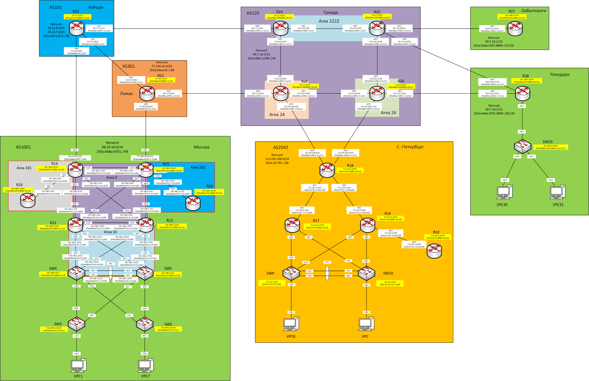

## Практическое задание №14

1. [Настроить GRE поверх IPSec между офисами Москва и С.-Петербург.](https://github.com/Neytrin/Network-ingeneer/blob/main/labs/lab14/readme.md#1-%D0%BD%D0%B0%D1%81%D1%82%D1%80%D0%BE%D0%B8%D1%82%D1%8C-gre-%D0%BF%D0%BE%D0%B2%D0%B5%D1%80%D1%85-ipsec-%D0%BC%D0%B5%D0%B6%D0%B4%D1%83-%D0%BE%D1%84%D0%B8%D1%81%D0%B0%D0%BC%D0%B8-%D0%BC%D0%BE%D1%81%D0%BA%D0%B2%D0%B0-%D0%B8-%D1%81-%D0%BF%D0%B5%D1%82%D0%B5%D1%80%D0%B1%D1%83%D1%80%D0%B3)
2. [Настроить DMVPN поверх IPSec между Москва и Чокурдах, Лабытнанги.](https://github.com/Neytrin/Network-ingeneer/blob/main/labs/lab14/readme.md#2-%D0%BD%D0%B0%D1%81%D1%82%D1%80%D0%BE%D0%B8%D1%82%D1%8C-dmvpn-%D0%BF%D0%BE%D0%B2%D0%B5%D1%80%D1%85-ipsec-%D0%BC%D0%B5%D0%B6%D0%B4%D1%83-%D0%BC%D0%BE%D1%81%D0%BA%D0%B2%D0%B0-%D0%B8-%D1%87%D0%BE%D0%BA%D1%83%D1%80%D0%B4%D0%B0%D1%85-%D0%BB%D0%B0%D0%B1%D1%8B%D1%82%D0%BD%D0%B0%D0%BD%D0%B3%D0%B8)

Схема лабораторного стенда



Таблица адресов

| Office      | Hostname | Interface              | Description    | IPv4 address   | Subnet mask     | Gateway       | IPv6 address                    | IPV6 LLA     | Network                     |
|-------------|----------|------------------------|----------------|----------------|-----------------|---------------|---------------------------------|--------------|-----------------------------|
| Москва      | R14      | e0/0                   | to_R12         | 192.168.1.0    | 255.255.255.254 |               | 203a:bb8a:d701:2::14:12/64      | FE80::14     | 98.10.10.0/24               |
|             |          | e0/1                   | to_R13         | 192.168.1.2    | 255.255.255.254 |               | 203a:bb8a:d701:3::14:13/64      | FE80::14     | 203a:bb8a:d701::/48         |
|             |          | e0/2                   | to_Kitorn      | 33.13.8.21     | 255.255.255.254 |               | 203a:bb8a:d701::2/64            | FE80::14     |                             |
|             |          | e0/3                   | to_R19         | 192.168.1.4    | 255.255.255.254 |               | 203a:bb8a:d701:4::14:19/64      | FE80::14     |                             |
|             |          | e1/0                   | to_R15         | 192.168.1.22   | 255.255.255.254 |               | 203a:bb8a:d701:d::14:15/64      | FE80::14     |                             |
|             |          | Loopback0              |                | 192.168.0.14   | 255.255.255.255 |               | 203a:bb8a:d701:8888::14/128     |              |                             |
|             |          | Loopback1              |                | 98.10.10.2     | 255.255.255.255 |               |                                 |              |                             |
|             | R15      | e0/0                   | to_R13         | 192.168.1.6    | 255.255.255.254 |               | 203a:bb8a:d701:5::15:13/64      | FE80::15     |                             |
|             |          | e0/1                   | to_R12         | 192.168.1.8    | 255.255.255.254 |               | 203a:bb8a:d701:6::15:12/64      | FE80::15     |                             |
|             |          | e0/2                   | to_Lamas       | 77.100.10.41   | 255.255.255.254 |               | 203a:bb8a:d701:1::2/64          | FE80::15     |                             |
|             |          | e0/3                   | to_R20         | 192.168.1.10   | 255.255.255.254 |               | 203a:bb8a:d701:7::15:20/64      | FE80::15     |                             |
|             |          | e1/0                   | to_R14         | 192.168.1.23   | 255.255.255.254 |               | 203a:bb8a:d701:d::15:14/64      | FE80::15     |                             |
|             |          | Loopback0              |                | 192.168.0.15   | 255.255.255.255 |               | 203a:bb8a:d701:8888::15/128     |              |                             |
|             |          | Loopback1              |                | 98.10.10.1     | 255.255.255.255 |               |                                 |              |                             |
|             | R12      | e0/0                   | to_SW4         | 192.168.1.12   | 255.255.255.254 |               | 203a:bb8a:d701:8::12:4/64       | FE80::12     |                             |
|             |          | e0/1                   | to_SW5         | 192.168.1.14   | 255.255.255.254 |               | 203a:bb8a:d701:9::12:5/64       | FE80::12     |                             |
|             |          | e0/2                   | to_R14         | 192.168.1.1    | 255.255.255.254 |               | 203a:bb8a:d701:2::12:14/64      | FE80::12     |                             |
|             |          | e0/3                   | to_R15         | 192.168.1.9    | 255.255.255.254 |               | 203a:bb8a:d701:6::12:15/64      | FE80::12     |                             |
|             |          | e1/0                   | to_R13         | 192.168.1.24   | 255.255.255.254 |               | 203a:bb8a:d701:e::12:13/64      | FE80::12     |                             |
|             |          | Loopback0              |                | 192.168.0.12   | 255.255.255.255 |               | 203a:bb8a:d701:8888::12/128     |              |                             |
|             | R13      | e0/0                   | to_SW5         | 192.168.1.16   | 255.255.255.254 |               | 203a:bb8a:d701:a::13:5/64       | FE80::13     |                             |
|             |          | e0/1                   | to_SW4         | 192.168.1.18   | 255.255.255.254 |               | 203a:bb8a:d701:b::13:4/64       | FE80::13     |                             |
|             |          | e0/2                   | to_R15         | 192.168.1.7    | 255.255.255.254 |               | 203a:bb8a:d701:5::13:15/64      | FE80::13     |                             |
|             |          | e0/3                   | to_R14         | 192.168.1.3    | 255.255.255.254 |               | 203a:bb8a:d701:3::13:14/64      | FE80::13     |                             |
|             |          | e1/0                   | to_R12         | 192.168.1.25   | 255.255.255.254 |               | 203a:bb8a:d701:e::13:12/64      | FE80::13     |                             |
|             |          | Loopback0              |                | 192.168.0.13   | 255.255.255.255 |               | 203a:bb8a:d701:8888::13/128     |              |                             |
|             | R19      | e0/0                   | to_R14         | 192.168.1.5    | 255.255.255.254 |               | 203a:bb8a:d701:4::19:14/64      | FE80::19     |                             |
|             |          | Loopback0              |                | 192.168.0.19   | 255.255.255.255 |               | 203a:bb8a:d701:8888::19/128     |              |                             |
|             | R20      | e0/0                   | to_R15         | 192.168.1.11   | 255.255.255.254 |               | 203a:bb8a:d701:7::20:15/64      | FE80::20     |                             |
|             |          | Loopback0              |                | 192.168.0.20   | 255.255.255.255 |               | 203a:bb8a:d701:8888::20/128     |              |                             |
|             | SW4      | VLAN10                 | Client1        | 172.16.8.3     | 255.255.255.0   |               | 203a:bb8a:d701:1010::3/64       |              |                             |
|             |          | VLAN20                 | Client7        | 172.16.12.3    | 255.255.255.0   |               | 203a:bb8a:d701:1020::3/64       |              |                             |
|             |          | VLAN99                 | Mgmt_Access_SW | 192.168.0.131  | 255.255.255.128 |               | 203a:bb8a:d701:d::4/112         |              |                             |
|             |          | Port-chanel 1 (e0/2-3) | to_PO1_SW5     | 192.168.1.21   | 255.255.255.254 |               | 203a:bb8a:d701:c::4:5/64        | FE80::4      |                             |
|             |          | e1/0                   | to_R12         | 192.168.1.13   | 255.255.255.254 |               | 203a:bb8a:d701:8::4:12/64       | FE80::4      |                             |
|             |          | e1/1                   | to_R13         | 192.168.1.19   | 255.255.255.254 |               | 203a:bb8a:d701:b::4:13/64       | FE80::4      |                             |
|             |          | VRRP2                  | Client1_ipv4   | 172.16.8.1     | 255.255.255.0   |               |                                 |              |                             |
|             |          | VRRP21                 | Client1_ipv6   |                |                 |               |                                 | FE80::4:4    |                             |
|             |          | VRRP3                  | Client7_ipv4   | 172.16.12.1    | 255.255.255.0   |               |                                 |              |                             |
|             |          | VRRP31                 | Client7_ipv6   |                |                 |               |                                 | FE80::4:5    |                             |
|             |          | VRRP1                  | Mgmt_Access_SW | 192.168.0.129  | 255.255.255.128 |               |                                 |              |                             |
|             |          | VRRP11                 | Mgmt_Access_SW |                |                 |               |                                 | FE80::4:1    |                             |
|             |          | Loopback0              |                | 192.168.0.4    | 255.255.255.255 |               | 203a:bb8a:d701:8888::4/128      |              |                             |
|             | SW5      | VLAN20                 | Client7        | 172.16.8.2     | 255.255.255.0   |               | 203a:bb8a:d701:1020::2/64       |              |                             |
|             |          | VLAN99                 | Mgmt_Access_SW | 192.168.0.130  | 255.255.255.128 |               | 203a:bb8a:d701:d::5/112         |              |                             |
|             |          | VLAN10                 | Client1        | 172.16.12.2    | 255.255.255.0   |               | 203a:bb8a:d701:1010::2/64       |              |                             |
|             |          | Port-chanel 1 (e0/2-3) | to_PO1_SW4     | 192.168.1.20   | 255.255.255.254 |               | 203a:bb8a:d701:c::5:4/64        | FE80::5      |                             |
|             |          | e1/0                   | to_R13         | 192.168.1.17   | 255.255.255.254 |               | 203a:bb8a:d701:a::5:13/64       | FE80::5      |                             |
|             |          | e1/1                   | to_R12         | 192.168.1.15   | 255.255.255.254 |               | 203a:bb8a:d701:9::5:12/64       | FE80::5      |                             |
|             |          | VRRP2                  | Client1_ipv4   | 172.16.8.1     | 255.255.255.0   |               |                                 |              |                             |
|             |          | VRRP21                 | Client1_ipv6   |                |                 |               |                                 | FE80::4:4    |                             |
|             |          | VRRP3                  | Client7_ipv4   | 172.16.12.1    | 255.255.255.0   |               |                                 |              |                             |
|             |          | VRRP31                 | Client7_ipv6   |                |                 |               |                                 | FE80::4:5    |                             |
|             |          | VRRP1                  | Mgmt_Access_SW | 192.168.0.129  | 255.255.255.128 |               |                                 |              |                             |
|             |          | VRRP11                 | Mgmt_Access_SW |                |                 |               |                                 | FE80::4:1    |                             |
|             |          | Loopback0              |                | 192.168.0.5    | 255.255.255.255 |               | 203a:bb8a:d701:8888::5/128      |              |                             |
|             | SW3      | VLAN98                 | Mgmt_SW3       | 192.168.0.133  | 255.255.255.128 | 192.168.0.129 | 203a:bb8a:d701:d::3/112         | FE80::3      |                             |
|             |          | e0/0                   | to_SW4         | NA             | NA              | NA            |                                 |              |                             |
|             |          | e0/1                   | to_SW5         | NA             | NA              | NA            |                                 |              |                             |
|             |          | e0/2                   | to_VPC1        | NA             | NA              | NA            |                                 |              |                             |
|             | SW2      | VLAN99                 | Mgmt_SW2       | 192.168.0.132  | 255.255.255.128 | 192.168.0.129 | 203a:bb8a:d701:d::2/112         | FE80::2      |                             |
|             |          | e0/0                   | to_SW5         | NA             | NA              | NA            |                                 |              |                             |
|             |          | e0/1                   | to_SW4         | NA             | NA              | NA            |                                 |              |                             |
|             |          | e0/2                   | to_VPC7        | NA             | NA              | NA            |                                 |              |                             |
|             | VPC1     | NIC                    |                | DHCP           | DHCP            | DHCP          | SLAAC+DHCPv6                    |              |                             |
|             | VPC7     | NIC                    |                | DHCP           | DHCP            | DHCP          | SLAAC+DHCPv6                    |              |                             |
| Киторн      | R22      | e0/0                   | to_Moscow      | 33.13.8.20     | 255.255.255.254 |               | 203a:bb8a:d701::1/64            | FE80::22     | 33.13.8.0/24                |
|             |          | e0/1                   | to_Lamas       | 33.13.7.60     | 255.255.255.254 |               | 203a:a87a:413:7000::1/112       | FE80::22     | 33.13.7.0/24                |
|             |          | e0/2                   | to_Triada      | 90.7.17.11     | 255.255.255.254 |               | 203a:88a1:a789:1::1:1/112       | FE80::22     | 203a:a87a:413::/48          |
|             |          | Loopback0              |                | 10.1.1.22      | 255.255.255.255 |               | 203a:a87a:413:8888::22/128      |              |                             |
|             |          | Loopback1              |                | 33.13.7.1      | 255.255.255.255 |               |                                 |              |                             |
| Ламас       | R21      | e0/0                   | to_Moscow      | 77.100.10.40   | 255.255.255.254 |               | 203a:bb8a:d701:1::1/64          | FE80::21     | 77.100.10.0/24              |
|             |          | e0/1                   | to_Kitorn      | 33.13.7.61     | 255.255.255.254 |               | 203a:a87a:413:7000::2/112       | FE80::21     | 203a:90aa:91::/48           |
|             |          | e0/2                   | to_Triada      | 90.7.17.53     | 255.255.255.254 |               | 203a:88a1:a789:1::2:1/112       | FE80::21     |                             |
|             |          | Loopback0              |                | 10.10.2.22     | 255.255.255.255 |               | 203a:90aa:91:8888::21/128       |              |                             |
|             |          | Loopback1              |                | 77.100.10.1    | 77.100.10.0/24  |               |                                 |              |                             |
| Триада      | R23      | e0/0                   | to_Kitorn      | 90.7.17.10     | 255.255.255.254 |               | 203a:88a1:a789:1::1:2/112       | FE80::23     | 90.7.16.0/22                |
|             |          | e0/1                   | to_R25         | 10.10.10.1     | 255.255.255.252 |               | 203a:88a1:a789:2::1/112         | FE80::23     | 203a:88a1:a789::/48         |
|             |          | e0/2                   | to_R24         | 10.10.10.5     | 255.255.255.252 |               | 203a:88a1:a789:2::2:1/112       | FE80::23     |                             |
|             |          | Loopback0              |                | 10.1.1.23      | 255.255.255.255 |               | 203a:88a1:a789:8888::23/128     |              |                             |
|             | R24      | e0/0                   | to_Lamas       | 90.7.17.52     | 255.255.255.254 |               | 203a:88a1:a789:1::2:2/112       | FE80::24     |                             |
|             |          | e0/1                   | to_R26         | 10.10.10.10    | 255.255.255.252 |               | 203a:88a1:a789:2::3:2/112       | FE80::24     |                             |
|             |          | e0/2                   | to_R23         | 10.10.10.6     | 255.255.255.252 |               | 203a:88a1:a789:2::2:2/112       | FE80::24     |                             |
|             |          | e0/3                   | to_SPeterburg  | 113.201.100.9  | 255.255.255.254 |               | 203a:88a1:a789:1::3:2/112       | FE80::24     |                             |
|             |          | Loopback0              |                | 10.1.1.24      | 255.255.255.255 |               | 203a:88a1:a789:8888::24/128     |              |                             |
|             |          | Loopback1              |                | 90.7.16.1      | 255.255.255.255 |               |                                 |              |                             |
|             | R25      | e0/0                   | to_R23         | 10.10.10.2     | 255.255.255.252 |               | 203a:88a1:a789:2::2/112         | FE80::25     |                             |
|             |          | e0/1                   | to_Labutnangi  | 90.7.18.100    | 255.255.255.254 |               | 203a:88a1:a789:1::5:2/112       | FE80::25     |                             |
|             |          | e0/2                   | to_R26         | 10.10.10.14    | 255.255.255.252 |               | 203a:88a1:a789:2::4:2/112       | FE80::25     |                             |
|             |          | e0/3                   | to_Chokurdak   | 90.7.18.120    | 255.255.255.254 |               | 203a:88a1:a789:1::6:2/112       | FE80::25     |                             |
|             |          | Loopback0              |                | 10.1.1.25      | 255.255.255.255 |               | 203a:88a1:a789:8888::25/128     |              |                             |
|             | R26      | e0/0                   | to_R24         | 10.10.10.9     | 255.255.255.252 |               | 203a:88a1:a789:2::3:1/112       | FE80::26     |                             |
|             |          | e0/1                   | to_Chokurdak   | 90.7.18.122    | 255.255.255.254 |               | 203a:88a1:a789:1::7:2/112       | FE80::26     |                             |
|             |          | e0/2                   | to_R25         | 10.10.10.13    | 255.255.255.252 |               | 203a:88a1:a789:2::4:1/112       | FE80::26     |                             |
|             |          | e0/3                   | to_SPeterburg  | 113.201.100.11 | 255.255.255.254 |               | 203a:88a1:a789:1::4:2/112       | FE80::26     |                             |
|             |          | Loopback0              |                | 10.1.1.26      | 255.255.255.255 |               | 203a:88a1:a789:8888::26/112     |              | 113.201.100.0/24            |
| С-Петербург | R18      | e0/0                   | to_R16         | 172.18.13.5    | 255.255.255.252 |               | 203a:34:701::1:18:16/96         | FE80::18     | 203a:34:701::/48            |
|             |          | e0/1                   | to_R17         | 172.18.13.1    | 255.255.255.252 |               | 203a:34:701::2:18:17/96         | FE80::18     |                             |
|             |          | e0/2                   | to_Triada24    | 113.201.100.8  | 255.255.255.254 |               | 203a:88a1:a789:1::3:1/112       | FE80::18     |                             |
|             |          | e0/3                   | to_Triada26    | 113.201.100.10 | 255.255.255.254 |               | 203a:88a1:a789:1::4:1/112       | FE80::18     |                             |
|             |          | Loopback0              |                | 172.23.13.18   | 255.255.255.255 |               | 203a:34:701:8888::18/128        |              |                             |
|             |          | Loopback1              |                | 113.201.100.1  | 255.255.255.255 |               |                                 |              |                             |
|             | R17      | e0/0.101               | Client9        | 172.18.1.3     | 255.255.255.0   |               | 203a:34:701:101::2/64           | FE80::17:101 |                             |
|             |          | e0/1                   | to_R18         | 172.18.13.2    | 255.255.255.252 |               | 203a:34:701::2:17:18/96         | FE80::17     |                             |
|             |          | e0/2.102               | Client10       | 172.18.2.3     | 255.255.255.0   |               | 203a:34:701:102::2/64           | FE80::17:102 |                             |
|             |          | HSRP1                  | Client9v4      | 172.18.1.1     |                 |               |                                 |              |                             |
|             |          | HSRP2                  | Client10v4     | 172.18.2.1     |                 |               |                                 |              |                             |
|             |          | HSRP3                  | Client9v6      |                |                 |               | 203a:34:701:101::1/64           | FE80::17:3   |                             |
|             |          | HSRP4                  | Client10v6     |                |                 |               | 203a:34:701:102::1/64           | FE80::17:4   |                             |
|             |          | Loopback0              |                | 172.23.13.17   | 255.255.255.255 |               | 203a:34:701:8888::17/128        |              |                             |
|             | R16      | e0/0.102               | Client10       | 172.18.2.2     | 255.255.255.0   |               | 203a:34:701:102::3/64           | FE80::16:102 |                             |
|             |          | e0/1                   | to_R18         | 172.18.13.6    | 255.255.255.252 |               | 203a:34:701::1:16:18/96         | FE80::16     |                             |
|             |          | e0/2.101               | Client9        | 172.18.1.2     | 255.255.255.0   |               | 203a:34:701:101::3/64           | FE80::16:101 |                             |
|             |          | e0/3                   | to_R32         | 172.18.13.9    | 255.255.255.252 |               | 203a:34:701::3:16:32/96         | FE80::16     |                             |
|             |          | HSRP1                  | Client9v4      | 172.18.1.1     |                 |               |                                 |              |                             |
|             |          | HSRP2                  | Client10v4     | 172.18.2.1     |                 |               |                                 |              |                             |
|             |          | HSRP3                  | Client9v6      |                |                 |               | 203a:34:701:101::1/64           | FE80::17:3   |                             |
|             |          | HSRP4                  | Client10v6     |                |                 |               | 203a:34:701:102::1/64           | FE80::17:4   |                             |
|             |          | Loopback0              |                | 172.23.13.16   | 255.255.255.255 |               | 203a:34:701:8888::16/128        |              |                             |
|             | R32      | e0/0                   | to_R16         | 172.18.13.10   | 255.255.255.252 |               | 203a:34:701::3:32:16/96         | FE80::32     |                             |
|             |          | Loopback0              |                | 172.23.13.32   | 255.255.255.255 |               | 203a:34:701:8888::32/128        |              |                             |
|             | SW9      | e0/0                   | PO1_to_SW10    | NA             | NA              | NA            |                                 |              |                             |
|             |          | e0/1                   | PO1_to_SW10    | NA             | NA              | NA            |                                 |              |                             |
|             |          | e0/2                   | to_VPC8        | NA             | NA              | NA            |                                 |              |                             |
|             |          | e0/3                   | to_R17         | NA             | NA              | NA            |                                 |              |                             |
|             |          | e1/0                   | to_R16         | NA             | NA              | NA            |                                 |              |                             |
|             |          | VLAN101                | Mgmt_SW9       | 172.18.1.4     | 255.255.255.0   | 172.18.1.1    | 203a:34:701:101::9/64           |              |                             |
|             | SW10     | e0/0                   | PO1_to_SW10    | NA             | NA              | NA            |                                 |              |                             |
|             |          | e0/1                   | PO1_to_SW10    | NA             | NA              | NA            | `                               |              |                             |
|             |          | e0/2                   | to_VPC         | NA             | NA              | NA            |                                 |              |                             |
|             |          | e0/3                   | to_R16         | NA             | NA              | NA            |                                 |              |                             |
|             |          | e1/0                   | to_R17         | NA             | NA              | NA            |                                 |              |                             |
|             |          | VLAN102                | Mgmt_SW10      | 172.18.2.4     | 255.255.255.0   | 172.18.2.1    | 203a:34:701:102::10/64          |              |                             |
|             | VPC8     | NIC                    |                | DHCP           | DHCP            | DHCP          | SLAAC                           |              |                             |
|             | VPC      | NIC                    |                | DHCP           | DHCP            | DHCP          | SLAAC                           |              |                             |
| Лабытнанги  | R27      | e0/0                   | to_Triada25    | 90.7.18.101    | 255.255.255.254 |               | 203a:88a1:a789:1::5:1/112       | fe80::27     | 90.7.18.1/32                |
|             |          | Loopback0              |                | 192.168.0.27   | 255.255.255.255 |               | 203a:bb8a:d701:8888::27/128     |              | 203a:bb8a:d701:8888::27/128 |
| Чокурдак    | R28      | e0/0                   | to_Triada26    | 90.7.18.123    | 255.255.255.254 |               | 203a:88a1:a789:1::1:1/112       | fe80::28     | 90.7.18.2/31                |
|             |          | e0/1                   | to_Triada25    | 90.7.18.121    | 255.255.255.254 |               | 203a:88a1:a789:1::6:1/112       | fe80::28     | 203a:bb8a:d701:8888::28/128 |
|             |          | e0/2.30                | Client30       | 172.16.30.1    | 255.255.255.0   |               | 203a:bb8a:d701:61::1/64         | fe80::28:30  | 203a:bb8a:d701:61::1/64     |
|             |          | e0/2.31                | Client31       | 172.16.31.1    | 255.255.255.0   |               | 203a:bb8a:d701:62::1/64         | fe80::28:31  | 203a:bb8a:d701:62::1/64     |
|             |          | e0/2.88                | Mgmt_SW29      | 192.168.0.217  | 255.255.255.252 |               | 203a:bb8a:d701:8888::1111:1/112 | fe80::28:88  |                             |
|             |          | Loopback0              |                | 192.168.0.28   | 255.255.255.255 |               | 203a:bb8a:d701:8888::28/128     |              |                             |
|             | SW29     | VLAN88                 | Mgmt_SW29      | 192.168.0.218  | 255.255.255.252 | 192.168.0.217 | 203a:bb8a:d701:8888::1111:2/112 |              |                             |
|             | VPC30    | NIC                    |                | 172.16.30.2    | 255.255.255.0   | 172.16.30.1   | SLAAC+DHCPv6                    |              |                             |
|             | VPC31    | NIC                    |                | 172.16.31.2    | 255.255.255.0   | 172.16.31.1   | SLAAC+DHCPv6                    |

### 1. Настроить GRE поверх IPSec между офисами Москва и С.-Петербург.

Для построения IPsec Phase1 воспользуемся протоколом IKEv2, при построении двух однонапрвленных туннелей Phase2 воспользуемся протоколом ESP.
IPsec будет работать в траснпортном режиме и в него будет погружен уже настроенный GRE тунель.
Тунель GRE используется для соединения сети 172.16.12.0/24 в Москве c cетью 172.18.2.0/24 в С-Петербурге.
Стоит так-же отметить, что указанные сети имеют выход в сеть Интернет через настроенный NAT.

Настройка IPsec на R15

````
crypto ikev2 proposal Phase1
 encryption aes-cbc-128
 integrity md5
 group 2
!
crypto ikev2 policy IKEV2
 proposal Phase1
!
crypto ikev2 profile PROFILE1
 match address local interface Ethernet0/2
 match identity remote address 113.201.100.8 255.255.255.255
 authentication remote pre-share key Cisco1
 authentication local pre-share key Cisco2
!
crypto ipsec transform-set IPSEC_TS esp-aes esp-md5-hmac
 mode transport
!
crypto map IPSEC 1 ipsec-isakmp
 set peer 113.201.100.8
 set transform-set IPSEC_TS
 set pfs group5
 set ikev2-profile PROFILE1
 match address R15_to_R18

interface Ethernet0/2
 description to_Lamas
 ip address 77.100.10.41 255.255.255.254
 ip nat outside
 ip virtual-reassembly in
 ipv6 address FE80::15 link-local
 ipv6 address 203A:BB8A:D701:1::2/64
 ipv6 enable
 no cdp enable
 crypto map IPSEC

ip access-list extended R15_to_R18
 permit gre host 77.100.10.41 host 113.201.100.8
````
Настройка IPsec на R18
````
crypto ikev2 proposal Phase1
 encryption aes-cbc-128
 integrity md5
 group 2
!
crypto ikev2 policy IKEV2
 proposal Phase1
!
crypto ikev2 profile PROFILE1
 match address local interface Ethernet0/2
 match identity remote address 77.100.10.41 255.255.255.255
 authentication remote pre-share key Cisco2
 authentication local pre-share key Cisco1
!
crypto ipsec transform-set IPSEC_TS esp-aes esp-md5-hmac
 mode transport
!
crypto map IPSEC 1 ipsec-isakmp
 set peer 77.100.10.41
 set transform-set IPSEC_TS
 set pfs group5
 set ikev2-profile PROFILE1
 match address R18_to_R15

interface Ethernet0/2
 description to_Triada24
 ip address 113.201.100.8 255.255.255.254
 ip nat outside
 ip virtual-reassembly in
 ipv6 address FE80::18 link-local
 ipv6 address 203A:88A1:A789:1::3:1/112
 ipv6 enable
 no cdp enable
 crypto map IPSEC

ip access-list extended R18_to_R15
 permit gre host 113.201.100.8 host 77.100.10.41
````
Посмотрим есть ли соединение между сетями. Пингуем VPC в Москве со сторны Петербурга.


Сразу продемонстрируем, что NAT включен. Пропингуем порт e0/2 R15


Из внутренней сети Петербург мы выходим в глобальную сеть через настроенный NAT


Выведем результаты выполнения команд просмотра состояния тунелей IPsec на примере R18


Видно, что в результате выполнения эхо запросов были шифрованы и дешифрованы одинаковое количество пакетов.
Пришел к выводу, что в транспортном режиме работы IPsec в механизме NAT traversal необходимости нет, в отличии от тунельного режима.

### 2. Настроить DMVPN поверх IPSec между Москва и Чокурдах, Лабытнанги.

Настройка DMVPN уже была выполнена на роутерах R15, R27 и R28 уже выполнена в предыдущей работе.

Выполним настройки IPsec Singl HUB DMVPN c IKEVv2 на примере R15.

````
crypto ikev2 keyring IKEV2-KEYRING
 peer dmvpn-node
  address 0.0.0.0 0.0.0.0
  pre-shared-key CiscoDMVPN
!
crypto ipsec profile IKEV2-DMVPN
 set ikev2-profile IKEV2-PROF
!
crypto ikev2 profile IKEV2-PROF
 match identity remote address 0.0.0.0
 authentication remote pre-share
 authentication local pre-share
 keyring local IKEV2-KEYRING
!
crypto ipsec profile IKEV2-DMVPN
 set ikev2-profile IKEV2-PROF
!
interface Tunnel8
 description DMVPN_INSIDE_COMPANY
 ip address 10.0.8.1 255.255.255.0
 no ip redirects
 ip mtu 1400
 ip nhrp authentication MSK1001
 ip nhrp map multicast dynamic
 ip nhrp network-id 8
 ip nhrp redirect
 ip tcp adjust-mss 1360
 ip ospf network broadcast
 ip ospf priority 255
 ip ospf 1 area 8
 tunnel source 77.100.10.41
 tunnel mode gre multipoint
 tunnel protection ipsec profile IKEV2-DMVPN
````
Настройки IKEVv2 для Spoke ничем не отличаются, покажем на примере R28
````
crypto ikev2 keyring IKEV2-KEYRING
 peer dmvpn-node
  address 0.0.0.0 0.0.0.0
  pre-shared-key CiscoDMVPN
!
crypto ikev2 profile IKEV2-PROF
 match identity remote address 0.0.0.0
 authentication remote pre-share
 authentication local pre-share
 keyring local IKEV2-KEYRING
!
crypto ipsec profile IKEV2-DMVPN
 set ikev2-profile IKEV2-PROF
!
interface Tunnel8
 description DMVPN_INSIDE_COMPANY
 ip address 10.0.8.4 255.255.255.0
 no ip redirects
 ip mtu 1400
 ip nhrp authentication MSK1001
 ip nhrp map multicast 77.100.10.41
 ip nhrp map 10.0.8.1 77.100.10.41
 ip nhrp network-id 8
 ip nhrp nhs 10.0.8.1
 ip nhrp shortcut
 ip tcp adjust-mss 1360
 ip ospf network broadcast
 ip ospf priority 0
 ip ospf 1 area 8
 tunnel source Ethernet0/0
 tunnel mode gre multipoint
 tunnel protection ipsec profile IKEV2-DMVPN
````
Продемонтрируем результат настройки, как это выглядит на R15


Связанность между HUB и Spoke есть

Теперь посмотрим состояние IKEv2
````
R15#sh crypto ikev2 sa
 IPv4 Crypto IKEv2  SA

Tunnel-id Local                 Remote                fvrf/ivrf            Statu                                                                 s
1         77.100.10.41/500      113.201.100.8/500     none/none            READY                                                                 
      Encr: AES-CBC, keysize: 128, PRF: MD5, Hash: MD596, DH Grp:2, Auth sign: P                                                                 SK, Auth verify: PSK
      Life/Active Time: 86400/47189 sec

Tunnel-id Local                 Remote                fvrf/ivrf            Statu                                                                 s
3         77.100.10.41/500      90.7.18.101/500       none/none            READY                                                                 
      Encr: AES-CBC, keysize: 128, PRF: MD5, Hash: MD596, DH Grp:2, Auth sign: P                                                                 SK, Auth verify: PSK
      Life/Active Time: 86400/5061 sec

Tunnel-id Local                 Remote                fvrf/ivrf            Statu                                                                 s
2         77.100.10.41/500      90.7.18.123/500       none/none            READY                                                                 
      Encr: AES-CBC, keysize: 128, PRF: MD5, Hash: MD596, DH Grp:2, Auth sign: P                                                                 SK, Auth verify: PSK
      Life/Active Time: 86400/5753 sec

 IPv6 Crypto IKEv2  SA

R15#
````
и туннеля IPSec
````
R15#sh crypto ipsec sa

interface: Ethernet0/2
    Crypto map tag: IPSEC, local addr 77.100.10.41

   protected vrf: (none)
   local  ident (addr/mask/prot/port): (77.100.10.41/255.255.255.255/47/0)
   remote ident (addr/mask/prot/port): (113.201.100.8/255.255.255.255/47/0)
   current_peer 113.201.100.8 port 500
     PERMIT, flags={origin_is_acl,}
    #pkts encaps: 4989, #pkts encrypt: 4989, #pkts digest: 4989
    #pkts decaps: 0, #pkts decrypt: 0, #pkts verify: 0
    #pkts compressed: 0, #pkts decompressed: 0
    #pkts not compressed: 0, #pkts compr. failed: 0
    #pkts not decompressed: 0, #pkts decompress failed: 0
    #send errors 0, #recv errors 0

     local crypto endpt.: 77.100.10.41, remote crypto endpt.: 113.201.100.8
     plaintext mtu 1458, path mtu 1500, ip mtu 1500, ip mtu idb Ethernet0/2
     current outbound spi: 0xCA3F4FC6(3393146822)
     PFS (Y/N): Y, DH group: group5

     inbound esp sas:
      spi: 0xAC49C595(2890515861)
        transform: esp-aes esp-md5-hmac ,
        in use settings ={Transport, }
        conn id: 36, flow_id: SW:36, sibling_flags 80000000, crypto map: IPSEC
        sa timing: remaining key lifetime (k/sec): (4355692/1137)
        IV size: 16 bytes
        replay detection support: Y
        Status: ACTIVE(ACTIVE)

     inbound ah sas:

     inbound pcp sas:

     outbound esp sas:
      spi: 0xCA3F4FC6(3393146822)
        transform: esp-aes esp-md5-hmac ,
        in use settings ={Transport, }
        conn id: 35, flow_id: SW:35, sibling_flags 80000000, crypto map: IPSEC
        sa timing: remaining key lifetime (k/sec): (4355654/1137)
        IV size: 16 bytes
        replay detection support: Y
        Status: ACTIVE(ACTIVE)

     outbound ah sas:

     outbound pcp sas:

interface: Tunnel8
    Crypto map tag: Tunnel8-head-0, local addr 77.100.10.41

   protected vrf: (none)
   local  ident (addr/mask/prot/port): (77.100.10.41/255.255.255.255/47/0)
   remote ident (addr/mask/prot/port): (90.7.18.101/255.255.255.255/47/0)
   current_peer 90.7.18.101 port 500
     PERMIT, flags={origin_is_acl,}
    #pkts encaps: 596, #pkts encrypt: 596, #pkts digest: 596
    #pkts decaps: 23, #pkts decrypt: 23, #pkts verify: 23
    #pkts compressed: 0, #pkts decompressed: 0
    #pkts not compressed: 0, #pkts compr. failed: 0
    #pkts not decompressed: 0, #pkts decompress failed: 0
    #send errors 0, #recv errors 0

     local crypto endpt.: 77.100.10.41, remote crypto endpt.: 90.7.18.101
     plaintext mtu 1458, path mtu 1500, ip mtu 1500, ip mtu idb (none)
     current outbound spi: 0x2E113908(772880648)
     PFS (Y/N): N, DH group: none

     inbound esp sas:
      spi: 0x63008D94(1660980628)
        transform: esp-aes esp-sha-hmac ,
        in use settings ={Transport, }
        conn id: 37, flow_id: SW:37, sibling_flags 80000000, crypto map: Tunnel8-head-0
        sa timing: remaining key lifetime (k/sec): (4155478/1776)
        IV size: 16 bytes
        replay detection support: Y
        Status: ACTIVE(ACTIVE)

     inbound ah sas:

     inbound pcp sas:

     outbound esp sas:
      spi: 0x2E113908(772880648)
        transform: esp-aes esp-sha-hmac ,
        in use settings ={Transport, }
        conn id: 38, flow_id: SW:38, sibling_flags 80000000, crypto map: Tunnel8-head-0
        sa timing: remaining key lifetime (k/sec): (4155448/1776)
        IV size: 16 bytes
        replay detection support: Y
        Status: ACTIVE(ACTIVE)

     outbound ah sas:

     outbound pcp sas:

   protected vrf: (none)
   local  ident (addr/mask/prot/port): (77.100.10.41/255.255.255.255/47/0)
   remote ident (addr/mask/prot/port): (90.7.18.123/255.255.255.255/47/0)
   current_peer 90.7.18.123 port 500
     PERMIT, flags={origin_is_acl,}
    #pkts encaps: 687, #pkts encrypt: 687, #pkts digest: 687
    #pkts decaps: 681, #pkts decrypt: 681, #pkts verify: 681
    #pkts compressed: 0, #pkts decompressed: 0
    #pkts not compressed: 0, #pkts compr. failed: 0
    #pkts not decompressed: 0, #pkts decompress failed: 0
    #send errors 0, #recv errors 0

     local crypto endpt.: 77.100.10.41, remote crypto endpt.: 90.7.18.123
     plaintext mtu 1458, path mtu 1500, ip mtu 1500, ip mtu idb (none)
     current outbound spi: 0xF597CA33(4120365619)
     PFS (Y/N): N, DH group: none

     inbound esp sas:
      spi: 0x4D96F6E3(1301739235)
        transform: esp-aes esp-sha-hmac ,
        in use settings ={Transport, }
        conn id: 33, flow_id: SW:33, sibling_flags 80000000, crypto map: Tunnel8-head-0
        sa timing: remaining key lifetime (k/sec): (4335792/1043)
        IV size: 16 bytes
        replay detection support: Y
        Status: ACTIVE(ACTIVE)

     inbound ah sas:

     inbound pcp sas:

     outbound esp sas:
      spi: 0xF597CA33(4120365619)
        transform: esp-aes esp-sha-hmac ,
        in use settings ={Transport, }
        conn id: 34, flow_id: SW:34, sibling_flags 80000000, crypto map: Tunnel8-head-0
        sa timing: remaining key lifetime (k/sec): (4335791/1043)
        IV size: 16 bytes
        replay detection support: Y
        Status: ACTIVE(ACTIVE)

     outbound ah sas:

     outbound pcp sas:
R15#
````
Передаваемы данные по DMVPN шифруются.

Так-же сохранилась связанность между Spoke


В дополнение настроим центр сертфикации на R15 офиса Москва.
````
R15(config)#ip domain-name MSK1001.ru
R15(config)#ip http server
R15(config)#$sa general-keys label FromDMVPN exportable modulus 2048
The name for the keys will be: FromDMVPN

% The key modulus size is 2048 bits
% Generating 2048 bit RSA keys, keys will be exportable...
[OK] (elapsed time was 7 seconds)

R15(config)#
*Apr  5 20:40:17.012: %SSH-5-ENABLED: SSH 1.99 has been enabled
R15(config)#crypto pki server FromDMVPN
R15(cs-server)#no shut
%Some server settings cannot be changed after CA certificate generation.
% Please enter a passphrase to protect the private key
% or type Return to exit
Password:

Re-enter password:

% Certificate Server enabled.
R15(cs-server)#
*Apr  5 20:42:27.599: %PKI-6-CS_ENABLED: Certificate server now enabled.
R15(cs-server)#exit
R15(config)#do sh crypto pki certificates
CA Certificate
  Status: Available
  Certificate Serial Number (hex): 01
  Certificate Usage: Signature
  Issuer:
    cn=FromDMVPN
  Subject:
    cn=FromDMVPN
  Validity Date:
    start date: 23:42:27 MSK Apr 5 2024
    end   date: 23:42:27 MSK Apr 5 2027
  Associated Trustpoints: FromDMVPN
````
Сертификат был сгенерирован.

На примере R28 покажем настройки для получения подписанного сертификата
````
R28#conf t
Enter configuration commands, one per line.  End with CNTL/Z.
R28(config)#crypto key generate rsa label DMVPN modulus 2048
The name for the keys will be: DMVPN

% The key modulus size is 2048 bits
% Generating 2048 bit RSA keys, keys will be non-exportable...
[OK] (elapsed time was 3 seconds)

R28(config)#
*Apr  5 22:19:37.293: %SSH-5-ENABLED: SSH 1.99 has been enabled
R28(config)#crypto pki trustpoint DMVPN
R28(ca-trustpoint)#enrollment url http://77.100.10.41
R28(ca-trustpoint)#subject-name CN=R28,OU=DMVPN,O=MSK,C=RU
R28(ca-trustpoint)#rsakeypair DMVPN
R28(ca-trustpoint)#revocation-check none
R28(ca-trustpoint)#exit
R28(config)#crypto pki authenticate DMVPN
Certificate has the following attributes:
       Fingerprint MD5: F70FE1FA 363F02EB E5744610 E2A98102
      Fingerprint SHA1: C8103DE7 7CA2CC14 BD8E3A7E 53CAA002 AF89295A

% Do you accept this certificate? [yes/no]: yes
Trustpoint CA certificate accepted.
R28(config)#crypto pki enroll DMVPN
%
% Start certificate enrollment ..
% Create a challenge password. You will need to verbally provide this
   password to the CA Administrator in order to revoke your certificate.
   For security reasons your password will not be saved in the configuration.
   Please make a note of it.

Password:
Re-enter password:

% The subject name in the certificate will include: CN=R28,OU=DMVPN,O=MSK,C=RU
% The subject name in the certificate will include: R28.Chokurdak1001.ru
% Include the router serial number in the subject name? [yes/no]: no
% Include an IP address in the subject name? [no]: yes
Enter Interface name or IP Address[]: ethernet0/0
Request certificate from CA? [yes/no]: yes
% Certificate request sent to Certificate Authority
% The 'show crypto pki certificate verbose DMVPN' commandwill show the fingerpri                                                                                                             nt.

R28(config)#
*Apr  5 22:22:45.924: CRYPTO_PKI:  Certificate Request Fingerprint MD5: 3CD279B8                                                                                                              F646E91F E7E18EA2 D835818D
*Apr  5 22:22:45.924: CRYPTO_PKI:  Certificate Request Fingerprint SHA1: 5E95905                                                                                                             6 BF7A24D8 5D2F5DD2 792A60D8 9E704F5E
R28(config)#
````
Аналогично настриваем и R27.

После чего на сервере сертификации R15 необходимо выпустить сертификаты для R27 и R28 

````
R15#sho crypto pki server FromDMVPN requests
Enrollment Request Database:

Subordinate CA certificate requests:
ReqID  State      Fingerprint                      SubjectName
--------------------------------------------------------------

RA certificate requests:
ReqID  State      Fingerprint                      SubjectName
--------------------------------------------------------------

Router certificates requests:
ReqID  State      Fingerprint                      SubjectName
--------------------------------------------------------------
2      pending    B4E3C0D3CBA72C63BE5D6FD254151A22 ipaddress=90.7.18.101+hostname=R27.Labutnangi1001.ru,cn=R27,ou=DMVPN,o=MSK,c=RU
1      pending    3CD279B8F646E91FE7E18EA2D835818D hostname=R28.Chokurdak1001.ru+ipaddress=203A:88A1:A789:1::7:1,cn=R28,ou=DMVPN,o=MSK,c=RU

R15#crypto pki server FromDMVPN grant all
R15#
````
Проверяем, что на R28 получен действительный сертификат
````
R28#sh crypto pki certificates
Certificate
  Status: Available
  Certificate Serial Number (hex): 03
  Certificate Usage: General Purpose
  Issuer:
    cn=FromDMVPN
  Subject:
    Name: R28.Chokurdak1001.ru
    IP Address: 203A:88A1:A789:1::7:1
    hostname=R28.Chokurdak1001.ru+ipaddress=203A:88A1:A789:1::7:1
    cn=R28
    ou=DMVPN
    o=MSK
    c=RU
  Validity Date:
    start date: 01:36:54 MSK Apr 6 2024
    end   date: 01:36:54 MSK Apr 6 2025
  Associated Trustpoints: DMVPN

CA Certificate
  Status: Available
  Certificate Serial Number (hex): 01
  Certificate Usage: Signature
  Issuer:
    cn=FromDMVPN
  Subject:
    cn=FromDMVPN
  Validity Date:
    start date: 23:42:27 MSK Apr 5 2024
    end   date: 23:42:27 MSK Apr 5 2027
  Associated Trustpoints: DMVPN


R28#
````
Привязать сертификат для аутентификации по IKEVv2 не получилось, оставлю для самостоятельной проработки

Все изменения в настройках оборудования приведены [здесь](https://github.com/Neytrin/Network-ingeneer/blob/07926c4ee407a4c1f91f47cb932f0de60c321858/labs/lab14/Configs)
